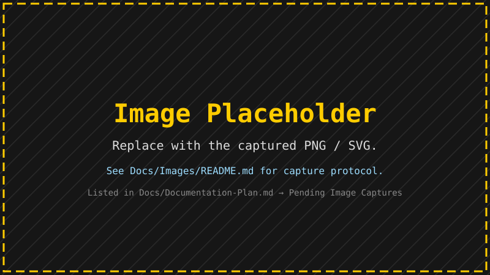

# Documentation Images

This folder holds every image referenced from `Docs/User/**` and `Docs/Technical/**`.

Use a relative path from the calling markdown file:

```markdown

```

Inside the in-app viewer, the Avalonia resource glob (`FracturingFog.UI.Avalonia.csproj`) embeds
everything under `Docs/Images/` via the `avares://` URI scheme, so the same `` reference
works in both the embedded viewer and the static HTML site (see `Docs/site/`).

## Folder Layout

| Folder                  | Purpose                                                                                  |
|-------------------------|------------------------------------------------------------------------------------------|
| `Images/fractals/`      | Reference renders of each fractal family. One representative image per family.           |
| `Images/dialogs/`       | Annotated screenshots of every dialog / floating window.                                 |
| `Images/diagrams/`      | Architecture and dataflow SVG diagrams (preferred over PNG for vector content).           |
| `Images/examples/`      | Worked-example output used in tutorial sections (color theme tweaks, equation edits…).   |
| `Images/_placeholders/` | Holding pen for stub graphics — replace as you capture the real image.                   |

## Capture Protocol

Reproducible captures keep documentation consistent across releases.

### Fractal family reference renders

| Field        | Value                                                                                  |
|--------------|----------------------------------------------------------------------------------------|
| Resolution   | 1600 × 1000                                                                            |
| Quality      | High                                                                                   |
| Region       | The named region marked **"Doc Reference"** in `Resources/Regions/regions.json`        |
| Theme        | The fractal-family default theme (i.e. whatever `Reset` selects after a `Type` swap)   |
| Overlays     | Grid OFF, Watermark OFF                                                                |
| Filename     | `fractals/<family>.png` — `family` is the FractalType combobox value lowercased         |

Workflow:

1. Launch the Avalonia shell.
2. From the Type combo pick the fractal family.
3. Press `R` (Reset) to land on the family default view.
4. Select Quality → High.
5. Toggle Grid + Watermark OFF (toolbar buttons).
6. Floating Menu → Image → save into `Docs/Images/fractals/<family>.png`.

### Dialog screenshots

| Field        | Value                                                                                  |
|--------------|----------------------------------------------------------------------------------------|
| OS theme     | Dark (Windows + Avalonia Fluent dark)                                                  |
| Scaling      | 100% DPI                                                                               |
| Window size  | Default startup size                                                                   |
| Format       | PNG                                                                                    |
| Filename     | `dialogs/<view-name>.png` — view-name = file name minus `View.axaml` (e.g. `slideshow-settings.png`) |

Use the OS snipping tool to crop tightly to the window chrome.

### Diagrams

Author in any tool that exports clean SVG (Excalidraw, draw.io, Inkscape). Keep:

- Text in editable form (do not flatten to outlines).
- A maximum 1200 px logical width.
- A transparent background.

Save as `diagrams/<topic>.svg`.

## Placeholders

When a topic mentions an image that has not been captured yet, use the placeholder:

```markdown

```

Then add an entry to **Docs/Documentation-Plan.md → Pending Image Captures** so the work is
tracked centrally. Replace the placeholder reference with the real path once the image lands.
