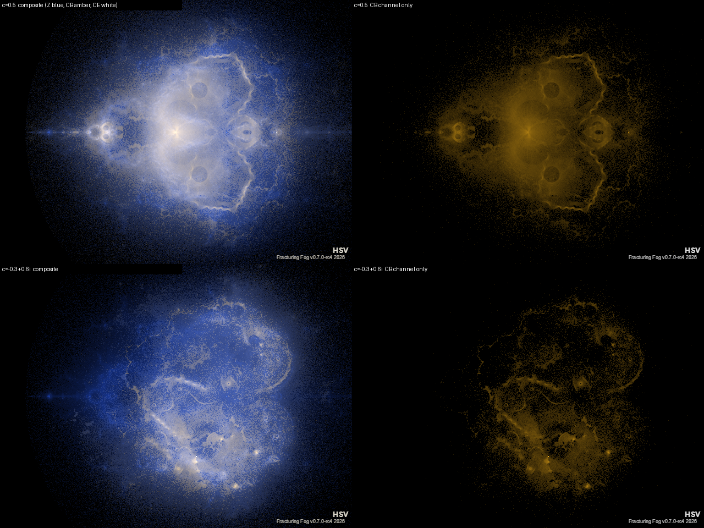
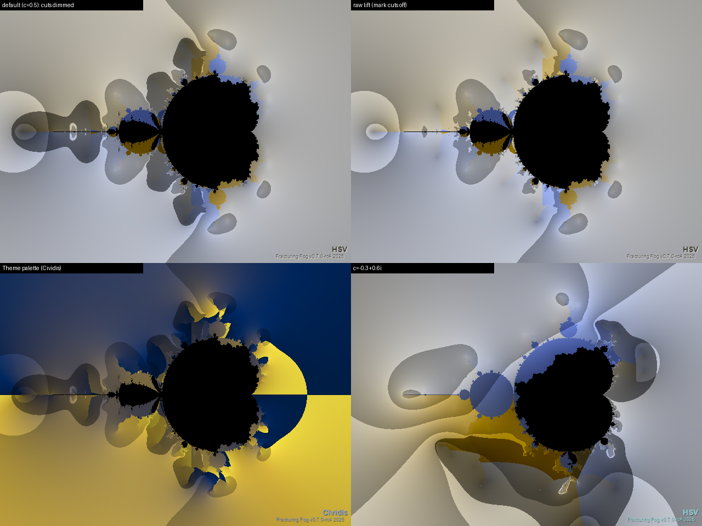
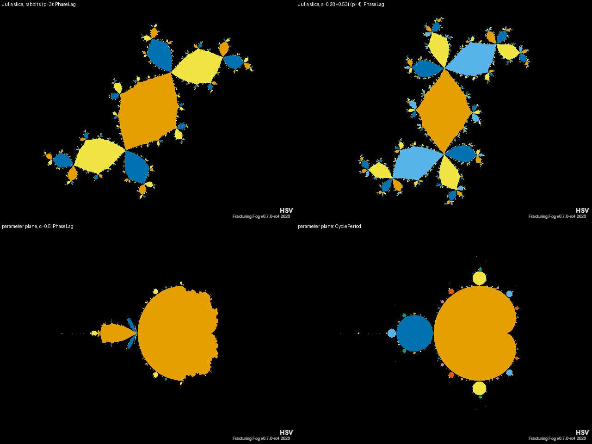
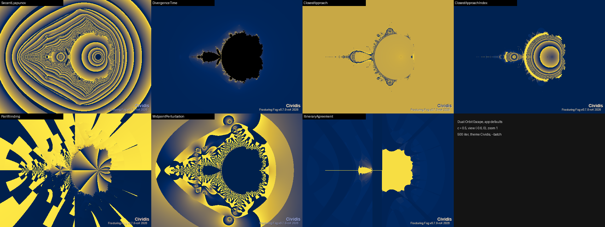
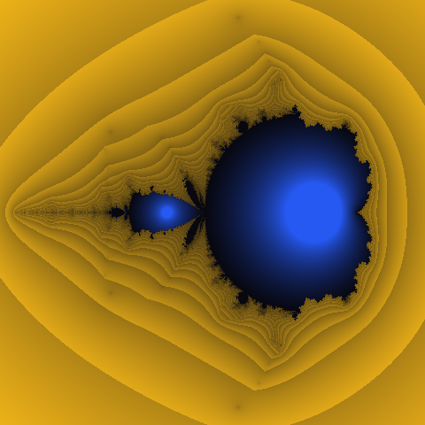
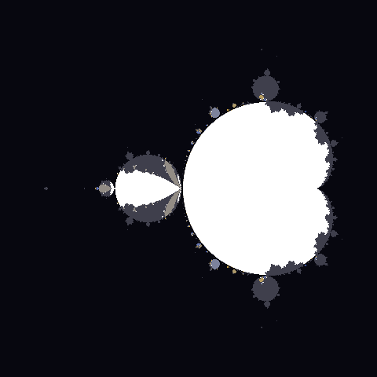
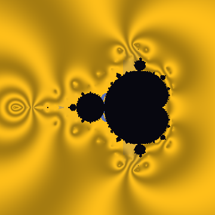
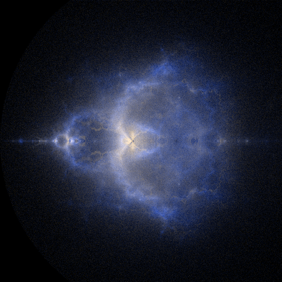
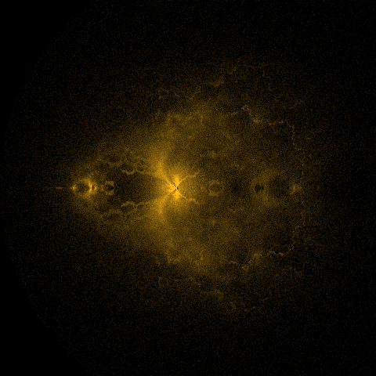
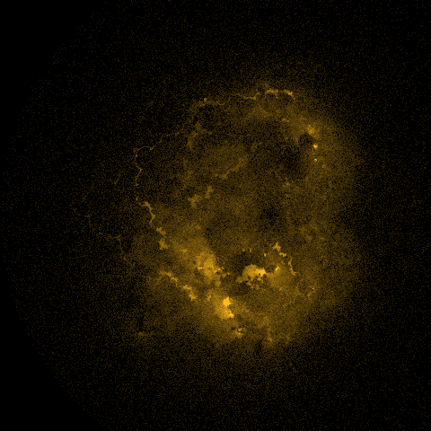

# Dual-Orbit Colouring — R&D and Design Plan

**Epic:** [#1114](https://github.com/AloneButUnsober/FracturingFog/issues/1114) ·
**Parents:** R&D epic #850, dual-orbit family #863 ·
**Background:** [Theoretical-Fractal-RnD.md §3.6](Theoretical-Fractal-RnD.md) ·
**Novelty follow-up (deferred):** [#1130](https://github.com/AloneButUnsober/FracturingFog/issues/1130) ·
**Session:** 2026-10-05

The dual-orbit construction (`DualOrbitEscapeCalculator`, `DualOrbitVolumeCalculator`) iterates
**two** orbits under one map `u → u² + s` — the critical orbit `z` (seed 0) and a decoupled probe
orbit `c` (seed `c`) — and today colours them through either one derived scalar
(`DualOrbitField`) or two blended 1D layers (`PerOrbitLayers`, #939). `Colorize` sees only
**two smooth counts + four flags per pixel (9 B/px)**; everything else the pair computes is thrown
away. This doc catalogues what else that data can colour, records the identities and numerical
checks that ground the catalogue, and gives the slice rationale for epic #1114. It also covers the
epic's stated goal, a **Dual Buddhabrot**.

> **Colour-blind note.** The project owner is red/green colour-blind. Every default proposed here
> codes data on **lightness** and the **blue ↔ amber/yellow** axis (OkLab `L` and `b`), never on the
> red ↔ green (`a`) axis. The prototype renders follow that rule.

---

## 1. The pair algebra (verified)

For the complex map, the two orbits are tied together by exact identities.

**Separation / pair sum.** With `D_n = c_n − z_n` and `σ_n = z_n + c_n`:

```
D_{n+1} = c_n² − z_n² = (c_n − z_n)(c_n + z_n) = D_n · σ_n      ⇒   D_N = c · Π_{k<N} σ_k
```

**Split-complex (bicomplex) form.** With midpoint `m = (z + c)/2` and half-separation `e = (z − c)/2`:

```
m' = m² + e² + s,      e' = 2·m·e
```

That is squaring in the split-complex numbers `m + e·k` with `k² = +1`. So **the dual-orbit pair is
exactly one orbit of the bicomplex quadratic map** `w → w² + s`, seeded at `w₀ = 0·e₁ + c·e₂`
(idempotents `e₁,₂ = (1 ± ij)/2`) with a complex scalar parameter `s`. In idempotent coordinates
bicomplex dynamics is a product of two complex dynamics (Rochon 2000, "Tetrabrot"). FF already ships
a `BicomplexMandelbrotCalculator` (Fractal-Expansion C.3).

**What this means.**
- The **shapes** of dual-orbit sets are product-structured and not new. FF's possible contribution
  is in **colouring the relation between the two components**, which is what this epic does.
- The pair has natural *relational* coordinates (`σ`, `D`, `m`, `e`) that no single-orbit colouring
  can see.
- **Quaternion map caveat.** The Hamilton square doesn't commute, so `c² − z² ≠ (c − z)(c + z)`. The
  product identity fails there, and quaternion-mode pair fields must store `D` explicitly (S1/S15).

**Coalescence.** `σ_k = 0 ⇔ c_k = −z_k`, after which `D ≡ 0` (the orbits merge exactly, since
`u → u²` is even). That set has measure zero (e.g. `c = 0`), so logs are clamped at a floor.

---

## 2. Where the current colouring stands

| Have (shipped) | Notes |
|---|---|
| `DualOrbitField` ×8 | 3 bailout-dependent (separation / residual / angle), Δn, 2 intrinsic (`GreenRatio`, `ExternalAngleDelta`), 2 single-orbit |
| `PerOrbitLayers` | two 1D themes, W3C blend, opacity, interior alpha, #615 surround (#939) |
| Cheap recolour | 2-phase render, `GeometryKey`, reflection guard (#981) |
| Volume colour | `ExternalAngle`, `CriticalLayer`, `Steps` (#972) |

Gaps: none of FF's orbit-aware colour families (`UsesOrbitTrap`, `UsesStripeAvg`, `UsesFinalZ`,
`UsesDerivative`, `UsesInterior`) run on the dual-orbit calculators, and there is no
per-iteration data path at all.

---

## 3. Catalogue

Cost: **L** = cheap, rides S1's accumulator · **M** = new maths or a new mode · **H** = new render path / ×N work.
Novelty is the session's *guess*, not established; #1130 checks it properly.

### 3.A Ported FF colourings (gaps)

| Method | Dual version | Cost | Slice |
|---|---|---|---|
| Orbit traps (19 shapes) | per orbit; Δtrap; two trap themes in layer mode | L | S3 #1117 |
| Stripe average / TIA | per orbit; stripe *interference* (moiré of two stripe families) | L | S3 #1117 |
| Exterior DE | per orbit → dual outlines (M boundary and M_c boundary) | L–M | S4 #1118 |
| Final-z / binary decomposition | per orbit; `BinaryXor` interference checkerboard | L | S4 #1118 |
| Relief height ≠ colour | height from one channel, albedo from another | L | S9 #1123 |

### 3.B Pair-native fields (new)

| Field | Definition | Live in | Cost | Slice |
|---|---|---|---|---|
| **SecantLyapunov** | `λ = (1/N) Σ log|z_k + c_k|` | **every region** | L | S2 #1116 |
| ~~SecantDistance~~ | **dropped in S2**: λ already equals `log|D_N/c|/N`, and a 2^-N normalisation just reproduces the first escaper's escape time. True DE is S4 | — | — | — |
| DivergenceTime | time for `|D_n|` to first exceed **ρ·|D_0|** (ρ = `DualOrbitDivergenceRatio`, default 4), log-interpolated. *An absolute ε was unusable: D_0 = |c| ≫ ε* | where it diverges | L | S2 |
| ClosestApproach (+Index) | `min_n |D_n|` and its `n` | all | L | S2 |
| PairWinding | unwrapped `Σ arg σ_k / 2π` — how many times the pair winds | all | L | S2 |
| MidpointPerturbation | `|e²| / |m²|` (split-complex coordinates) | all | L | S2 |
| ItineraryAgreement | common prefix length of the two binary itineraries | escaped | L | S2 |
| **Co-moving orbit trap** | trap shape centred on `z_n`, rotated by `arg z_n`, measuring `c_n` | all | L–M | S5 #1119 |

**Secant Lyapunov is the headline 2D field.** Unlike every shipped field it has no interior hole.
Inside M_c the pair contracts (`λ < 0`); outside, the pair separates (`λ > 0`) with banding. In the
period-2 bulb, the lagged lobes read exactly `λ = 0` (see §5).

### 3.C Colour-mapping innovations

| Mode | Idea | Cost | Slice |
|---|---|---|---|
| `Bivariate2D` | `Palette2D[u, v]` lookup of two channels, not a blend of two 1D gradients | M | S8 #1122 |
| `JointEqualised` | rank-transform each marginal (copula) and optionally 2D-histogram-equalise before the lookup | M | S8 |
| `PerceptualSplit` | channel A → OkLab L, B → OkLab b (blue↔yellow), separation → chroma; no `a` axis | L | S8 |
| `PhaseModulated` | `Palette(n_z + κ·n_c)` — FM-synthesis analogy; κ animatable | L | S8 |

### 3.D Rare, hard or theoretical

| Method | Idea | Cost | Slice |
|---|---|---|---|
| **Böttcher-ratio domain colouring** | `log(φ_s(c₁)/φ_s(z₁)) = (G_c − G_z) + 2πi·Δθ` — one complex, bailout-independent invariant; hue = Δθ, contours = ΔG | M | S6 #1120 |
| **Interior cycle phase lag** | inside M_c both orbits reach one p-cycle; colour by the offset `k (mod p)` with `c_N ≈ z_{N+k}` — exists only with two orbits | M | S7 #1121 |
| Koenigs-coordinate difference | interior twin of the Böttcher ratio; parabolic case ties to Parabolic-Implosion work | H | (future) |
| **Path interference** | `|e^{iκΦ_z} + e^{iκΦ_c}|²`, `Φ = G + 2πiθ`; κ = animatable "ħ" | M | S12 #1126 |
| Basin entropy / ensemble | N seeds round c; Shannon entropy of outcomes (Daza 2016); uncertainty exponent → local boundary dimension | H | S13 #1127 |
| FTLE / Jacobian anisotropy | singular values of ∂(z_N, c_N)/∂(s, c) → coherent-structure ridges (Haller 2015) | M–H | S14 #1128 |
| LIC flow texture | line-integral convolution of `D`, `∇GreenRatio`, or the dominant singular vector (revisits #868) | H | S14 |
| Monodromy colouring | animate c round a loop; colour by the permutation of external angles (Blanchard–Devaney–Keen) | theory | — |

### 3.E Dual Buddhabrot — epic goal

Classic Buddhabrot: sample `s`, iterate the critical orbit, deposit escaping trajectories. The
**Dual Buddhabrot** iterates *both* orbits per sample and deposits into **joint-outcome channels**:

| Channel | Orbit deposited | Condition | What it shows |
|---|---|---|---|
| `Z` | z-orbit | z escaped | classic Buddhabrot (the control) |
| **`CB`** | c-orbit | **c escaped, z bounded** (`s ∈ M \ M_c`) | **new structure**: lace-like filaments along the M_c boundary, absent from `Z` |
| `CE` | c-orbit | both escaped | diffuse cloud, partly classic |
| (anti) | bounded orbits | as AntiBuddhabrot | — |

`M_c ⊂ M` (§3.6 of the R&D doc), so "z escaped, c bounded" never happens. That gives a test invariant.
The c-seed is animatable: sweeping it re-textures the CB channel while `Z` stays fixed. Variants
(S11 #1125): midpoint `m_n`, **pair-chord** (rasterise `z_n → c_n` — string art),
escape-location (#867's original idea), per-outcome Nebulabrot bands, c-sweep video.

Prototype findings that fix design decisions (S10 #1124):
- A **minimum-escape cut** (≈ 12) is required. Without it the c-channels drown in fast-escaping
  orbits and the whole `|s| ≤ 2` disc washes grey (first prototype).
- **Real-axis mirror sampling** (`HighDefinition`) is **invalid for the c channels when `c.y ≠ 0`**:
  `conj(s)` maps to the orbit of `conj(c)`, not of `c`. Force it off for those channels.

**S10 as shipped (#1124).** The Dual Buddhabrot is `FractalType.DualBuddhabrot`, implemented as
`DualBuddhabrotCalculator : BuddhaFamilyCalculator`.
- **Base hooks:** the base class gained protected virtual hooks (`SampleBatch`, `Composite`,
  `PrepareSampling`, `CanReuseSamples`, `OnSamplingFinished`) and a `mirror` flag on the HD splat.
  The classic types are unchanged.
- **Channels:** the base's three hit buffers hold Z / CB / CE.
- **Z channel = classic, hit for hit:** the z-orbit uses the classic loop, and its splats draw from
  the classic RNG stream; c splats use a second stream. So with uniform sampling and
  `DualBuddhaMinIter = 0`, the Z channel is the classic Buddhabrot's hit total, exactly (tested in
  both qualities).
- **Early stop for bounded c-orbits:** they stop on Brent periodicity (no analytic "c ∈ K_s" test
  exists, and they're never deposited). Default renders cost about the same as the classic.
- **Mirror rule:** HD mirror is on for Z, and on for CB / CE only when `c.y = 0`.
- **Colour edits don't re-sample:** colour / gain / composite edits re-composite the cached hits
  (sample key; a reflection guard covers every `Buddha*` / `DualBuddha*` param). Exception: a run
  with a video `OnBatchComposited` callback always re-samples.
- **New params:** `DualBuddhaCSeedX/Y` (animatable), `DualBuddhaMinIter` (12),
  `DualBuddhaComposite` {Channels, Theme}, `DualBuddhaColorZ/CB/CE` (blue / amber / near-white),
  and `DualBuddhaGainZ/CB/CE` (1 / 1 / 0.35; animatable).
- **Batch parity:** the region snapshot carries the dual knobs *and* the shared `Buddha*` sampler
  settings. This is the first Buddha-family type to persist them; the classic four don't (#1134).
- **Deferred to S11 #1125:** anti (bounded-orbit) channels.
- **Cost:** about 0.9 s for 4M HD samples at 640×480.


*Headless `--batch`, 4M samples, HD. Top: c = 0.5, composite and the CB channel alone. Bottom:
c = −0.3+0.6i. The CB lace follows the M_c boundary and re-textures with c.*

**S6 as shipped (#1120).** `DualOrbitColorMode.BoettcherDomain` colours the complex invariant
w = (G_c − G_z) + 2πi·Δθ.
- **Data:** Δθ comes from the cached level-1 external angles of both orbits (two float planes).
  ΔG comes straight from the cached smooth counts, as G = 2·ln R·2^(−smooth). Both are
  bailout-independent.
- **Rendering:** hue = Δθ, a sawtooth lightness contour every 1/`DualOrbitContourDensity` of ΔG,
  and an optional angular grid. Inside M it falls back to w = log φ_s(c₁).
- **Default palette:** a cyclic OkLab path with **a = 0** (lightness × blue↔yellow), so nothing is
  coded on red↔green. A test round-trips every rendered pixel to OkLab and asserts |a| < 0.02.
  `Theme` uses the active theme instead.
- **Speed:** density, grid, palette and cut-marking are colour-only, so changing them recolours
  from the cache.
- **Branch cuts (found in the smoke render):** φ_s is analytic only where G > G_s(0) = G(z₁)/2.
  Where c₁ sits below the critical level, the lifted angle crosses branch cuts and shows
  straight-looking seams. A probe confirmed every seam lies in G(c₁) ≤ G(0).
  `DualOrbitDomainMarkCuts` (default on) dims those pixels; turn it off to see the raw lift.
- **Tests:** checked against the **Böttcher product formula** (independent of the lifting code),
  inside-M fallback, bailout invariance, the critical-level test via direct Green-function
  iteration, a = 0, theme mapping, quaternion → interior, cache behaviour and the CLI round trip.


*Headless `--batch`. Top: c = 0.5 with the cut region dimmed, then the raw lift (seams visible).
Bottom: the Theme palette (Cividis is not cyclic, hence its wrap line), then c = −0.3+0.6i.*

**S7 as shipped (#1121).** Three interior `DualOrbitField` values:
- `PhaseLag` (k);
- `PhaseLagFraction` ((k+½)/p across the palette);
- `CyclePeriod` (p of the critical cycle; it doesn't need the c-orbit).

How they're computed: from the cached end states, the critical orbit is iterated on (up to 1024
steps) until it first returns within 1e-8; then k minimises |c_N − z_{N+k}|. A pixel is only live
if the c-orbit has converged onto the cycle (within 1e-5). Otherwise the field has no value
(escaping, near-parabolic slow convergence, or a period above the cap) and the pixel gets the
interior colour.

**Found in the smoke render:** cycling themes alias small evenly spaced class values. For p = 4,
(k+½)/4 × 2000 = 250 / 750 / 1250 / 1750 all landed on one colour in HSV, Cividis *and* a
"Gradient" theme. So `PhaseLag` / `CyclePeriod` now default to `DualOrbitLagColors = Categorical`:
Okabe–Ito reordered blue / amber first, one fixed colour per class whatever the theme. `Theme` is
still available, and `PhaseLagFraction` stays theme-mapped (best with a non-cycling gradient).

**Tests:**
- c = s ⇒ lag 1 exactly; a seed near 0 ⇒ lag 0.
- The period matches a test-side critical-cycle search.
- The Julia plane has exactly p lag classes (p = 1..4), stable from maxIter N to N + p.
- Lag agrees with the S2 secant Lyapunov exponent (lag 0 ⇔ λ ≈ ln|μ|/p, else 0).
- Categorical colours are one-per-class.
- Outside M, when only c escapes, and under the quaternion map, the fields are interior.


*Headless `--batch`, categorical colours. Top: Julia (CxCy) slices — the rabbit's three lag classes
and a period-4 basin's four. Bottom: the parameter plane at c = 0.5 (mostly lag 0, lagged lobes in
the 2-bulb) and `CyclePeriod`.*

---

## 4. Architecture (S1 #1115)

- `DualOrbitPairAccumulator`: an opt-in, per-pixel struct updated inside `Run` / `RunQuat`.
  Each field or theme declares which sub-accumulators it needs, so the default path does no extra work.
- Optional cache planes are added to the #981 cache only when needed, keeping it at ≤ ~40 B/px at
  1080p. Every new param is classified as geometry or colour-only in the reflection guard.
- Expose `ITrapFieldSource` / `IDistanceFieldSource` so Relief's Trap / Blend / Distance height
  sources work.
- **Dual Buddhabrot** is a new `FractalType` on `BuddhaFamilyCalculator`, reusing its Metropolis,
  progressive, HD and zoom-compensation machinery. Channel buffers replace the iteration bands.
- **S1 as shipped (#1115).** `DualOrbitPairChannels` flags (`SecantLogSum`, `Winding`, `Separation`,
  `MidpointPerturbation`, `Itinerary`, `Derivatives`) live on the calculator (`PairChannels`) and are
  merged with what the selected field needs (`ChannelsFor`; every shipped field needs none).
  `None` keeps the original `Run` path, so output is byte-identical with no allocation. Otherwise
  `RunPair` / `RunQuatPair` iterate in lockstep with `Run`'s exact arithmetic; tests prove the cached
  render is byte-identical with or without channels.
  - **Accumulation window:** steps `0 … N−1`, where N is the first step at which *either* orbit is
    past the bailout.
  - **Derivatives** are stored as `(ln|d|, arg d)` floats at each orbit's own escape step, so they
    don't overflow float.
  - **Quaternion:** the secant sum is the telescoped `log|D_N| − log|D_0|`; winding, itinerary and
    derivatives are NaN.
  - **Cost** (1280×720 @ 500 iterations, this machine): default 47–53 ms (unchanged); single
    channels 75–165 ms (winding, with atan2 per step, is the most expensive); all channels about
    300 ms. Planes cost 40 B/px without derivatives and 64 B/px with them.
  - **Deferred to the slices that consume them:** trap / stripe sub-accumulators and
    `ITrapFieldSource` (S3), and `IDistanceFieldSource` (S4).
  - **Finding:** the direct `|c_N − z_N|` hits round-off (~1e-16) once the orbits converge, but
    the σ-sum keeps tracking the true contraction. That's why the secant fields accumulate σ.
- **S2 as shipped (#1116).** Seven fields were appended to `DualOrbitField`: `SecantLyapunov`,
  `DivergenceTime`, `ClosestApproach`, `ClosestApproachIndex`, `PairWinding`, `MidpointPerturbation`,
  `ItineraryAgreement`. Each one requests its channel through `ChannelsFor`. The scalars follow the
  shipped fields' `[0, maxIter]` contract:
  - `SecantLyapunov` uses a diverging ±`DualOrbitLyapunovSpan` (default 2 nats/step).
  - `ClosestApproach` uses `1 − e^(−depth/8)`.
  - `MidpointPerturbation` uses log10 over ±6 decades.
  - `PairWinding` gives one palette unit per turn, centred.
  - The count-like fields (`DivergenceTime`, `ClosestApproachIndex`, `ItineraryAgreement`) are used raw.

  Liveness comes from the accumulator, not from the escape flags (cache bit `FlagPairDead`):
  `DivergenceTime` is interior where the pair never diverges, and `PairWinding` /
  `ItineraryAgreement` are interior under the quaternion map. New params `DualOrbitLyapunovSpan` and
  `DualOrbitDivergenceRatio` are always in `GeometryKey`, so the #981 guard classifies them as
  geometry.
  - **Round-off floor (found in the smoke render):** the separation is read as at least
    `1e-14·|(z, c)|`, and the closest-approach index keeps the *first* step that reaches the minimum
    (to 1e-9 relative). Without this, converged pairs speckled `ClosestApproach` / `Index` under
    cycling themes.
  - **Seams:** `PairWinding` has sharp seams by construction. It's a sum of principal args, a
    topological label rather than a smooth field.

  
  *All seven S2 fields rendered headless via `--batch` at app defaults (c = 0.5). The exteriors of
  ClosestApproach / Index are flat there because the minimum separation is at step 0; the structure
  is inside M.*
- **Batch parity** (CLAUDE.md): new params flow through `RegionFractalParams` → `--param`.
  `BuildFractalParameters`, the Command-builder live seed and a round-trip test go in the same change,
  per slice.

---

## 5. Numerical validation (2026-10-05)

Prototype: [`DualOrbit-Coloring-Prototypes/dualorbit_checks.py`](DualOrbit-Coloring-Prototypes/dualorbit_checks.py)
(NumPy; not shipped code). Each check tests an **independent invariant**, not self-consistency.
These become xUnit tests in the slices.

| # | Claim | Independent check | Result |
|---|---|---|---|
| C1 | pair ≡ bicomplex orbit | bicomplex product built from the basis table only (`i² = j² = −1`, `k = ij`, `k² = 1`), components extracted by idempotent projection, vs two separately iterated complex orbits; 400 random (s, c) | **PASS** — max rel err 1.4e-12, 0 escape-step mismatches |
| C1b | split-complex step `m' = m² + e² + s`, `e' = 2me` | vs the bicomplex orbit | **PASS** — 1.7e-16 |
| C3 | secant λ inside M_c | analytic multiplier μ of the critical cycle (`Π 2ζ_j`), for s = 0.2 (p 1), −0.9 (p 2), −0.12+0.74i (p 3), 0.28+0.53i and −1.3+0.05i (p 4); c over a grid of the filled Julia set | **PASS** — lag 0: `λ → log|μ|/p` (≤ 3.6e-3); lag ≠ 0: `λ → 0` (≤ 1.1e-4) |
| C3 | phase lag well defined | number of distinct lags vs the period p from cycle detection; lag stable from N to N + p | **PASS** — distinct lags = p for p = 1..4; all stable |
| C4 | Böttcher ratio is intrinsic | bailout 128 vs 4096; known parameter rays (real s > ¼ → 0, s < −2 → ½) | **PASS** — worst 4.5e-4; rays exact. *(The functional-equation sub-check `φ(f u) = φ(u)²` is tautological in this implementation; it's a code sanity check only, not evidence.)* |

**Corrections to the session's first-pass claims** (what the checks found):
1. *"Secant λ → log|μ|/p inside M_c."* That holds only when the two orbits share **cycle phase**.
   With phase lag `k ≠ 0`, `D_n` becomes periodic and non-zero, so `Π|σ|` over a cycle is 1 and
   `λ → 0`. The secant λ therefore **reproduces the phase-lag partition** (S2 ↔ S7).
2. *"The Böttcher ratio's real part is `GreenRatio`."* Wrong. The real part is the **difference**
   `G_c − G_z`; `GreenRatio` is `log₂(G_c/G_z)`. The imaginary part is exactly `ExternalAngleDelta`.
3. *"The bicomplex link gives free 3D."* Overstated. The sets are product-structured (known); the
   relational colouring is the contribution.

### Prototype renders

All at c = 0.5 (the FF default) unless noted; s-plane `[−2.1, 0.7] × [−1.4, 1.4]`.

| | |
|---|---|
|  | **Secant Lyapunov.** Blue = contracting pair (interior, no hole), amber = separating, banded exterior. Dark wedges in the period-2 bulb = lagged lobes (`λ = 0`). |
|  | **Phase lag** (s-plane). White = lag 0, grey = M \ M_c, blue→amber = lag k/p in small bulbs. Plain in this plane; the showcase is the Julia plane (CxCy). |
|  | **Böttcher-ratio domain colouring.** Hue (blue↔amber cyclic) = Δθ, stripes = G_c − G_z. Dipole patterns around each minibrot. |
|  | **Dual Buddhabrot composite**, c = 0.5. Blue = Z (classic), amber = CB, white = CE. 4 M samples, NMIN 12. |
|  | **CB channel alone**, c = 0.5. Correlation with classic Z: 0.78. |
|  | **CB channel**, c = −0.3+0.6i. Asymmetric, Julia-like lace (corr 0.71). Changing c re-textures the channel → c-sweep animation. |

Other renders: [`dual-buddhabrot-Z.png`](../Images/dualorbit-coloring/dual-buddhabrot-Z.png),
[`dual-buddhabrot-composite-cm0p3p0p6i.png`](../Images/dualorbit-coloring/dual-buddhabrot-composite-cm0p3p0p6i.png).
Scripts: [`dualorbit_previews.py`](DualOrbit-Coloring-Prototypes/dualorbit_previews.py),
[`dual_buddha2.py`](DualOrbit-Coloring-Prototypes/dual_buddha2.py) (`python dual_buddha2.py "-0.3+0.6j"`).

---

## 6. Slice plan (epic #1114)

| Slice | Issue | Depends on | Summary |
|---|---|---|---|
| S1 | #1115 | — | pair accumulator + extended cache (foundation) |
| S2 | #1116 | S1 | pair-native fields (secant λ, divergence, winding, …) |
| S3 | #1117 | S1 | traps + stripe / TIA per orbit |
| S4 | #1118 | S1 | DE + final-z per orbit (dual outlines, XOR) |
| S5 | #1119 | S3 | co-moving orbit trap |
| S6 | #1120 | S1 | Böttcher-ratio domain colouring |
| S7 | #1121 | S2 | interior cycle phase lag |
| S8 | #1122 | S1 | bivariate modes (2D palette, copula EQ, OkLab split, FM) |
| S9 | #1123 | S1 | Relief split: height / colour channels |
| **S10** | **#1124** | (S1 shared code; parallel OK) | **Dual Buddhabrot core — epic goal** |
| S11 | #1125 | S10 | Dual Buddhabrot variants (midpoint, chord, escape-location, bands, c-sweep) |
| S12 | #1126 | S6 | path-interference colouring |
| S13 | #1127 | S2 | basin entropy / uncertainty exponent |
| S14 | #1128 | S1, S4 | FTLE / Jacobian + LIC |
| S15 | #1129 | S2, S7 | volume colour sources + quaternion parity |
| — | #1130 | deferred | novelty research |

**Suggested order:** S1 → S2 → **S10** → S6 → S7 → S3 / S4 → S8 → S11 → S5 → S9 → S12 → S13 → S14 → S15.
#867 (S4 deposition) is superseded by S10/S11. #868 (glyphs) is revisited by S14's LIC.

---

## 7. Open design questions

- **S1:** Cache budget versus recolour scope. Should trap shape be in the `GeometryKey` (re-iterate
  on a shape change), or should each shape's planes be cached?
- **S8:** Where do 2D palettes come from? A built-in set first; PaletteBuilder image extraction later
  (#392 tails).
- **S10:** Should the c-seed in the Dual Buddhabrot also be samplable (4D (c, s) sampling — a density
  over all Julia sets) as a mode, or stay fixed? Fixed first, because it makes c an animation knob.
- **S13:** Per-pixel ensemble cost (×N). Progressive refinement only, or also a tile-level budget?

---

## 8. Novelty status

These are candidate "FF-first" methods: secant Lyapunov colouring, co-moving traps, Böttcher-ratio
domain colouring, interior phase lag, path interference, Dual Buddhabrot joint-outcome channels,
copula-equalised bivariate fractal palettes, and pair-chord deposition. All are **unverified**: the
session judged them from recall, with no literature search. **Do not claim innovation** in
user-facing docs until #1130 lands its novelty table here.

---

## 9. References

- D. Rochon, "A generalized Mandelbrot set for bicomplex numbers," *Fractals* 8(4), 2000.
- A. Daza, A. Wagemakers, B. Georgeot, D. Guéry-Odelin, M. A. F. Sanjuán, "Basin entropy: a new
  tool to analyze uncertainty in dynamical systems," *Sci. Rep.* 6, 2016.
- C. Grebogi, S. W. McDonald, E. Ott, J. A. Yorke, "Final state sensitivity: an obstruction to
  predictability," *Phys. Lett. A* 99, 1983.
- E. Aurell et al., "Predictability in the large," *J. Phys. A* 30, 1997 (FSLE).
- G. Haller, "Lagrangian coherent structures," *Annu. Rev. Fluid Mech.* 47, 2015.
- B. Cabral, L. Leedom, "Imaging vector fields using line integral convolution," SIGGRAPH 1993.
- P. Blanchard, R. Devaney, L. Keen, "The dynamics of complex polynomials and automorphisms of the
  shift," *Invent. Math.* 104, 1991 (monodromy).
- M. Green, "The Buddhabrot" (1993); see also Theoretical-Fractal-RnD §7.
- See also: [Theoretical-Fractal-RnD.md §7](Theoretical-Fractal-RnD.md).
