# Dual-Orbit Colouring — R&D and Design Plan

**Epic:** [#1114](https://github.com/AloneButUnsober/FracturingFog/issues/1114) ·
**Parents:** R&D epic #850, dual-orbit family #863 ·
**Background:** [Theoretical-Fractal-RnD.md §3.6](Theoretical-Fractal-RnD.md) ·
**Novelty research:** [#1130](https://github.com/AloneButUnsober/FracturingFog/issues/1130) → §8 ·
**Session:** 2026-10-05

> **Renamed (#1154 / #1155, after the #1130 novelty research):** the 2D type *Dual-Orbit Escape* is
> now **Julibrot Pair** (`FractalType.JulibrotPair`) and the 3D *Dual-Orbit Volume* is now
> **Julibrot** (`FractalType.Julibrot`). Same enum values; the old names still load everywhere
> (`FractalTypeNames`). The calculator classes and every `DualOrbit*` parameter key are unchanged,
> and this doc keeps "dual-orbit" for the construction.

The dual-orbit construction (`DualOrbitEscapeCalculator`, `DualOrbitVolumeCalculator`) iterates
**two** orbits under one map `u → u² + s` — the critical orbit `z` (seed 0) and a decoupled probe
orbit `c` (seed `c`) — and today colours them through either one derived scalar
(`DualOrbitField`) or two blended 1D layers (`PerOrbitLayers`, #939). `Colorize` sees only
**two smooth counts + four flags per pixel (9 B/px)**; everything else the pair computes is thrown
away. This doc catalogues what else that data can colour, records the identities and numerical
checks that ground the catalogue, and gives the slice rationale for epic #1114. It also covers the
epic's stated goal, a **Dual Buddhabrot**.

> **Colour-blind note.** The project owner is red/green colour-blind. Every default proposed here
> codes data on **lightness** and the **blue ↔ amber/yellow** axis (OkLab `L` and `b`), never on the
> red ↔ green (`a`) axis. The prototype renders follow that rule.

---

## 1. The pair algebra (verified)

For the complex map, the two orbits are tied together by exact identities.

**Separation / pair sum.** With `D_n = c_n − z_n` and `σ_n = z_n + c_n`:

```
D_{n+1} = c_n² − z_n² = (c_n − z_n)(c_n + z_n) = D_n · σ_n      ⇒   D_N = c · Π_{k<N} σ_k
```

**Split-complex (bicomplex) form.** With midpoint `m = (z + c)/2` and half-separation `e = (z − c)/2`:

```
m' = m² + e² + s,      e' = 2·m·e
```

That is squaring in the split-complex numbers `m + e·k` with `k² = +1`. So **the dual-orbit pair is
exactly one orbit of the bicomplex quadratic map** `w → w² + s`, seeded at `w₀ = 0·e₁ + c·e₂`
(idempotents `e₁,₂ = (1 ± ij)/2`) with a complex scalar parameter `s`. In idempotent coordinates
bicomplex dynamics is a product of two complex dynamics (Rochon 2000, "Tetrabrot"). FF already ships
a `BicomplexMandelbrotCalculator` (Fractal-Expansion C.3).

**What this means.**
- The **shapes** of dual-orbit sets are product-structured and not new. FF's possible contribution
  is in **colouring the relation between the two components**, which is what this epic does.
- The pair has natural *relational* coordinates (`σ`, `D`, `m`, `e`) that no single-orbit colouring
  can see.
- **Quaternion map caveat.** The Hamilton square doesn't commute, so `c² − z² ≠ (c − z)(c + z)`. The
  product identity fails there, and quaternion-mode pair fields must store `D` explicitly (S1/S15).

**Coalescence.** `σ_k = 0 ⇔ c_k = −z_k`, after which `D ≡ 0` (the orbits merge exactly, since
`u → u²` is even). That set has measure zero (e.g. `c = 0`), so logs are clamped at a floor.

---

## 2. Where the current colouring stands

| Have (shipped) | Notes |
|---|---|
| `DualOrbitField` ×8 | 3 bailout-dependent (separation / residual / angle), Δn, 2 intrinsic (`GreenRatio`, `ExternalAngleDelta`), 2 single-orbit |
| `PerOrbitLayers` | two 1D themes, W3C blend, opacity, interior alpha, #615 surround (#939) |
| Cheap recolour | 2-phase render, `GeometryKey`, reflection guard (#981) |
| Volume colour | `ExternalAngle`, `CriticalLayer`, `Steps` (#972) |

Gaps: none of FF's orbit-aware colour families (`UsesOrbitTrap`, `UsesStripeAvg`, `UsesFinalZ`,
`UsesDerivative`, `UsesInterior`) run on the dual-orbit calculators, and there is no
per-iteration data path at all.

---

## 3. Catalogue

Cost: **L** = cheap, rides S1's accumulator · **M** = new maths or a new mode · **H** = new render path / ×N work.
Novelty was the session's *guess*; §8 now has the researched verdicts (#1130).

### 3.A Ported FF colourings (gaps)

| Method | Dual version | Cost | Slice |
|---|---|---|---|
| Orbit traps (19 shapes) | per orbit; Δtrap; two trap themes in layer mode | L | S3 #1117 |
| Stripe average / TIA | per orbit; stripe *interference* (moiré of two stripe families) | L | S3 #1117 |
| Exterior DE | per orbit → dual outlines (M boundary and M_c boundary) | L–M | S4 #1118 |
| Final-z / binary decomposition | per orbit; `BinaryXor` interference checkerboard | L | S4 #1118 |
| Relief height ≠ colour | height from one channel, albedo from another | L | S9 #1123 |

### 3.B Pair-native fields (new)

| Field | Definition | Live in | Cost | Slice |
|---|---|---|---|---|
| **SecantLyapunov** | `λ = (1/N) Σ log|z_k + c_k|` | **every region** | L | S2 #1116 |
| ~~SecantDistance~~ | **dropped in S2**: λ already equals `log|D_N/c|/N`, and a 2^-N normalisation just reproduces the first escaper's escape time. True DE is S4 | — | — | — |
| DivergenceTime | time for `|D_n|` to first exceed **ρ·|D_0|** (ρ = `DualOrbitDivergenceRatio`, default 4), log-interpolated. *An absolute ε was unusable: D_0 = |c| ≫ ε* | where it diverges | L | S2 |
| ClosestApproach (+Index) | `min_n |D_n|` and its `n` | all | L | S2 |
| PairWinding | unwrapped `Σ arg σ_k / 2π` — how many times the pair winds | all | L | S2 |
| MidpointPerturbation | `|e²| / |m²|` (split-complex coordinates) | all | L | S2 |
| ItineraryAgreement | common prefix length of the two binary itineraries | escaped | L | S2 |
| **Co-moving orbit trap** | trap shape centred on `z_n`, rotated by `arg z_n`, measuring `c_n` | all | L–M | S5 #1119 |

**Secant Lyapunov is the headline 2D field.** Unlike every shipped field it has no interior hole.
Inside M_c the pair contracts (`λ < 0`); outside, the pair separates (`λ > 0`) with banding. In the
period-2 bulb, the lagged lobes read exactly `λ = 0` (see §5).

### 3.C Colour-mapping innovations

| Mode | Idea | Cost | Slice |
|---|---|---|---|
| `Bivariate2D` | `Palette2D[u, v]` lookup of two channels, not a blend of two 1D gradients | M | S8 #1122 |
| `JointEqualised` | rank-transform each marginal (copula) and optionally 2D-histogram-equalise before the lookup | M | S8 |
| `PerceptualSplit` | channel A → OkLab L, B → OkLab b (blue↔yellow), separation → chroma; no `a` axis | L | S8 |
| `PhaseModulated` | `Palette(n_z + κ·n_c)` — FM-synthesis analogy; κ animatable | L | S8 |

### 3.D Rare, hard or theoretical

| Method | Idea | Cost | Slice |
|---|---|---|---|
| **Böttcher-ratio domain colouring** | `log(φ_s(c₁)/φ_s(z₁)) = (G_c − G_z) + 2πi·Δθ` — one complex, bailout-independent invariant; hue = Δθ, contours = ΔG | M | S6 #1120 |
| **Interior cycle phase lag** | inside M_c both orbits reach one p-cycle; colour by the offset `k (mod p)` with `c_N ≈ z_{N+k}` — exists only with two orbits | M | S7 #1121 |
| Koenigs-coordinate difference | interior twin of the Böttcher ratio; parabolic case ties to Parabolic-Implosion work | H | (future) |
| **Path interference** | `|e^{iκΦ_z} + e^{iκΦ_c}|²`, `Φ = G + 2πiθ`; κ = animatable "ħ" | M | S12 #1126 |
| Basin entropy / ensemble | N seeds round c; Shannon entropy of outcomes (Daza 2016); uncertainty exponent → local boundary dimension | H | S13 #1127 |
| FTLE / Jacobian anisotropy | singular values of ∂(z_N, c_N)/∂(s, c) → coherent-structure ridges (Haller 2015) | M–H | S14 #1128 |
| LIC flow texture | line-integral convolution of `D`, `∇GreenRatio`, or the dominant singular vector (revisits #868) | H | S14 |
| Monodromy colouring | animate c round a loop; colour by the permutation of external angles (Blanchard–Devaney–Keen) | theory | — |

### 3.E Dual Buddhabrot — epic goal

Classic Buddhabrot: sample `s`, iterate the critical orbit, deposit escaping trajectories. The
**Dual Buddhabrot** iterates *both* orbits per sample and deposits into **joint-outcome channels**:

| Channel | Orbit deposited | Condition | What it shows |
|---|---|---|---|
| `Z` | z-orbit | z escaped | classic Buddhabrot (the control) |
| **`CB`** | c-orbit | **c escaped, z bounded** (`s ∈ M \ M_c`) | **new structure**: lace-like filaments along the M_c boundary, absent from `Z` |
| `CE` | c-orbit | both escaped | diffuse cloud, partly classic |
| (anti) | bounded orbits | as AntiBuddhabrot | — |

`M_c ⊂ M` (§3.6 of the R&D doc), so "z escaped, c bounded" never happens. That gives a test invariant.
The c-seed is animatable: sweeping it re-textures the CB channel while `Z` stays fixed. Variants
(S11 #1125): midpoint `m_n`, **pair-chord** (rasterise `z_n → c_n` — string art),
escape-location (#867's original idea), per-outcome Nebulabrot bands, c-sweep video.

Prototype findings that fix design decisions (S10 #1124):
- A **minimum-escape cut** (≈ 12) is required. Without it the c-channels drown in fast-escaping
  orbits and the whole `|s| ≤ 2` disc washes grey (first prototype).
- **Real-axis mirror sampling** (`HighDefinition`) is **invalid for the c channels when `c.y ≠ 0`**:
  `conj(s)` maps to the orbit of `conj(c)`, not of `c`. Force it off for those channels.

**S10 as shipped (#1124).** The Dual Buddhabrot is `FractalType.DualBuddhabrot`, implemented as
`DualBuddhabrotCalculator : BuddhaFamilyCalculator`.
- **Base hooks:** the base class gained protected virtual hooks (`SampleBatch`, `Composite`,
  `PrepareSampling`, `CanReuseSamples`, `OnSamplingFinished`) and a `mirror` flag on the HD splat.
  The classic types are unchanged.
- **Channels:** the base's three hit buffers hold Z / CB / CE.
- **Z channel = classic, hit for hit:** the z-orbit uses the classic loop, and its splats draw from
  the classic RNG stream; c splats use a second stream. So with uniform sampling and
  `DualBuddhaMinIter = 0`, the Z channel is the classic Buddhabrot's hit total, exactly (tested in
  both qualities).
- **Early stop for bounded c-orbits:** they stop on Brent periodicity (no analytic "c ∈ K_s" test
  exists, and they're never deposited). Default renders cost about the same as the classic.
- **Mirror rule:** HD mirror is on for Z, and on for CB / CE only when `c.y = 0`.
- **Colour edits don't re-sample:** colour / gain / composite edits re-composite the cached hits
  (sample key; a reflection guard covers every `Buddha*` / `DualBuddha*` param). Exception: a run
  with a video `OnBatchComposited` callback always re-samples.
- **New params:** `DualBuddhaCSeedX/Y` (animatable), `DualBuddhaMinIter` (12),
  `DualBuddhaComposite` {Channels, Theme}, `DualBuddhaColorZ/CB/CE` (blue / amber / near-white),
  and `DualBuddhaGainZ/CB/CE` (1 / 1 / 0.35; animatable).
- **Batch parity:** the region snapshot carries the dual knobs *and* the shared `Buddha*` sampler
  settings. This is the first Buddha-family type to persist them; the classic four don't (#1134).
- **Deferred to S11 #1125:** anti (bounded-orbit) channels.
- **Cost:** about 0.9 s for 4M HD samples at 640×480.


**S11 as shipped (#1125, also #867).** Variants of the Dual Buddhabrot. Each one transforms the
recorded orbits in place, so the Metropolis-Hastings scoring / acceptance and the splats stay
generic.
- **`DualBuddhaDeposit`:**
  - `Midpoint`: (z_k + c_k)/2. The z-orbit is recorded up to the c-orbit's escape even in the
    bulbs.
  - `PairChord`: one uniform random point per step on z_k → c_k. t comes from the c RNG stream, so
    the Z channel stays classic, and memory stays bounded.
  - `EscapeLocation`: each kept orbit's first point past |u| = 2. This is #867's escape-space
    render; zoom out to see it.
- **Pair deposits start at step 1:** the seed pair (0, c) is identical for every sample. The smoke
  render showed it as a bright fixed chord.
- **`DualBuddhaNebula`** (Z / CB / CE): one outcome split by escape count into the
  `BuddhaIterLow/Mid` bands. `BuddhaIterLow/Mid` are now persisted for this type.
- **`DualBuddhaAnti`:** bounded orbits — R = z for s ∈ M \ M_c, G = c for s ∈ M_c, B = z for
  s ∈ M_c. No bulb skip and no periodicity exit, so it's as slow as the classic Anti-Buddhabrot.
- **Built-in animation "Dual Buddhabrot c-sweep":** c loops round 0.5 ± 0.35. The sampler seed is
  a fixed param, so every frame draws the same s samples and the sweep doesn't flicker. The video
  path already handles the Buddha family.
- **Tests:**
  - c = 0 ⇒ midpoint / chord ≡ Z (except the z₀ origin pixel);
  - midpoint / chord hits inside the radius-2 disc, escape hits outside it;
  - midpoint and chord deposit the same number of points;
  - outcome-Nebulabrot bands **sum exactly** to the outcome channel;
  - anti R + B **equals the classic AntiBuddhabrot calculator**, and G − B equals the counted
    finite-cap exceptions;
  - the default mode is unchanged (Z = classic);
  - the preset targets animatable params; CLI round trip.

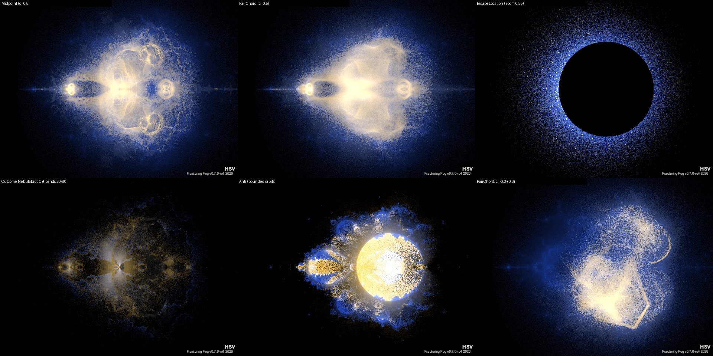
*Headless `--batch`, HD: Midpoint, PairChord, EscapeLocation (zoom 0.35); outcome Nebulabrot (CB,
bands 20/80), Anti (1M samples, cap 2000), PairChord at c = −0.3+0.6i.*
*Headless `--batch`, 4M samples, HD. Top: c = 0.5, composite and the CB channel alone. Bottom:
c = −0.3+0.6i. The CB lace follows the M_c boundary and re-textures with c.*

**S6 as shipped (#1120).** `DualOrbitColorMode.BoettcherDomain` colours the complex invariant
w = (G_c − G_z) + 2πi·Δθ.
- **Data:** Δθ comes from the cached level-1 external angles of both orbits (two float planes).
  ΔG comes straight from the cached smooth counts, as G = 2·ln R·2^(−smooth). Both are
  bailout-independent.
- **Rendering:** hue = Δθ, a sawtooth lightness contour every 1/`DualOrbitContourDensity` of ΔG,
  and an optional angular grid. Inside M it falls back to w = log φ_s(c₁).
- **Default palette:** a cyclic OkLab path with **a = 0** (lightness × blue↔yellow), so nothing is
  coded on red↔green. A test round-trips every rendered pixel to OkLab and asserts |a| < 0.02.
  `Theme` uses the active theme instead.
- **Speed:** density, grid, palette and cut-marking are colour-only, so changing them recolours
  from the cache.
- **Branch cuts (found in the smoke render):** φ_s is analytic only where G > G_s(0) = G(z₁)/2.
  Where c₁ sits below the critical level, the lifted angle crosses branch cuts and shows
  straight-looking seams. A probe confirmed every seam lies in G(c₁) ≤ G(0).
  `DualOrbitDomainMarkCuts` (default on) dims those pixels; turn it off to see the raw lift.
- **Tests:** checked against the **Böttcher product formula** (independent of the lifting code),
  inside-M fallback, bailout invariance, the critical-level test via direct Green-function
  iteration, a = 0, theme mapping, quaternion → interior, cache behaviour and the CLI round trip.


*Headless `--batch`. Top: c = 0.5 with the cut region dimmed, then the raw lift (seams visible).
Bottom: the Theme palette (Cividis is not cyclic, hence its wrap line), then c = −0.3+0.6i.*

**S7 as shipped (#1121).** Three interior `DualOrbitField` values:
- `PhaseLag` (k);
- `PhaseLagFraction` ((k+½)/p across the palette);
- `CyclePeriod` (p of the critical cycle; it doesn't need the c-orbit).

How they're computed: from the cached end states, the critical orbit is iterated on (up to 1024
steps) until it first returns within 1e-8; then k minimises |c_N − z_{N+k}|. A pixel is only live
if the c-orbit has converged onto the cycle (within 1e-5). Otherwise the field has no value
(escaping, near-parabolic slow convergence, or a period above the cap) and the pixel gets the
interior colour.

**Found in the smoke render:** cycling themes alias small evenly spaced class values. For p = 4,
(k+½)/4 × 2000 = 250 / 750 / 1250 / 1750 all landed on one colour in HSV, Cividis *and* a
"Gradient" theme. So `PhaseLag` / `CyclePeriod` now default to `DualOrbitLagColors = Categorical`:
Okabe–Ito reordered blue / amber first, one fixed colour per class whatever the theme. `Theme` is
still available, and `PhaseLagFraction` stays theme-mapped (best with a non-cycling gradient).

**Tests:**
- c = s ⇒ lag 1 exactly; a seed near 0 ⇒ lag 0.
- The period matches a test-side critical-cycle search.
- The Julia plane has exactly p lag classes (p = 1..4), stable from maxIter N to N + p.
- Lag agrees with the S2 secant Lyapunov exponent (lag 0 ⇔ λ ≈ ln|μ|/p, else 0).
- Categorical colours are one-per-class.
- Outside M, when only c escapes, and under the quaternion map, the fields are interior.


*Headless `--batch`, categorical colours. Top: Julia (CxCy) slices — the rabbit's three lag classes
and a period-4 basin's four. Bottom: the parameter plane at c = 0.5 (mostly lag 0, lagged lobes in
the 2-bulb) and `CyclePeriod`.*

**S3 as shipped (#1117).** FF's orbit colourings run on each orbit, by two routes:
- **Scalar fields**, palette-driven and cached: `TrapZ` / `TrapC` / `TrapDelta`, `StripeZ` /
  `StripeC` / `StripeInterference`, and `TiaZ` / `TiaC`.
  - Traps use FF's own 19 trap-shape samplers (`DataDrivenOrbitTrap.ShapeImpl`) via
    `DualOrbitTrapShape`, mapped d/(d + `DualOrbitTrapScale`).
  - Stripes use the Härkönen average with escape-step smoothing (`DualOrbitStripeDensity`).
    `StripeInterference` is StripeZ × StripeC.
  - All are defined for bounded orbits too, so there's **no interior hole**.
  - Trap fields fill `TrapBuffer` (`ITrapFieldSource`), so the Relief "Trap" height source works.
- **Orbit-aware themes:** fields `OrbitThemeZ` / `OrbitThemeC` let any `IOrbitAwareColorMap` (trap,
  stripe, TIA, curvature …) sample one orbit and colour with `MapWithOrbit`; themes that want it
  get interior colour via `MapInteriorWithOrbit`. In `PerOrbitLayers` mode each orbit-aware layer
  theme samples its own orbit. A plain theme on `OrbitTheme*` behaves as `EscapeTime*`.
- **Caching:** the theme accumulator can't be cached, so when one is active every Calculate
  re-iterates. The host already treats orbit-aware themes as needing a full render.
- **Conventions:** sampling follows the Mandelbrot / User-Equation calculators (after the escape
  test, k ≥ 1). ComplexPlane only; the quaternion map gives interior.
- **Tests:**
  - point trap, Cross trap, stripe and TIA against test-side re-iteration with the textbook
    definitions;
  - the orbit-theme field and the orbit-aware layer theme against the same theme driven by a
    test loop;
  - live everywhere, `TrapBuffer`, no caching with a theme, quaternion → interior, CLI round trip.

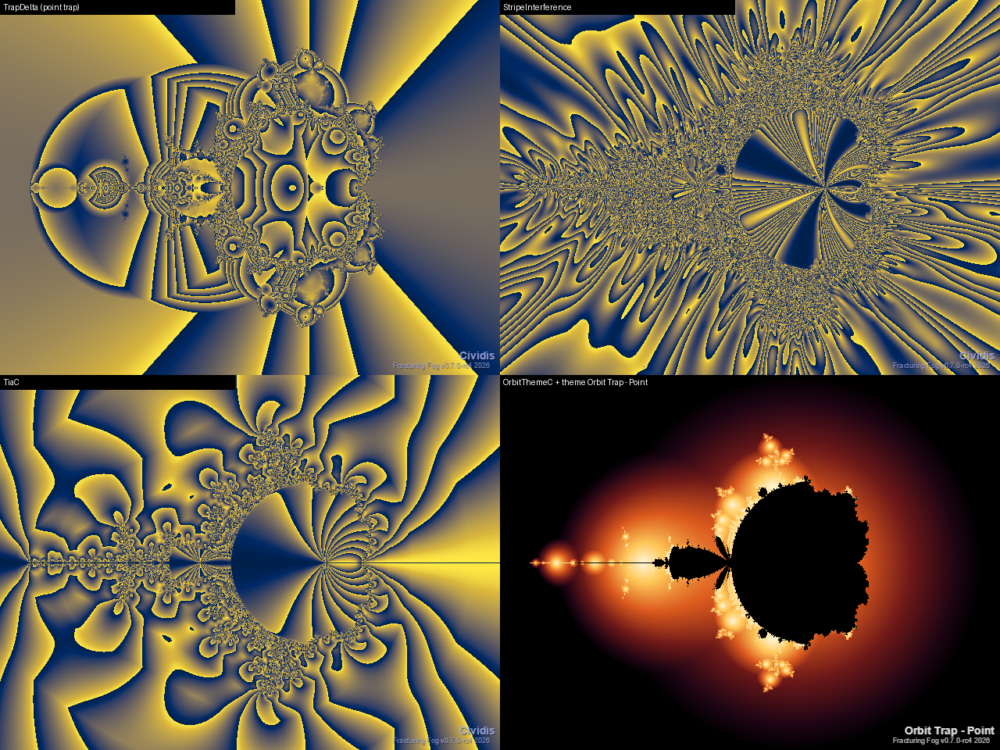
*Headless `--batch`, c = 0.5. TrapDelta (point trap), StripeInterference, TiaC (Cividis), and
FF's "Orbit Trap - Point" theme sampling the c-orbit (`OrbitThemeC`).*

**S4 as shipped (#1118).**
- **Image-plane distance estimate for every slice:** DE = ½·ln|u_N| / |∇ln|u_N||. The gradient is
  built from each orbit's derivatives wrt s and c₀, with ∂ln|u|/∂Re p = Re(u_p/u) and
  ∂ln|u|/∂Im p = −Im(u_p/u). On the holomorphic slices this is exactly the classic ½|u|ln|u|/|u′|:
  a Koebe lower bound on the distance to M (z, SxSy), M_c (c, SxSy) or the filled Julia set
  (c, CxCy). On mixed slices it's an estimate, not a bound.
- **Distance fields:** `DistanceZ` / `DistanceC` give d px → d/(d + `DualOrbitDEScale`). `DistanceZ`
  has no value on the CxCy slice, since the z-orbit doesn't depend on c.
- **`DualOutline`:** ink lines on **both** boundaries over the z escape time — M blue, M_c amber,
  width and colours colour-only. This is the first view to show the two boundaries interleaving.
- **Relief:** `DistanceBuffer` (`IDistanceFieldSource`) drives the Relief "Distance" height source.
- **`BinaryXor`:** XOR of the two orbits' binary decompositions. It was flat in the first smoke
  render because 0.25 / 0.75 × maxIter aliased under a cycling theme, as phase lag had. It's now a
  two-class categorical field via `DualOrbitLagColors`.
- **`FinalAngleDelta`:** raw arg E_c − arg E_z (bailout-dependent; the intrinsic version is
  `ExternalAngleDelta`).
- **Tests:**
  - DistanceZ / DistanceC against the classic Mandelbrot / M_c DE, and the Julia-slice DE wrt the
    seed;
  - a **brute-force Koebe probe**: 16 points at 0.95·DE around pixels on three slice/field
    combinations all escape;
  - the mixed-slice DE against central differences of ln|u_N|;
  - outline inking, the XOR / angle against test-side escape points, `DistanceBuffer` scope, the
    quaternion case and the CLI round trip.

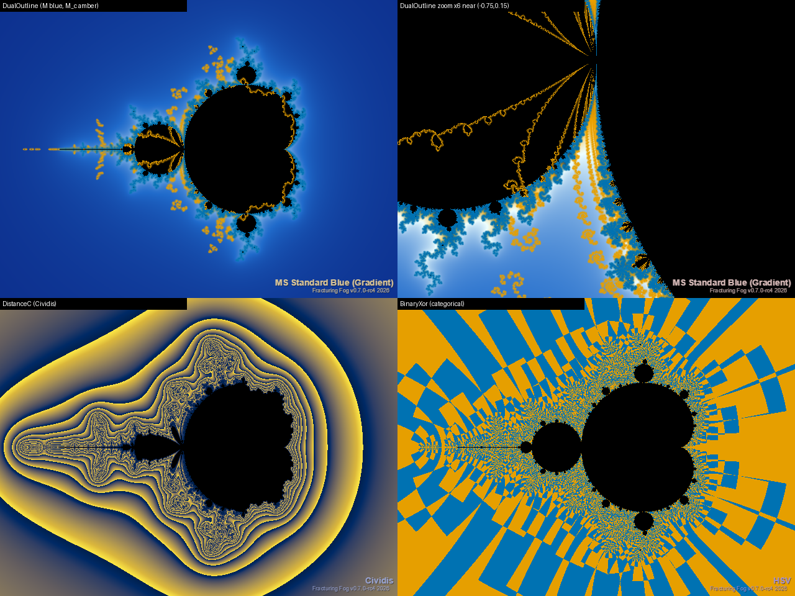
*Headless `--batch`. DualOutline (M blue, M_c amber) at zoom 1 and ×6 near −0.75+0.15i;
DistanceC (Cividis); BinaryXor (categorical).*

**S8 as shipped (#1122).** Four `DualOrbitColorMode` values map the two escape counts *jointly*:
- `Bivariate2D`: 2D palette at u = n_z/(n_z + k), v = n_c/(n_c + k).
- `JointEqualised`: the copula transform. Each channel becomes its empirical mid-rank, so both
  marginals are uniform.
- `PerceptualSplit`: u → OkLab L, v → OkLab b, a = 0.
- `PhaseModulated`: the theme at n_z + κ·n_c, with κ animatable.

Details:
- **Built-in 2D palettes:** `BlueAmberSquare` (bilinear in OkLab: near-black, blue #0072B2,
  amber #E69F00, near-white) and `ThemeByLightness`.
- **No extra iteration data:** the channels are the cached n_z / n_c, so the four modes share the
  layer cache key. Switching between layers and the bivariate modes, and every knob, recolours
  without iterating.
- **Bounded orbits:** a bounded channel saturates, so only M_c is interior.
- **Default count scale is 6:** at 20 the exterior read near-black in the smoke render.
- **Not done:** the issue's "separation → chroma" third channel. With a = 0 and b already carrying
  v, there's no free colour-blind-safe axis left for it.
- **Tests** (all using test-side OkLab):
  - Bivariate2D against the bilinear OkLab square at the test's own smooth counts;
  - the ThemeByLightness formula;
  - **KS < 0.02** on both equalised marginals;
  - PerceptualSplit round trip: a ≈ 0, L and b within 0.02;
  - κ = 0 ⇔ the EscapeTimeZ field, and the general κ formula;
  - only M_c is interior;
  - mode switching recolours from the cache;
  - CLI round trip.

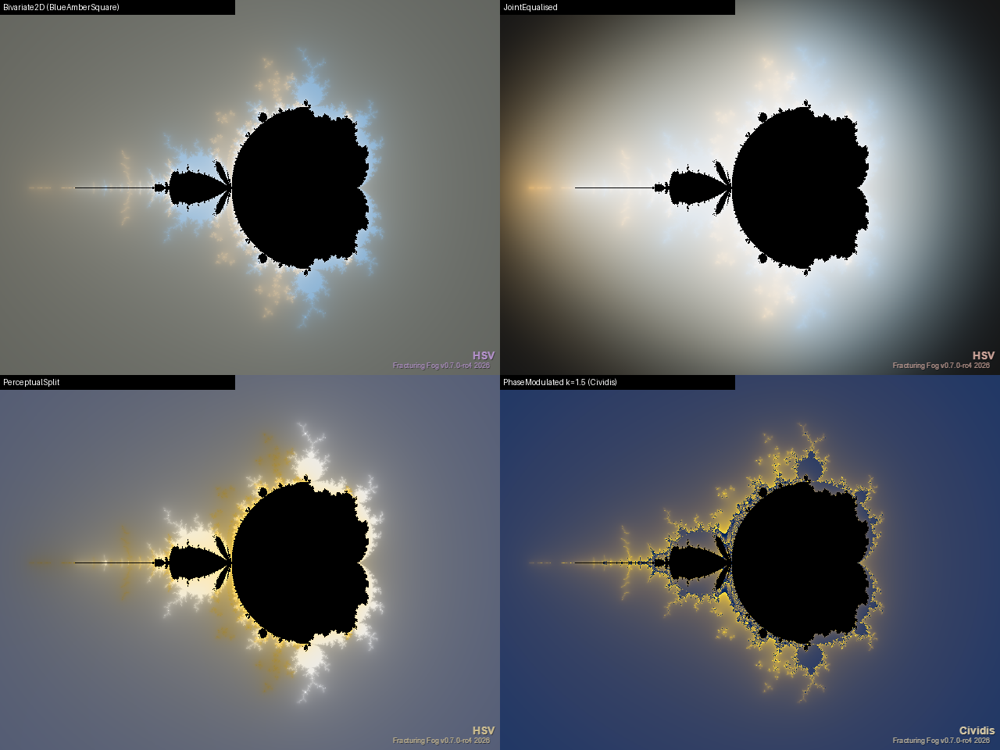
*Headless `--batch`, c = 0.5: Bivariate2D, JointEqualised, PerceptualSplit, PhaseModulated
(κ = 1.5, Cividis).*

**S5 as shipped (#1119).** `DualOrbitTrapFrame.CoMoving` makes the trap ride the *other* orbit.
Each step the measured point is put in a frame centred on the frame orbit's point f_k:
w_k = (m_k − f_k)·e^{−i·arg f_k} / |f_k| · e^{−iα}, and w_k goes to the unchanged trap sampler, so
all 19 built-in shapes work as they are.
- **Fields:** `TrapC` = the c-orbit in the z-orbit's frame; `TrapZ` = the z-orbit in the c-orbit's
  frame; `TrapDelta` = their difference. This replaces the issue's three-valued
  {Fixed, CoMovingZ, CoMovingC}: which orbit rides is already chosen by the field.
- **Knobs:** `DualOrbitTrapRotate` (default on: turn by arg f_k), `DualOrbitTrapScaleByOrbit`
  (divide by |f_k|), and `DualOrbitTrapAngle` α in degrees. α works in the Fixed frame too and is
  animatable (spin the trap). All four are geometry (in the `GeometryKey`).
- **Starts at k = 2 (found in the smoke render).** c₁ − z₁ = c₀² for *every* s
  (D₁ = D₀·σ₀ = c₀·c₀), so the first relative point carries no dynamics. Sampling it made the
  unrotated Cross trap flat (a real c₀ puts D₁ on the axis: distance 0 everywhere) and the rotated
  exterior pure radial rays (a function of arg s alone). The Fixed frame keeps S3's k ≥ 1.
- **Sampling stops** when either orbit escapes: past its escape the frame orbit has no frame.
- **Inside M_c the co-moving trap goes to 0.** Both orbits fall into the same attracting cycle at
  phase lag 0 (S7), so D_k → 0 and w_k → 0.
- **Fixed frame, α = 0** never enters the lockstep path, so it is byte-identical to S3.
- **Tests:**
  - point and Cross traps, all four rotate / scale combinations, `TrapZ` and `TrapC`, against a
    test-side lockstep loop with the textbook frame;
  - α in both frames against the loop;
  - **c₀ = 0 degeneracy:** the c-orbit is the z-orbit, so w ≡ 0 and the image is one constant,
    the shape's own value at the origin (six shapes, against the public trap classes);
  - **rotation covariance:** Cross turned 45° equals the independent DiagonalCross sampler
    (Fixed, CoMoving, CoMoving + scale);
  - unrotated point trap: TrapZ ≡ TrapC (|c − z| = |z − c|), and rotation leaves it unchanged;
  - Fixed frame: toggles byte-identical to S3; α = 360° (lockstep path) reproduces S3;
  - the k = 2 regression (real c₀, unrotated Cross is not flat); animatable α; CLI round trip.

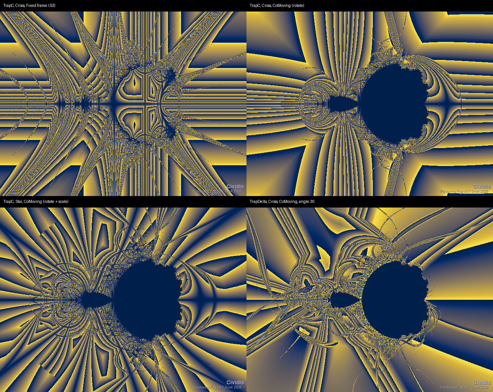
*Headless `--batch`, default c-seed, Cividis. TrapC with the Cross trap, Fixed (S3) against
CoMoving; the Star trap co-moving with rotate + scale; TrapDelta co-moving at α = 30°.*

**S9 as shipped (#1123).** Relief split: `DualOrbitSplitHeight` + `DualOrbitHeightField` publish the
height (`SmoothBuffer`, which Relief, SSAO and every other height consumer read) from a different
field than the one the theme colours. For example, hills from the secant Lyapunov exponent painted
by `ExternalAngleDelta`, or the per-orbit layer composite on a `GreenRatio` relief.
- **How:** the colour scalar moved to a private buffer (`ColorScalarBuffer`). With split on, a
  private height-only twin of the calculator (Field mode, the height field selected, no colour
  pass) fills `SmoothBuffer`. Every colour mode works: Field, PerOrbitLayers, BoettcherDomain and
  the bivariate modes.
- **Caching:** the twin keeps its own #981 orbit cache. The colour orbits never re-iterate for a
  height change, so both params are colour-only in the recolour guard, and `Recolor()` refreshes the
  height from the twin's cache.
- **Shared settings:** the height field shares the colour field's settings (trap shape, spans,
  scales).
- **Split off is byte-identical:** `SmoothBuffer` is the colour scalar. `--batch` Relief at app
  defaults (emboss, raymarch, layers) is pixel-identical to the pre-change build.
- **Observation:** a `SecantLyapunov` relief shows terrace lines. λ = (1/N)Σ ln|σ| is not smoothed
  across the escape step, so it jumps where N changes. That's a property of the field (S2), not of
  the split. Fixed by `DualOrbitLyapunovSmooth` (#1144, below).
- **Tests:**
  - split height ≡ the `SmoothBuffer` of an independent render that colours that field, and
    `ColorBuffer` ≡ the unsplit render (five mode / field combinations);
  - a height change reuses the colour orbits and only moves the height; `Recolor` follows it;
    switching split off restores the original;
  - resize;
  - through `PosterRenderer`: the relief field of (colour A, height B) ≡ the field of colour B; the
    flat image is unchanged by the split, the emboss image is changed;
  - CLI round trip.

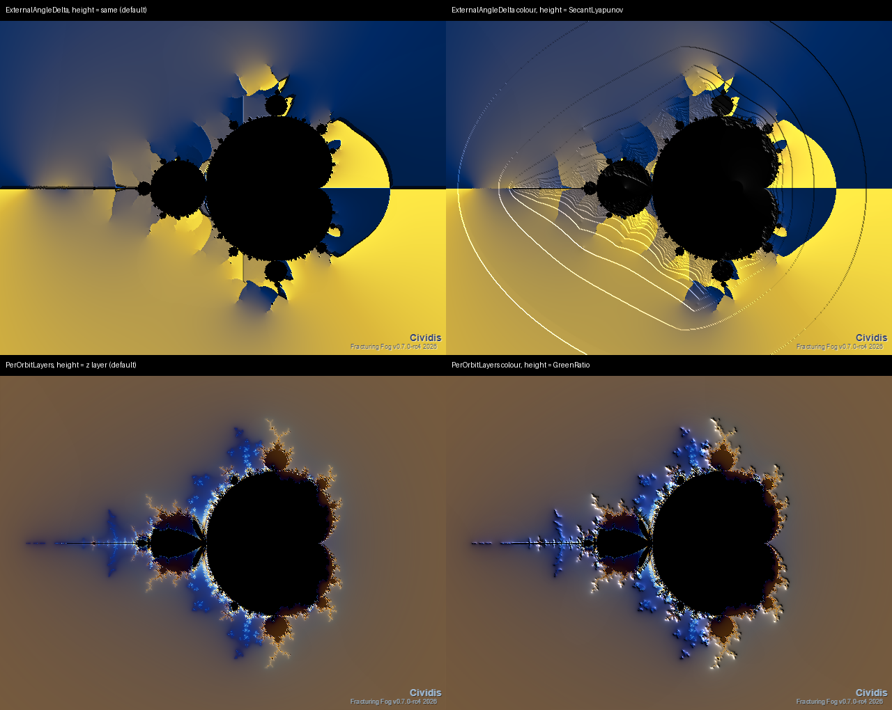
*Headless `--batch --relief --relief-height 3`, Cividis. Top: `ExternalAngleDelta` with its own
height, then with `SecantLyapunov` height. Bottom: PerOrbitLayers with the z-layer height, then
with `GreenRatio` height.*

**S12 as shipped (#1126).** Path interference: each orbit is a path with complex phase
Φ = G + 2πiθ, the log of its level-1 Böttcher coordinate (S6). The two paths interfere with
amplitude e^{iκΦ}, where κ (`DualOrbitInterferenceK`, animatable) is the "ħ" knob.
- **Fields:** `PathInterference` and `PathInterferencePhase`.
- **Normalised, not raw, intensity.** e^{iκΦ} = e^{iκG}·e^{−2πκθ}, and the raw amplitude is
  not single-valued (θ → θ + 1 rescales it by e^{−2πκ}), so the raw |a + b|² has a seam wherever θ
  wraps. FF uses the normalised two-path intensity with amplitudes symmetric about their mean
  (θ_z = −Δθ/2, θ_c = +Δθ/2, Δθ wrapped to [−½, ½)):
  **I = |a + b|²/(|a|² + |b|²) = 1 + cos(κ·ΔG)/cosh(2πγκ·Δθ)** ∈ [0, 2].
  - It is continuous across the wrap (cosh is even).
  - κ = 0 gives I = 2, the normalised form of the issue's "constant 4".
  - `PathInterference` = I/2; `PathInterferencePhase` = arg(a + b)/2π.
- **γ (`DualOrbitInterferenceGamma`) weights the angle part of Φ:**
  - γ = 1 is Φ as written. Fringes keep full visibility only near the curves where the two external
    angles agree, and they wash out elsewhere ("decoherence").
  - **The default is γ = 0, set from the smoke render.** Δθ inherits S6's branch cuts below the
    critical level, so any γ > 0 shows them as straight seams and flattens large regions. γ = 0
    reads only ΔG (the Green functions, no cuts): clean fringes along the equipotential-difference
    curves.
- **Colour-only:** κ and γ never iterate. The scalar is rebuilt in the colour pass from the cached
  smooth counts and lifted angles, so a κ sweep recolours (the fringes shimmer). The S9 split-height
  twin rebuilds it too.
- **Live only where both orbits escape:** a single path has nothing to interfere with. The
  quaternion map gives interior.
- **Found by the oracle:** the first phase implementation gave the e^{+x} amplitude to the wrong
  path. Intensity is symmetric and hid it; the direct-sum phase test caught it.
- **Tests:**
  - intensity (three κ/γ pairs) and phase against a **direct complex sum** of e^{iκΦ}, built from
    independent sources: the EscapeTime fields' smooth counts give G per orbit, and the S6 domain
    pass gives Δθ;
  - κ = 0 constant;
  - continuity at the wrap, and periodicity in Δθ;
  - bailout invariance (128 against 10⁴; ≤ 1 % of pixels may differ at lift flips);
  - κ and γ recolour from the cache (`Calculate` reuses the orbits, and `Recolor` matches a fresh
    render);
  - single path and quaternion map → interior; the split height follows κ; κ animatable; CLI
    round trip.

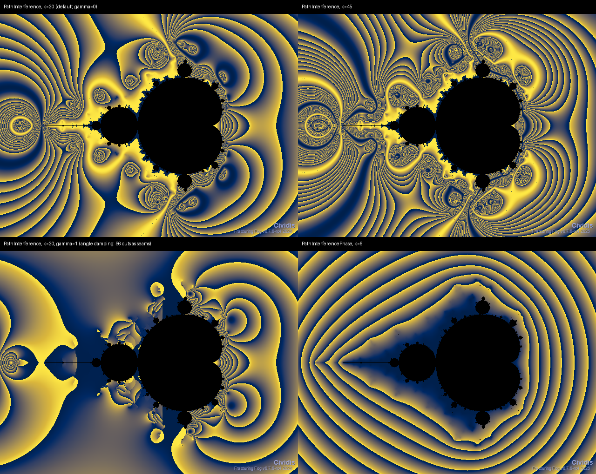
*Headless `--batch`, default c-seed, Cividis. κ = 20 (default, γ = 0); κ = 45; γ = 1 (the angle
damping, S6 cuts visible as seams); phase at κ = 6.*

**S13 as shipped (#1127).** The c-orbit is generalised to an ensemble of N seeds in a disc of
radius ρ round c (`DualOrbitEnsembleN` = 32, `DualOrbitEnsembleRadius` = 0.02 in c units).
- **Seed layout:** a deterministic sunflower spiral, area-uniform with no RNG, so renders are
  reproducible.
- **Outcome classes:** bounded or escaped (`DualOrbitEnsembleSectors` = 0). With K ≥ 1, bounded or
  escaped through one of K level-1 external-angle sectors (lifted, so bailout-independent).
- **`BasinEntropy`:** the Shannon entropy of the class histogram (Daza et al. 2016), scaled by
  ln(#classes).
  - Image aggregates are public: S_b (`BasinEntropyMean`), S_bb (`BasinEntropyBoundaryMean`) and
    the boundary-box fraction.
  - Daza's ln 2 criterion needs ≥ 3 classes (with 2 classes the bound *is* ln 2), so use sectors.
- **`UncertaintyExponent`** (Grebogi–McDonald–Ott–Yorke):
  - Each seed is paired with a partner at ε_k = ρ·2^{−(k+1)}, for k < `DualOrbitUncertaintyLevels`
    (= 4), with one fixed plastic-sequence direction per seed.
  - f(ε) is the fraction of disagreeing pairs. α is the least-squares slope of ln f against ln ε,
    with α = 2 − D_boundary.
  - Fewer than 2 disagreeing levels gives no value (interior).
- **Measured α (N = 2048, ρ = 0.05, 5 levels):**
  - unit circle (J of z²): **0.991**;
  - straight external ray (2 sectors): **0.962**;
  - basilica (D ≈ 1.268, theory 0.732): **0.666**.
- **The UE field is a noisy local estimator.** N = 32–64 renders speckled; use N ≥ 256 for
  smooth fields.
- **Budget:** N·(1 + L) orbits per pixel (defaults: 160). A Brent cycle check stops bounded seeds
  once they settle, so interior seeds in hyperbolic components are cheap. BasinEntropy skips the
  partners. The smoke renders at 640×480 took 0.4–1.0 s.
- **Progressive refinement:** the host's ¼ → ½ → full chain was Mandelbrot-only. #1146 extends it
  to Julibrot Pair (below).
- All four params are geometry (`GeometryKey`). The quaternion map gives interior.
- **Tests:**
  - the layout is deterministic, in the unit disc, and area-uniform (P(r ≤ ½) = ¼);
  - entropy is 0 inside one basin (both sides of |c| = 1);
  - entropy over a basilica image ≡ a **test-side ensemble with its own escape loop** (≤ 1e-5),
    including the boundary fraction and S_bb ≥ S_b;
  - the entropy bound holds, and some box sees ≥ 3 of 4 classes;
  - α ∈ [0.9, 1.1] on the circle and on a straight ray; α ∈ [0.5, 0.88] on the basilica; no
    value away from boundaries;
  - determinism; quaternion → interior; CLI round trip.

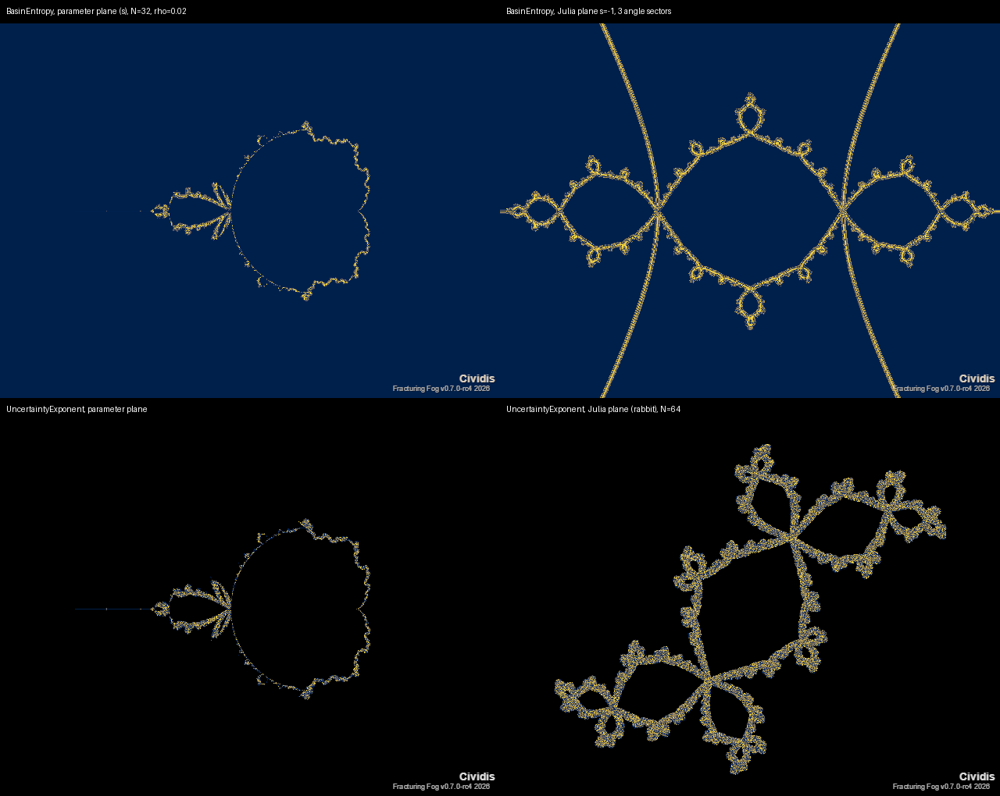
*Headless `--batch`, Cividis. BasinEntropy on the parameter plane (traces M_c's boundary) and on
the basilica's Julia plane with 3 sectors (the θ = 0, ⅓, ⅔ rays appear as smooth class
boundaries); UncertaintyExponent on the parameter plane and on the rabbit (N = 64: speckled, as
expected).*

**S14 as shipped (#1128).** FTLE, Jacobian anisotropy and an LIC flow texture.
- **The Jacobian:** the pair map (s, c₀) ↦ (z_N, c_N) is holomorphic, and z doesn't depend on c₀,
  so J = [[a, 0], [b, d]] is complex lower-triangular. a = ∂z/∂s, b = ∂c/∂s, d = ∂c/∂c₀, with
  a' = 2za + 1, b' = 2cb + 1, d' = 2cd.
  - N is the lockstep count until either orbit escapes (maxIter if both are bounded).
  - **The singular values are formed in logs:** σ₁² = (T + √(T² − 4|ad|²))/2 and σ₂ = |a||d|/σ₁.
- **Fields:**
  - `Ftle` = ln σ₁ / N, centred with `DualOrbitFtleSpan` (1.5);
  - `JacobianAnisotropy` = ln(σ₁/σ₂), scaled A/(A + `DualOrbitAnisotropyScale`) (20).
- **Found by the tests, scale per entry:** the derivatives grow at different rates. At the
  Misiurewicz point s = −2, |a| ~ 4^N (the z-orbit lands on the repelling β = 2, multiplier 4) while
  |d| ~ 2^N (the c-orbit is a Chebyshev orbit). A common log-scale underflowed d entirely, so each
  entry carries its own. |d|² also underflowed in the interior (d ~ μ^N), fixed by working in logs.
- **LIC** (Cabral & Leedom) is a colour-only post-process for every colour mode. Fixed white noise
  is averaged along streamlines of an orientation field with a ±`DualOrbitLicLength` px box kernel,
  contrast-normalised by the kernel's own σ, and mixed in by `DualOrbitLicStrength`.
  - **Sources:**
    - `SeparationDirection`: arg(c_N − z_N), recorded in the Jacobian pass. Geometry; it has no
      value inside M_c, where D_N → 0.
    - `FieldGradient` / `FieldContour`: ∇ of, or ⊥ to, the coloured scalar (∇GreenRatio when the
      field is GreenRatio). Colour-only: switching between them, the length and the strength all
      recolour.
  - **The issue's "dominant singular vector" source is not offered.** The SxSy and CxCy slices are
    holomorphic in their image coordinate, so the image-plane Jacobian block is conformal and has no
    stretching direction to follow.
  - Streamlines are orientation-based (sign-agnostic) and stop at the border or at pixels with no
    orientation.
- **Tests:**
  - a, b, d against central finite differences (three points, plus the imaginary-step check:
    holomorphic);
  - σ₁, σ₂ against power iteration on JᴴJ;
  - **interior limit** ln σ₂/N → ln|μ|/p, for a fixed point (μ = 2α) and a 2-cycle
    (μ = 4(s + 1)), with FTLE → 0;
  - **Misiurewicz s = −2:** ln σ₁/N = ln 4 and ln σ₂/N = ln 2 over 4000 steps (no overflow);
  - fields live everywhere, quaternion → interior;
  - **LIC of a constant field = a 1D box blur** of the noise (0, π and π/2), and it stops at NaN;
  - the escape-time gradient is radial far out (within 0.2 rad over > 500 pixels);
  - LIC length / strength / gradient sources recolour (strength 0 = no texture); the separation
    source follows arg(c_N − z_N) and re-iterates;
  - CLI round trip.

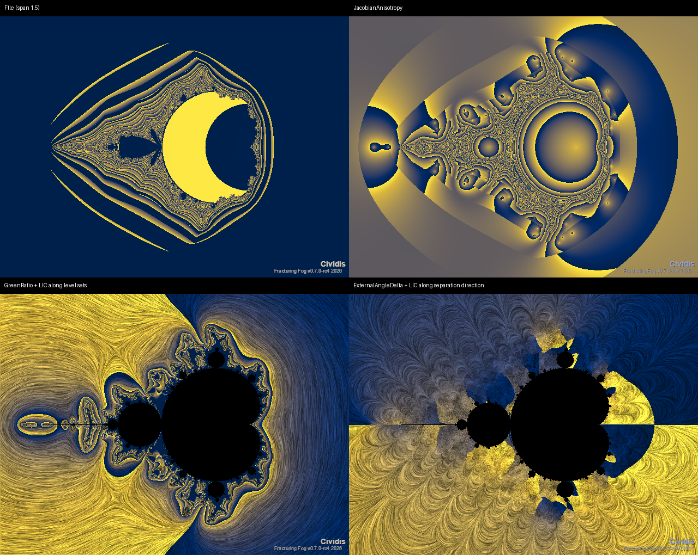
*Headless `--batch`, Cividis. Ftle; JacobianAnisotropy; GreenRatio with LIC along its level sets;
ExternalAngleDelta with LIC along the separation direction.*

**S15 as shipped (#1129).** Volume colour sources and quaternion parity.
- **Volume:** `DualOrbitVolumeColor` gains `SecantLyapunov`, `PhaseLag` and `PairWinding`
  (appended). Each surface point (c = X + iZ, s = (Y + s.x-centre) + i·s.y) is coloured by the 2D
  field at that (c, s).
  - The new `DualOrbitEscapeCalculator.TryFieldAt` runs the 2D pixel pass's own helpers (RunPair →
    PairScalar, Run → InteriorScalar), so **the volume and the 2D slice agree by construction**.
    Tested on a grid, and against the 2D render through `SurfaceFieldValue`.
  - **PhaseLag probes inward.** It lives where both orbits are bounded, just *inside* the surface,
    and a hit point is within ε outside. So a dead value is re-probed along −normal at
    2ε … 256ε (the Fatou component the surface bounds), and the categorical class colour is kept.
  - **SecantLyapunov and PairWinding** are sampled *on* the Julia boundary, where both genuinely
    fluctuate from point to point. The render is speckled, and that is the field, not noise in the
    method.
- **Quaternion parity audit.** In the complex subalgebra C_i (s = s_x·i, c = c_x·i) the Hamilton
  map *is* the complex map, so every field with a quaternion value must equal its complex value
  at s = i·s_x, c = i·c_x. Every `DualOrbitField` is classified, and a guard test fails if a new one
  isn't:

| Quaternion value | Fields |
|---|---|
| **= complex in C_i** (tested) | EscapeSeparation, MidpointResidual, DualOrbitAngle, DeltaN, GreenRatio, EscapeTimeZ/C, SecantLyapunov, DivergenceTime, ClosestApproach(+Index), MidpointPerturbation |
| **none** (interior) — planar angle or orientation | ExternalAngleDelta, PairWinding, ItineraryAgreement, FinalAngleDelta, BinaryXor, PathInterference(+Phase) |
| **none** — per-orbit sampling / image-plane derivatives | Trap*, Stripe*, Tia*, OrbitTheme*, Distance*, DualOutline, Ftle, JacobianAnisotropy |
| **none** — interior cycle / ensemble (complex-only so far) | PhaseLag(+Fraction), CyclePeriod, BasinEntropy, UncertaintyExponent |

- **Two bugs fixed by the audit:**
  1. **The quaternion SecantLyapunov read the round-off floor on bounded pairs.** It took
     ln|D_N| − ln|D_0| with D_N = c_N − z_N differenced, and once both orbits land on the same
     floating-point cycle the difference is exactly 0. The fix uses the symmetrised identity
     **c² − z² = ½(D·σ + σ·D)**, which is exact for quaternions because the cross terms cancel, to
     carry D explicitly (normalised, Σ ln|D'|/|D|). In C_i it is |σ|, matching the complex sum.
     λ now reaches ln|μ| (test: −0.6051 against −0.6047). The old S1 test, which pinned the
     telescoped value, is replaced by a full-Hamilton-product reference (bounded pair) and the
     telescoped value (escaping pair, where it is still accurate).
  2. **ExternalAngleDelta returned a live 0** under the quaternion map. It is now interior: there is
     no Böttcher angle in 4D.
- **Rotation covariance** (#970): conjugating s and c by a rotation about the i-axis rotates every
  orbit, so every norm-built field (SecantLyapunov, GreenRatio, EscapeSeparation, ClosestApproach,
  MidpointPerturbation) is invariant. Tested at two angles. These fields depend only on rotation
  invariants of (s, c) — the "radially trivial" reading: on the quaternion map they vary only with
  |s|, |c| and the angle between them.
- **Tests:**
  - `TryFieldAt` ≡ the 2D pixel on a rabbit Julia-plane grid (six fields);
  - the volume surface value ≡ the 2D render at 40 random points;
  - the PhaseLag inward probe takes the first live class;
  - each new source renders deterministically;
  - the parity classification of every field, with ln|μ| for the quaternion λ;
  - rotation covariance; CLI round trip.

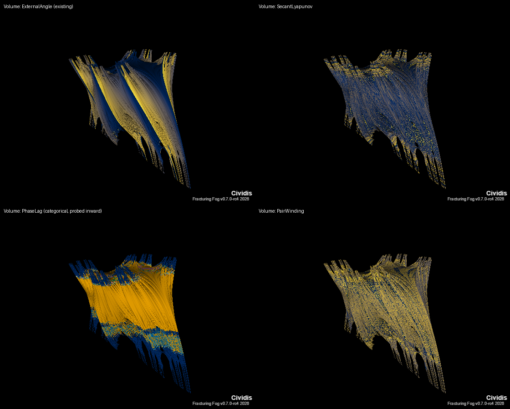
*Headless `--batch` Julibrot (then DualOrbitVolume), Cividis: ExternalAngle (existing), SecantLyapunov, PhaseLag
(categorical: lag-0 amber on the layers whose s is in M), PairWinding.*

**Escape-step smoothing (#1144).** `DualOrbitLyapunovSmooth` (default off, so the shipped look is
byte-identical) removes the escape-band terraces from the two step-additive pair fields.
- **Why they jump:** the pair window holds N whole steps (until either orbit escapes). λ = S_N/N
  and the winding sum W_N jump wherever N changes.
- **The blend:** the window really closes at the continuous time T = min(smooth count of each
  escaping orbit) ∈ (N − 1, N]. The fields blend the N- and (N − 1)-step values by w = T − (N − 1),
  as the S3 stripe average does (Härkönen):
  λ = w·S_N/N + (1 − w)·S_{N−1}/(N − 1) and W = W_N − (1 − w)·(the last step's turn).
- **Why it is continuous:** across an edge (N → N + 1), T is continuous, and the blend meets itself
  (w → 1 on one side, w → 0 on the other).
- **Scope:** bounded pairs (no escape) are unchanged.
  - **The quaternion pair runner records T too,** so C_i parity holds with smoothing on.
  - **Not smoothed:** `MidpointPerturbation` is a point value at step N rather than a window sum
    (blending would mix different steps' geometry), and the separation-based fields are minima or
    crossing times.
- **Tests:**
  - the blend against a test-side loop at three points, with off = the original values;
  - **continuity at band edges** found by bisection on the test-side step count. The smoothed jump
    is < 1e-4 of the raw one, for both λ and winding, over ≥ 3 edges near the s = ¼ cusp;
  - a 2000-pixel scan whose largest jump shrinks below 0.2× the raw one;
  - bounded pairs unchanged; quaternion ≡ complex in C_i with smoothing; CLI round trip;
  - the recolour guard classifies it as geometry.

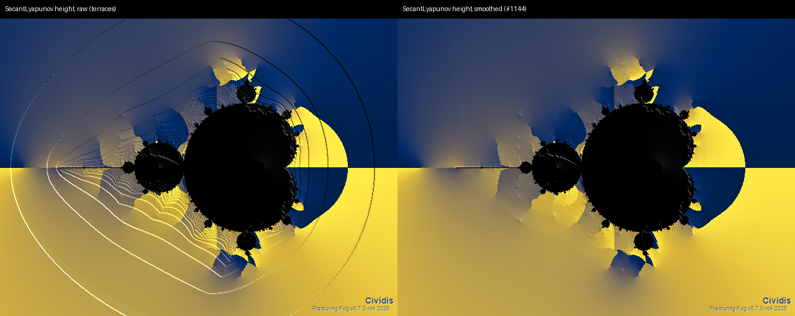
*Headless `--batch --relief`, the S9 split (colour ExternalAngleDelta, height SecantLyapunov).
Raw: escape-band terraces. Smoothed: continuous.*

**Progressive preview (#1146).** Julibrot Pair now gets the host's Wave 2.5 progressive chain
(¼ → ½ → full) during interaction, like Mandelbrot. Previously that chain covered the canonical
Mandelbrot path and, since #327, only *relief-eligible* alt types.
- **How:** `FractalRenderHost.AlwaysProgressiveAlt(type)` names alt types that are expensive per
  pixel. For those, `AltPreviewEligible` is true whether or not relief is on. The S13 ensemble fields
  cost N·(1 + L) orbits per pixel, and the orbit-theme and Jacobian fields re-iterate.
- **Reuses the #327 machinery:** the low-res twin comes from `CreateReliefFieldCalc`, configured by
  `SyncAltStateFromMandel`. The upload tail applies relief only when relief is on. The final stage is
  the unchanged full render, so the settled frame is **byte-identical** to a single pass (tested).
  Extra cost ≈ 1/16 + 1/4 ≈ 31 % of a frame, paid only on interactive (progressive) triggers.
- **Headless renders** (`--batch`, export, video) stay single-pass by design.
- **Not done:** the tile-level budget (cap orbits per frame, continue on the next frame). A finer
  ensemble pre-pass (N/8 first) is also possible later; the resolution chain already makes heavy
  views responsive.
- **Tests:** through a real `FractalRenderHost` with a recording renderer:
  - Julibrot Pair uploads the quarter, then half, then full frame, and the final frame equals a
    non-progressive render;
  - a non-relief Julia keeps its single full render;
  - Mandelbrot's chain is unchanged.

---

## 4. Architecture (S1 #1115)

- `DualOrbitPairAccumulator`: an opt-in, per-pixel struct updated inside `Run` / `RunQuat`.
  Each field or theme declares which sub-accumulators it needs, so the default path does no extra work.
- Optional cache planes are added to the #981 cache only when needed, keeping it at ≤ ~40 B/px at
  1080p. Every new param is classified as geometry or colour-only in the reflection guard.
- Expose `ITrapFieldSource` / `IDistanceFieldSource` so Relief's Trap / Blend / Distance height
  sources work.
- **Dual Buddhabrot** is a new `FractalType` on `BuddhaFamilyCalculator`, reusing its Metropolis,
  progressive, HD and zoom-compensation machinery. Channel buffers replace the iteration bands.
- **S1 as shipped (#1115).** `DualOrbitPairChannels` flags (`SecantLogSum`, `Winding`, `Separation`,
  `MidpointPerturbation`, `Itinerary`, `Derivatives`) live on the calculator (`PairChannels`) and are
  merged with what the selected field needs (`ChannelsFor`; every shipped field needs none).
  `None` keeps the original `Run` path, so output is byte-identical with no allocation. Otherwise
  `RunPair` / `RunQuatPair` iterate in lockstep with `Run`'s exact arithmetic; tests prove the cached
  render is byte-identical with or without channels.
  - **Accumulation window:** steps `0 … N−1`, where N is the first step at which *either* orbit is
    past the bailout.
  - **Derivatives** are stored as `(ln|d|, arg d)` floats at each orbit's own escape step, so they
    don't overflow float.
  - **Quaternion:** the secant sum is the telescoped `log|D_N| − log|D_0|`; winding, itinerary and
    derivatives are NaN.
  - **Cost** (1280×720 @ 500 iterations, this machine): default 47–53 ms (unchanged); single
    channels 75–165 ms (winding, with atan2 per step, is the most expensive); all channels about
    300 ms. Planes cost 40 B/px without derivatives and 64 B/px with them.
  - **Deferred to the slices that consume them:** trap / stripe sub-accumulators and
    `ITrapFieldSource` (S3), and `IDistanceFieldSource` (S4).
  - **Finding:** the direct `|c_N − z_N|` hits round-off (~1e-16) once the orbits converge, but
    the σ-sum keeps tracking the true contraction. That's why the secant fields accumulate σ.
- **S2 as shipped (#1116).** Seven fields were appended to `DualOrbitField`: `SecantLyapunov`,
  `DivergenceTime`, `ClosestApproach`, `ClosestApproachIndex`, `PairWinding`, `MidpointPerturbation`,
  `ItineraryAgreement`. Each one requests its channel through `ChannelsFor`. The scalars follow the
  shipped fields' `[0, maxIter]` contract:
  - `SecantLyapunov` uses a diverging ±`DualOrbitLyapunovSpan` (default 2 nats/step).
  - `ClosestApproach` uses `1 − e^(−depth/8)`.
  - `MidpointPerturbation` uses log10 over ±6 decades.
  - `PairWinding` gives one palette unit per turn, centred.
  - The count-like fields (`DivergenceTime`, `ClosestApproachIndex`, `ItineraryAgreement`) are used raw.

  Liveness comes from the accumulator, not from the escape flags (cache bit `FlagPairDead`):
  `DivergenceTime` is interior where the pair never diverges, and `PairWinding` /
  `ItineraryAgreement` are interior under the quaternion map. New params `DualOrbitLyapunovSpan` and
  `DualOrbitDivergenceRatio` are always in `GeometryKey`, so the #981 guard classifies them as
  geometry.
  - **Round-off floor (found in the smoke render):** the separation is read as at least
    `1e-14·|(z, c)|`, and the closest-approach index keeps the *first* step that reaches the minimum
    (to 1e-9 relative). Without this, converged pairs speckled `ClosestApproach` / `Index` under
    cycling themes.
  - **Seams:** `PairWinding` has sharp seams by construction. It's a sum of principal args, a
    topological label rather than a smooth field.

  
  *All seven S2 fields rendered headless via `--batch` at app defaults (c = 0.5). The exteriors of
  ClosestApproach / Index are flat there because the minimum separation is at step 0; the structure
  is inside M.*
- **Batch parity** (CLAUDE.md): new params flow through `RegionFractalParams` → `--param`.
  `BuildFractalParameters`, the Command-builder live seed and a round-trip test go in the same change,
  per slice.

---

## 5. Numerical validation (2026-10-05)

Prototype: [`DualOrbit-Coloring-Prototypes/dualorbit_checks.py`](DualOrbit-Coloring-Prototypes/dualorbit_checks.py)
(NumPy; not shipped code). Each check tests an **independent invariant**, not self-consistency.
These become xUnit tests in the slices.

| # | Claim | Independent check | Result |
|---|---|---|---|
| C1 | pair ≡ bicomplex orbit | bicomplex product built from the basis table only (`i² = j² = −1`, `k = ij`, `k² = 1`), components extracted by idempotent projection, vs two separately iterated complex orbits; 400 random (s, c) | **PASS** — max rel err 1.4e-12, 0 escape-step mismatches |
| C1b | split-complex step `m' = m² + e² + s`, `e' = 2me` | vs the bicomplex orbit | **PASS** — 1.7e-16 |
| C3 | secant λ inside M_c | analytic multiplier μ of the critical cycle (`Π 2ζ_j`), for s = 0.2 (p 1), −0.9 (p 2), −0.12+0.74i (p 3), 0.28+0.53i and −1.3+0.05i (p 4); c over a grid of the filled Julia set | **PASS** — lag 0: `λ → log|μ|/p` (≤ 3.6e-3); lag ≠ 0: `λ → 0` (≤ 1.1e-4) |
| C3 | phase lag well defined | number of distinct lags vs the period p from cycle detection; lag stable from N to N + p | **PASS** — distinct lags = p for p = 1..4; all stable |
| C4 | Böttcher ratio is intrinsic | bailout 128 vs 4096; known parameter rays (real s > ¼ → 0, s < −2 → ½) | **PASS** — worst 4.5e-4; rays exact. *(The functional-equation sub-check `φ(f u) = φ(u)²` is tautological in this implementation; it's a code sanity check only, not evidence.)* |

**Corrections to the session's first-pass claims** (what the checks found):
1. *"Secant λ → log|μ|/p inside M_c."* That holds only when the two orbits share **cycle phase**.
   With phase lag `k ≠ 0`, `D_n` becomes periodic and non-zero, so `Π|σ|` over a cycle is 1 and
   `λ → 0`. The secant λ therefore **reproduces the phase-lag partition** (S2 ↔ S7).
2. *"The Böttcher ratio's real part is `GreenRatio`."* Wrong. The real part is the **difference**
   `G_c − G_z`; `GreenRatio` is `log₂(G_c/G_z)`. The imaginary part is exactly `ExternalAngleDelta`.
3. *"The bicomplex link gives free 3D."* Overstated. The sets are product-structured (known); the
   relational colouring is the contribution.

### Prototype renders

All at c = 0.5 (the FF default) unless noted; s-plane `[−2.1, 0.7] × [−1.4, 1.4]`.

| | |
|---|---|
|  | **Secant Lyapunov.** Blue = contracting pair (interior, no hole), amber = separating, banded exterior. Dark wedges in the period-2 bulb = lagged lobes (`λ = 0`). |
|  | **Phase lag** (s-plane). White = lag 0, grey = M \ M_c, blue→amber = lag k/p in small bulbs. Plain in this plane; the showcase is the Julia plane (CxCy). |
|  | **Böttcher-ratio domain colouring.** Hue (blue↔amber cyclic) = Δθ, stripes = G_c − G_z. Dipole patterns around each minibrot. |
|  | **Dual Buddhabrot composite**, c = 0.5. Blue = Z (classic), amber = CB, white = CE. 4 M samples, NMIN 12. |
|  | **CB channel alone**, c = 0.5. Correlation with classic Z: 0.78. |
|  | **CB channel**, c = −0.3+0.6i. Asymmetric, Julia-like lace (corr 0.71). Changing c re-textures the channel → c-sweep animation. |

Other renders: [`dual-buddhabrot-Z.png`](../Images/dualorbit-coloring/dual-buddhabrot-Z.png),
[`dual-buddhabrot-composite-cm0p3p0p6i.png`](../Images/dualorbit-coloring/dual-buddhabrot-composite-cm0p3p0p6i.png).
Scripts: [`dualorbit_previews.py`](DualOrbit-Coloring-Prototypes/dualorbit_previews.py),
[`dual_buddha2.py`](DualOrbit-Coloring-Prototypes/dual_buddha2.py) (`python dual_buddha2.py "-0.3+0.6j"`).

---

## 6. Slice plan (epic #1114)

| Slice | Issue | Depends on | Summary |
|---|---|---|---|
| S1 | #1115 | — | pair accumulator + extended cache (foundation) |
| S2 | #1116 | S1 | pair-native fields (secant λ, divergence, winding, …) |
| S3 | #1117 | S1 | traps + stripe / TIA per orbit |
| S4 | #1118 | S1 | DE + final-z per orbit (dual outlines, XOR) |
| S5 | #1119 | S3 | co-moving orbit trap |
| S6 | #1120 | S1 | Böttcher-ratio domain colouring |
| S7 | #1121 | S2 | interior cycle phase lag |
| S8 | #1122 | S1 | bivariate modes (2D palette, copula EQ, OkLab split, FM) |
| S9 | #1123 | S1 | Relief split: height / colour channels |
| **S10** | **#1124** | (S1 shared code; parallel OK) | **Dual Buddhabrot core — epic goal** |
| S11 | #1125 | S10 | Dual Buddhabrot variants (midpoint, chord, escape-location, bands, c-sweep) |
| S12 | #1126 | S6 | path-interference colouring |
| S13 | #1127 | S2 | basin entropy / uncertainty exponent |
| S14 | #1128 | S1, S4 | FTLE / Jacobian + LIC |
| S15 | #1129 | S2, S7 | volume colour sources + quaternion parity |
| — | #1130 | deferred | novelty research |

**Suggested order:** S1 → S2 → **S10** → S6 → S7 → S3 / S4 → S8 → S11 → S5 → S9 → S12 → S13 → S14 → S15.
#867 (S4 deposition) is superseded by S10/S11. #868 (glyphs) is revisited by S14's LIC.

---

## 7. Open design questions

- **S1:** Cache budget versus recolour scope. Should trap shape be in the `GeometryKey` (re-iterate
  on a shape change), or should each shape's planes be cached?
- **S8:** Where do 2D palettes come from? A built-in set first; PaletteBuilder image extraction later
  (#392 tails).
- **S10:** Should the c-seed in the Dual Buddhabrot also be samplable (4D (c, s) sampling — a density
  over all Julia sets) as a mode, or stay fixed? Fixed first, because it makes c an animation knob.
- **S13:** Per-pixel ensemble cost (×N). Progressive refinement only, or also a tile-level budget? → S13 shipped single-pass with a Brent early-out; host progressive refinement filed as #1146. #1146 shipped the ¼ → ½ → full preview chain; the tile-level budget is still open.

---

## 8. Novelty status (#1130, researched 2026-10-05)

**Method.** Targeted web and literature search (arXiv, Wikipedia, vendor docs, Ultra Fractal formula
reference, Gnofract4D manual, Fractint material, Paul Bourke, Jos Leys, Melinda Green, Wolfram
reference, the Daza / GMOY basin literature) for each candidate and for dual-seed features in
shipping software.
- **Coverage limits:** not exhaustive. The Ultra Fractal public formula database (thousands of
  user formulas) and the Fractal Forums archive could only be searched through the web index
  (forum fetches were rate-limited, HTTP 429). Fractint's own julibrot help page was offline
  (spanky.fractint.org); its description here comes from secondary sources.
- **What "apparently new" means:** *no prior art found* in this search, not *proven first*.
- **Not a reason to claim invention:** general formula languages (Ultra Fractal, ChaosPro,
  Gnofract4D, FF's own DSL) can express any of these colourings in a few lines. FF's defensible
  claim is a *shipped, named, tested and documented* feature set, not a mathematical invention.

**Headline.**
- **The objects are known.** Each orbit alone is a classic set:
  - the z-orbit is the Mandelbrot set;
  - the c-orbit is a "perturbed" Mandelbrot set (z₀ ≠ 0, Fractint's initial-orbit / perturbation
    parameter);
  - the pair is two fibres of the 4D **Julibrot** space (z₀, c) that share their parameter;
  - the 3D volume (now named **Julibrot**, #1154) is a 3D slice of that same Julibrot space.
- **The pair algebra is known:** D_{n+1} = D_n·(z_n + c_n) is the perturbation-theory recurrence
  δ_{n+1} = δ_n(2Z_n + δ_n) behind every modern deep-zoom renderer. The bicomplex equivalence is
  Rochon (2000).
- **What no source showed: relational colouring.** That is, colouring one pixel by the
  *relationship* between two seeds' orbits under a shared parameter: their phase lag, secant growth,
  joint escape outcome, co-moving traps, Böttcher ratio or joint palette. That, as a packaged
  feature family, is where FF's contribution lies.

### 8.1 Method verdicts

| # | Method | Closest prior art found | Verdict |
|---|---|---|---|
| 9 | **The construction** (two seeds, shared s) | Julibrot (z₀, c) space: Fractint julibrot type; Gnofract4D's 4D (c, z₀) view; perturbed-z₀ Mandelbrot sets; bicomplex quadratic (Rochon 2000; product of two complex orbits in idempotent coordinates) | **Known object.** FF reads *two* Julibrot points per pixel and colours their relation; no software found doing that |
| 1 | Secant Lyapunov Σ ln\|z_k + c_k\| | D' = D·σ *is* the perturbation recurrence (deep-zoom renderers); Lyapunov-exponent colouring of M / J (SFU / Corless notes; generalised M–J Lyapunov papers); FSLE (Aurell 1997) | **Variant of known.** The quantity is a finite-difference Lyapunov exponent of a seed pair. The lag-0 / lag ≠ 0 interior dichotomy (λ → ln\|μ\|/p against → 0) is FF's analysis; not found published |
| 2 | Co-moving orbit traps | Orbit traps (Pickover; UF Standard / DMJ traps with a *fixed* "Trap Position" transform) | **Apparently new as a feature.** No trap riding another iterated orbit found; trivially expressible in UF |
| 3 | Böttcher-ratio domain colouring | Böttcher coordinate (Wolfram `MandelbrotSetBoettcher`), external angles / binary decomposition (mrob), and φ_s(z₁) = Φ_M(s) (Douady–Hubbard) | **Variant of known.** Domain colouring of a ratio of two standard invariants. The colouring, and FF's branch-cut finding (G(c₁) ≤ G(z₁)/2), weren't found published |
| 4 | Interior phase lag | Colouring Julia interiors by which cycle component / point an orbit lands in (standard Fatou-basin pictures) | **Variant of known.** FF measures the lag *relative to the critical orbit*, in the parameter plane |
| 5 | Path interference | None specific. At FF's default γ = 0 it is a sinusoidal contouring of ΔG (a standard palette-on-scalar technique applied to S6's Green difference) | **Apparently new framing, low depth.** Present it as a physics-motivated mapping, not a new invariant |
| 6 | Dual Buddhabrot joint-outcome channels | Buddhabrot / Anti / Nebulabrot (Green); nonzero-z₀ Buddhabrots (Rosenman's plug-in 2015 "variable mutation"; Lobo); 4D Buddhagram over all of (z₀, c) (Green). *Conceptual* analogue: cubic-family parameter space classified by which critical orbits escape (Branner–Hubbard, Milnor) | **Apparently new as a render mode** (condition one seed's deposit on the other seed's outcome). No such channel split found |
| 7 | Copula / joint-equalised bivariate palettes | 1D histogram colouring (standard); bivariate colour maps (general visualisation) | **Combination of known techniques.** No fractal-specific 2D equalisation found |
| 8 | Pair-chord deposition | Buddhabrot deposition variants | **Apparently new, low depth.** A one-line deposition variant |
| — | S13 basin entropy / uncertainty exponent | Daza et al. 2016; Grebogi–McDonald–Ott–Yorke 1983; `Basins.jl` computes both for dynamical systems | **Known metrics,** applied per pixel to a c-seed ensemble. Application, not method |
| — | S14 FTLE / anisotropy, LIC | FTLE (Haller; FTLE field renderers); Lyapunov colouring of M; LIC (Cabral & Leedom 1993) | **Known tools.** The pair-map Jacobian [[a, 0], [b, d]] and its anisotropy as a colouring weren't found |
| — | S15 quaternion parity / explicit-D | The quaternion Mandelbrot / Julia sets are long-standing | The symmetrised identity c² − z² = ½(Dσ + σD) is elementary. It is an implementation note, not a claim |

### 8.2 Dual-orbit-escape-like features in shipping software

| Software | What it offers that overlaps | What it does not do (as found) |
|---|---|---|
| **Fractint** (Tyler, Wegner, Peterson, Branderhorst; 1989–) | Initial-orbit (z₀) **perturbation** of the Mandelbrot set; the **julibrot** type, a 3D slice of (z₀, c) space built from layered 2D Julia sets | One orbit per pixel; no relational colouring |
| **Gnofract4D** | Treats any two-parameter fractal as a 4D object (x, y, z, w) = (c.re, c.im, z₀.re, z₀.im) and views 2D slices at **arbitrary 4D rotation** | One orbit per pixel; 2D slices only |
| **Ultra Fractal** | Start-value / perturbation parameters; Mandelbrot ↔ Julia switch; orbit traps with a trap-position transform; perturbation deep zoom (a reference orbit plus a delta, internally the pair recurrence); a general formula language | No shipped dual-seed colouring found (the formula DB could only be searched through the web index). Anything here is *scriptable* there |
| **Kalles Fraktaler / Mandel Machine / mathr's tools** | Perturbation reference-orbit pairs (internal); atom domains, interior coordinates, external angles (Heiland-Allen) | The pair is a numerical device, not a colouring |
| **Rosenman Buddhabrot plug-in** (2015), Lobo's gallery | Nonzero-z₀ ("variable mutation") Buddhabrots; **4D projection planes**; Anti / Nebulabrot | No conditioning on a second seed's outcome |
| **Melinda Green's 4D Buddhagram** | Buddhabrot sampled over **all of (z₀, c)**, projected to any 2D plane | No pair / outcome channels |
| **Jos Leys; Fractal Forums "juliabrots 3d"; POV-Ray** | **3D Julibrot renders** (slices of (z₀, c)); POV-Ray `julia_fractal` (quaternion / hypercomplex Julia) | Shape renders; per-layer critical-orbit colouring not found |
| **Paul Bourke** | Volumetric fractal ray casting; higher-dimensional Julia sets | Not the (c, s.x) Julibrot slice specifically |
| **Wolfram Language** | `MandelbrotSetBoettcher` (the Böttcher coordinate) | No two-point ratio |
| **Basins.jl (Julia)** | Basin entropy, uncertainty exponent, fractal-boundary tests for dynamical systems | Not a fractal colouring |
| **Bicomplex / tricomplex research code** (Rochon group: Tetrabrot, tricomplex slices) | 3D slices of bicomplex / tricomplex Mandelbrot sets | Shapes; relational colouring not found |

**The 3D volume (now Julibrot) in particular.** World (X, Z) = c and Y = s.x at a fixed s.y. That is a
3D slice of the Julibrot space, so every horizontal layer is a filled Julia set, which is what
Fractint's julibrot type and the 3D Julibrot renders show. The *object* is therefore known (since
at least Fractint). Where no prior was found:
- colouring each layer by the critical orbit (`CriticalLayer`), which marks where the sweep crosses
  the Mandelbrot line;
- the S15 surface colours taken from 2D relational fields (secant λ, phase lag, winding);
- an analytic Hubbard–Douady-style DE with ∂u/∂s along the sweep axis.

The earlier description of the construction as "FF-original" overstated it, and has been corrected
(below).

### 8.3 How to describe it (user-facing)

- **Do say:** "colours the *relationship* between the critical orbit and a second seed's orbit under
  the same parameter: a 2D slice through Julibrot (z₀, c) space, read two points at a time"; "a
  family of relational colourings (secant Lyapunov, phase lag, Böttcher ratio, co-moving traps,
  joint-outcome Buddhabrot …) not found in other shipping fractal software as of 2026-10".
- **Do not say:** "new fractal", "new set", "first 3D …", or that the identities or metrics are new.
  The volume is a Julibrot slice; basin entropy, the uncertainty exponent, FTLE and LIC are
  established tools.
- **Claims corrected in this change:**
  - the `DualOrbitEscapeCalculator` header;
  - the `FractalType.JulibrotPair` (then `DualOrbitEscape`) doc comment;
  - Resources-Bibliography;
  - Theoretical-Fractal-RnD §3.6;
  - the Indra's Pearls design plan's aside.

---

## 9. References

- D. Rochon, "A generalized Mandelbrot set for bicomplex numbers," *Fractals* 8(4), 2000.
- A. Daza, A. Wagemakers, B. Georgeot, D. Guéry-Odelin, M. A. F. Sanjuán, "Basin entropy: a new
  tool to analyze uncertainty in dynamical systems," *Sci. Rep.* 6, 2016.
- C. Grebogi, S. W. McDonald, E. Ott, J. A. Yorke, "Final state sensitivity: an obstruction to
  predictability," *Phys. Lett. A* 99, 1983.
- E. Aurell et al., "Predictability in the large," *J. Phys. A* 30, 1997 (FSLE).
- G. Haller, "Lagrangian coherent structures," *Annu. Rev. Fluid Mech.* 47, 2015.
- B. Cabral, L. Leedom, "Imaging vector fields using line integral convolution," SIGGRAPH 1993.
- P. Blanchard, R. Devaney, L. Keen, "The dynamics of complex polynomials and automorphisms of the
  shift," *Invent. Math.* 104, 1991 (monodromy).
- M. Green, "The Buddhabrot" (1993); see also Theoretical-Fractal-RnD §7.
- M. Green, "The 4D Mandel/Juli/Buddhabrot Hologram," superliminal.com/fractals/bgram/bgram.html.
- Fractint (B. Tyler, T. Wegner, M. Peterson, P. Branderhorst), 1989–: julibrot type, initial-orbit
  perturbation. See en.wikipedia.org/wiki/Fractint.
- Gnofract 4D manual, "About the maths," gnofract4d.sourceforge.net/manual/maths.html (the 4D
  (c, z₀) object and slices).
- J. Leys, 3D Fractals gallery (Julibrots), josleys.com/show_gallery.php?galid=329.
- R. Rosenman, Buddhabrot plug-in (2015): 4D projection, initial-value mutation,
  richardrosenman.com/shop/buddhabrot/.
- Wikipedia, "Plotting algorithms for the Mandelbrot set" (perturbation recurrence, histogram
  colouring).
- Wolfram Language, `MandelbrotSetBoettcher`; R. Munafo, *Mu-Ency*: binary decomposition, external
  angle (mrob.com).
- Ultra Fractal help: Orbit Traps / DMJ OrbitTrapsColoring (trap-position transform),
  ultrafractal.com.
- J. Milnor, "Cubic polynomial maps with periodic critical orbit," arXiv:0910.1866 (escape regions
  of the two-critical-point family).
- Basins.jl documentation (basin entropy, uncertainty exponent), docs.juliahub.com/General/Basins.
- P. Bourke, "Visualising volumetric fractals," *GSTF J. Computing* 5(2), 2017.
- See also: [Theoretical-Fractal-RnD.md §7](Theoretical-Fractal-RnD.md).
