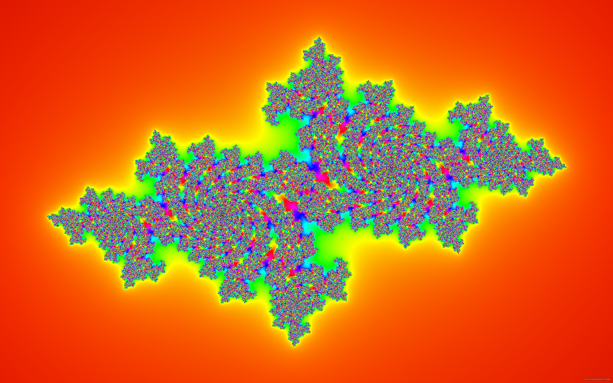
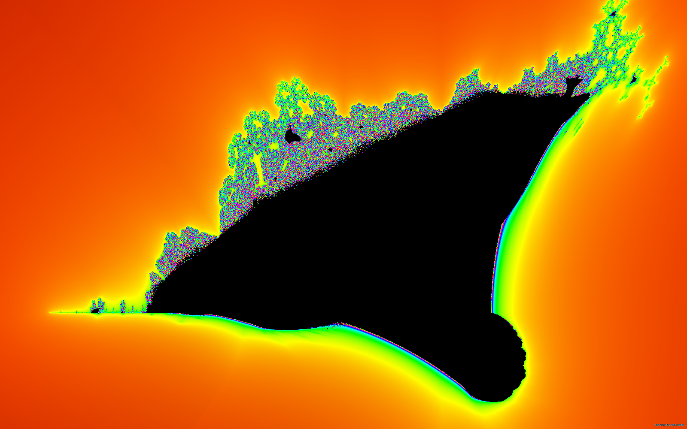
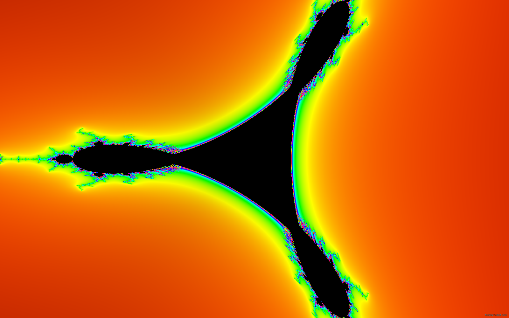
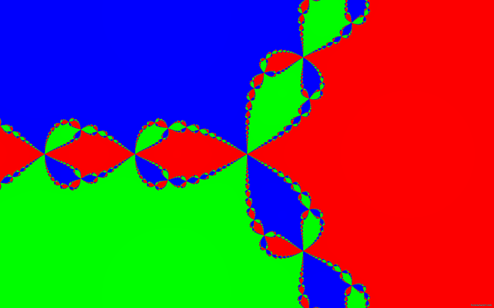

# Fracturing Fog — Avalonia User Guide

**Version 0.6.x · Windows x64 · .NET 10 · Direct3D 11/12 · Avalonia 12**

A complete tour of every feature exposed by the Avalonia shell — toolbar, floating menu, modeless editors, slideshow, capture, remote rendering. Companion to the in-app Help window (Help button or `?` in the Floating Menu).

> Companion pages: [User Index](_Index.md) · [Capture Guide](Capture-Guide.md) · [Regions Guide](Regions-Guide.md) · [Color Theme Editor Guide](ColorThemeEditor-Guide.md) · [Slideshow Guide](Slideshow-AudioReactive-Guide.md) · [CalcGen Guide](CalcGen-UserGuide.md) · [User Bulb 3D Guide](UserBulb-Guide.md) · [ColorGen Guide](ColorGen-UserGuide.md) · [Client/Server Guide](ClientServer-UserGuide.md) · [Keyboard Shortcuts](Keyboard-Shortcuts.md)


---

## A friendly tour

The fastest way to feel at home in Fracturing Fog is to know the five things you will use every
session, in the order you typically use them. Everything else is a refinement.

| Step | What you do                                                                        | UI surface                              |
|:----:|-------------------------------------------------------------------------------------|------------------------------------------|
| 1    | Pick a **fractal family** (Mandelbrot, Julia, Newton, …)                            | Toolbar → *Type* dropdown                |
| 2    | Navigate to something interesting (mouse + keyboard)                                | The render surface itself                |
| 3    | Pick a **palette / theme** you like                                                 | Toolbar → *Theme* dropdown               |
| 4    | Bookmark the view (press **`V`**) so you can come back                              | Region Navigation                        |
| 5    | Capture it — screenshot, poster, or video                                            | Floating Menu → *Image / Poster / Video* |

That is the whole core loop. You can spend an hour on step 2 alone. The hot keys make it muscle memory:

| Key           | What it does                                                       |
|---------------|--------------------------------------------------------------------|
| **`M`**       | Open / close the Floating Menu — the big stack of everything       |
| **`T`**       | Open / close the Color Theme Editor (live preview)                 |
| **`R`**       | Reset the view to whatever the current fractal's "home" is         |
| **`V`**       | Save the current view as a new region (bookmark)                   |
| **`Esc`**     | Stop a slideshow, exit Span mode, close a sub-dialog               |
| **`W/S`**     | Zoom in / out (centred)                                            |
| **`A/D/Q/E`** | Pan around                                                         |

### Worked example — "First five minutes, in plain English"

1. **Launch the app.** A classic Mandelbrot opens. The black blob in the middle is the *set* —
   points that, when you run the recipe `z = z*z + c` on them forever, stay finite. The colourful
   halos around it are points that escape. Hue shows *how fast* they escape.

2. **Hover the mouse over a swirl on the boundary** and roll the mouse wheel toward you. The view
   zooms in anchored at the cursor. Keep rolling. The picture grows new spirals, mini-cardioids, and
   filaments at every scale — that is the whole point.

3. **Hold the right mouse button and drag** to draw a rectangle over a tiny detail you want to
   inspect. Let go. The view jumps and zooms straight to that rectangle.

4. **Open the *Theme* dropdown** in the toolbar and click *Fire*. The picture repaints with warm
   oranges and reds. Try *Plasma*, *Phong3D Stone*, *Pbr3D Bronze*, *Domain Coloring*. There are
   hundreds; you will find favourites.

5. **Press `V`**. A prompt asks for a name. Pick anything. You have a bookmark.

You are now operating Fracturing Fog. Everything else in this guide is just expanding on each step.

---

## Table of Contents

1. [First Launch](#1-first-launch)
2. [The MainWindow](#2-the-mainwindow)
3. [Navigating the Set](#3-navigating-the-set)
4. [Floating Menu](#4-floating-menu)
5. [Region Bookmarks](#5-region-bookmarks)
6. [Color Themes](#6-color-themes)
7. [Color Theme Editor](#7-color-theme-editor)
8. [Post-FX](#8-post-fx)
9. [Adaptive Sweep](#9-adaptive-sweep)
10. [Slideshow + Video](#10-slideshow--video)
11. [Audio-Reactive Mode](#11-audio-reactive-mode)
12. [Screenshot + Poster](#12-screenshot--poster)
13. [Fractal Families](#13-fractal-families)
14. [User Equation + Sandbox + User Bulb](#14-user-equation--sandbox--user-bulb)
15. [Local Server + Remote Client](#15-local-server--remote-client)
16. [Quality + Precision](#16-quality--precision)
17. [Persistence](#17-persistence)
18. [Troubleshooting](#18-troubleshooting)

---

## 1. First Launch

Double-click `FracturingFog.exe`. The Avalonia shell opens at 1280×800 centered on the primary monitor. The default view is the classic Mandelbrot set at center (-0.5, 0), zoom 0.3.

On first run, `%APPDATA%\FracturingFog\` is created and populated with seed JSON files (built-in regions, default themes, an empty audio settings file). Nothing is written outside that directory.

If `--server` has already been launched once on this machine, the status bar shows a green `● Server` indicator on the right edge.

---

## 2. The MainWindow

```
┌──────────────────────────────────────────────────────────────────────┐
│ Type ▾  Quality ▾  Region ▾  Theme ▾    Grid Watermark Params Reset │
│                                          Edit Theme  Menu  Help     │
├──────────────────────────────────────────────────────────────────────┤
│                                                                      │
│                       (Render surface — Direct3D)                    │
│                                                                      │
│                                                                      │
├──────────────────────────────────────────────────────────────────────┤
│  ◀◀  ◀   ▮▮   ▶   ▶▶              (VCR — only while slideshow runs) │
├──────────────────────────────────────────────────────────────────────┤
│ CX -0.5  CY 0  Zoom 0.3  Iter 256  SP        ● Server                │
└──────────────────────────────────────────────────────────────────────┘
```

- **Toolbar (top)** — fractal type, quality preset, region / theme combos, overlay toggles, modeless-dialog launchers.
- **Render surface (center)** — Direct3D 11/12 swap-chain hosted in a `NativeControlHost`. An invisible `Border` ("InputSponge") above it captures pointer / key events for the Avalonia input adapter.
- **Slideshow VCR row** — only visible while a slideshow is running; never occluded by the swap-chain HWND.
- **Status bar (bottom)** — live CX / CY / Zoom / Iter, active precision (SP / DD / QD), render-time hint, and a colored `● Server` pill.

Both the toolbar and status bar can be hidden via the Floating Menu (`Status` checkbox). Span mode hides them automatically.

### Right-click sort menus

- **Region combo (toolbar OR menu):** right-click → `Default` or `By Fractal Type` filter.
- **Theme combo (toolbar OR menu):** right-click → `Default` / `All A–Z` / per-kind filter (Cycling / Phong3D / PBR3D / …).

---

## 3. Navigating the Set

### Mouse

| Input | Action |
|---|---|
| Wheel up / down | Zoom in / out anchored at the cursor |
| Left-click drag | Pan. A fast pass renders mid-drag; 300 ms after release a full-quality pass re-renders. |
| Double-click | Center on point + zoom in one step |
| Right-click drag | **Highlight to zoom** — marquee on the canvas; release centers + zooms to fill the rectangle. Mid-drag, the status bar shows the target box. |
| Right-click drag (3D) | Orbit camera. X = theta (azimuth), Y = phi (elevation, inverted for natural feel). |

### Keyboard

| Key | Action |
|---|---|
| `M` | Toggle Floating Menu |
| `T` | Toggle Color Theme Editor |
| `R` | Reset view (per-fractal default) |
| `V` | Save current view as a new region |
| `Esc` | Exit Span mode / stop slideshow / stop video zoom / close a sub-dialog |
| `W / S` | Zoom in / out (centered) |
| `A / D` | Pan left / right |
| `Q / E` | Pan up / down |
| `Shift+` pan key | Quarter-step pan |
| `Shift+W / Shift+S` | Quarter-step zoom / 3-D distance (fine) |
| Arrows (3D) | Orbit camera (↑↓ = phi, ←→ = theta) |
| `PgUp / PgDn` | Light azimuth |
| `Home / End` | Light elevation |

Keyboard pan/zoom/camera keys are **ignored** while a text box has focus (CX, CY, Zoom, Iter, equation editor, search box, …). Clicking the render surface restores focus — including after a toolbar click, since v0.6.2 fixed a focus regression that swallowed keystrokes after toolbar interaction.

---

## 4. Floating Menu

The Floating Menu is a modeless control panel containing every parameter exposed by the renderer. Open with `M`, the toolbar **Menu** button, or `?` for help.

```
View
  [Reset]  [Span]   [Image]   [Poster]
  [Slideshow]   [Video]   [Close Program]
  ☐ Status   ☐ Grid     Resolution ▾

Region Navigation
  Region ▾
  [Save] [Delete] [Exp…] [Imp…]
  CX  __________
  CY  __________
  Quality ▾
  Zoom  ________
  Iter  ________
  ☐ Lock Iterations
  [Go] [Flip Y] [Copy]

Color Themes
  Theme ▾
  [Exp…] [Imp…] [Delete] [Reload]
  [ Edit Theme… ]

Post-FX
  Brightness: ___  [—————◉—————]  ☐ Lock
  Contrast:   ___  [—————◉—————]  ☐ Lock
  Adaptive:   ___  [—————◉—————]  ☐ Lock
  [ Sweep ]   [5.0]  s

Slideshow
  [ Slideshow Settings… ]

Remote
  [ Server… ]   [ Client… ]
```

The Span / Video / Adaptive Sweep button labels flip while active (`Back`, `Stop`, `Stop Sweep`).

---

## 5. Region Bookmarks

A region captures **center coordinates (with full DD/QD limb fidelity)**, zoom factor, iteration count, fractal type, and an optional preferred theme.

### Saving

1. Pan / zoom to the view you want.
2. Press `V` or click the menu's **Save** button.
3. Type a name. If the name already exists, an overwrite confirmation appears (v0.6.2 added this; previously the existing entry was silently replaced).
4. The new region appears in both toolbar and menu combos.

### Applying

Pick the region in any combo. The view jumps with full precision, iter count restores, fractal type re-selects if it differs, and the preferred theme applies if recorded.

### Export / Import

- **Exp…** writes your user library to a JSON file.
- **Imp…** merges a region JSON into your library. Name collisions prompt per-region: Skip / Overwrite / Rename.

### Built-in tour

The shell ships a curated tour: cardioid valley, period-bulbs, seahorse valley, elephant valley, double-spirals, deep-zoom showpieces. Built-ins are read-only — selecting works, deleting does not.

### Slideshow filter

Slideshow Settings has an `Include extreme regions` checkbox. Off by default — gives a calmer rotation.

See [Regions-Guide.md](Regions-Guide.md) for the complete JSON schema.

---

## 6. Color Themes

200+ built-in palettes plus unlimited user themes. Categories include:

| Category | Examples |
|---|---|
| Escape Time | HSV, Fire, Plasma, Inferno, Twilight |
| Distance Estimation | Filament Glow, Dendrite, Distance Heatmap |
| Orbit Traps | Trap Circle, Trap Cross, Trap Image |
| Argument / Binary | Phase Spiral, Binary Decomposition |
| Domain Coloring | Argument HSV, Magnitude Log |
| Stripe Average (TIA) | Stripe Smooth, Stripe Banded |
| Lemniscate | Equipotential Rings |
| Phong3D | Bernstein, Copper Sheen, Solar Wind |
| PBR3D | Cesium Spectrum, Golden Phi |
| Chromostereopsis | Depth-3D Red/Blue |
| Post-Process | Painterly, Film Grain |
| ColorGen | Algorithmically-generated DSL output |
| JSON Imported | User-shared theme files |

Toolbar / Floating Menu Theme combo:
- **Exp…** — save the active theme to a JSON file.
- **Imp…** — load a theme JSON into your library.
- **Delete** — remove a user theme (built-ins protected).
- **Reload** — re-scan disk for edited JSON.
- **Edit Theme…** — open the live-preview editor.

Each theme can carry default Brightness / Contrast / Adaptive values. The Post-FX **Lock** checkboxes prevent a theme switch from overwriting your manual slider values.

---

## 7. Color Theme Editor

A modeless floating window. Open with `T`, the toolbar **Edit Theme** button, or the menu's **Edit Theme…** button.

### Kinds

| Kind | Description |
|---|---|
| Gradient | Multi-stop linear ramp once across iter range |
| Cycling | Same gradient repeated N times (CycleSpeed) |
| Phong3D | Cycling + Blinn-Phong from synthesized normals |
| Pbr3D | Cycling + Cook-Torrance PBR + material bands |

### Editing

- **Color stops** — add / delete / drag-reorder; click swatch for picker; minimum 2.
- **Lights** — Key + Fill + optional Rim. Direction, diffuse, specular, shininess.
- **Material bands (PBR)** — per-iter range (metallic, roughness) tuples.
- **In-set override** — opaque RGB for points that never escape.
- **Post-FX defaults** — per-theme brightness / contrast / adaptive.
- **From Image…** — sample a bitmap via k-means in CIELAB → 5-stop palette.

### Live preview

Tick **Live preview** to push edits through a 150 ms debounce. Calculator re-runs once per debounced commit, not per-keystroke.

### Save

- **Save to Library** validates name + ≥ 2 stops, then upserts into `colorthemes.json`. **v0.6.2 added an overwrite confirmation** when the typed name matches an existing user theme.
- **Export JSON…** writes a single-theme JSON array.
- **Save C#…** writes a compilable `ColorThemeData` C# class for ship-built-in inclusion.

See [ColorThemeEditor-Guide.md](ColorThemeEditor-Guide.md) for a deep-dive plus 20 worked examples.

---

## 8. Post-FX

Three real-time CPU sliders, applied before the BGRA buffer uploads to the GPU.

| Control | Range | Behavior |
|---|---:|---|
| Brightness | −100 … +100 | Additive offset; 0 = neutral |
| Contrast | −100 … +100 | Multiplicative gain; 0 = neutral (1.0×) |
| Adaptive | 0 … 100 | Histogram equalization; 0 = off, 100 = full |

Adaptive surfaces flat detail in deep-zoom shots where iteration counts cluster in a narrow band. Sliders debounce repaints to ~30 Hz so dragging never thrashes the pipeline.

### Lock checkboxes

Each slider has a **Lock**. When ticked, theme switches do not overwrite the current value. Useful for keeping your global brightness preference across theme browsing.

---

## 9. Adaptive Sweep

New in v0.6 — the Sweep button animates Adaptive 0 → 100 over a configurable duration with a sine ease-in/out. Re-press to cancel mid-sweep.

| Field | Range | Default |
|---|---:|---:|
| Duration (s) | 0.25 – 600 | 5.0 |

Use to demo the effect, find the sweet spot for a region, or generate a slow-build dramatic reveal in a video recording.

Internally, the sweep timer ticks at ~20 Hz (50 ms) and writes the slider value through the normal Adaptive setter — the throttled `RepaintWithAdaptive` debounce absorbs ticks at the renderer's preferred cadence.

---

## 10. Slideshow + Video

### Slideshow

Click **Slideshow** to start an auto-cycle. Defaults:

- 30 s per region
- 10 s per theme
- 3 s cross-fade

Configure via **Slideshow Settings…**. Set `Beats per Region = 0` (or Shift+click Slideshow) to lock the active region.

#### Record the slideshow to video

Tick **Record Slideshow** in Slideshow Settings to capture every cross-fade
step + dwell hold as a PNG sequence in a temp folder while the slideshow
runs. The chosen **Encode preset** (default `HighQualityH264Mp4`) is fed to
ffmpeg when you click Convert in the post-stop prompt.

On Stop you get **Convert** (ffmpeg → MP4/MKV at a path you pick),
**Save Frames** (move the PNG sequence to a folder of your choice), or
**Cancel** (discard the temp folder). Convert needs `ffmpeg.exe`; Save Frames
does not.

For headless capture, use the batch CLI:

```
FracturingFog.exe --batch --slideshow ""Default"" --seconds 90 \
                  --width 1920 --height 1080 --encode h264hq \
                  --out C:\out\slideshow.mp4
```

See [Capture-Guide.md §4a](Capture-Guide.md) for the full recording flow and
[§8 Batch CLI](Capture-Guide.md) for more `--slideshow` examples.

### VCR transport

Visible at the bottom of MainWindow while a slideshow is running:

```
◀◀  ◀   ▮▮   ▶   ▶▶
prev prev pause next next
region theme       theme region
```

### Single-shot Video Zoom

**Video** button → smooth animated zoom from the current view to the active region.

Two-phase motion: 5% pan, 95% log-zoom, both smoothstep-eased.

### Recording

Configure in Slideshow Settings → Video tab:

| Format | Notes |
|---|---|
| None | Live playback only |
| MP4 (built-in) | Media Foundation H.264; no external deps |
| Lossless H.264 | libx264 -qp 0, yuv444p, +faststart — needs ffmpeg |
| Lossless FFV1 | FFV1 v3 in MKV — needs ffmpeg |
| H.264 HQ | libx264 -crf 18 — needs ffmpeg |
| PNG sequence | Per-frame lossless dump (any mode) |

MP4 and PNG can record simultaneously. ffmpeg.exe is discovered in the app folder, `<install>\Tools\`, `<install>\Resources\`, or PATH.

### Live TAA tuning during video

While a video zoom is rendering, three extra sliders appear in the Floating Menu:

- **TAA Alpha** — temporal blend strength.
- **Fade Start** — zoom where the deep-zoom artifact fade begins.
- **Fade End** — zoom where the fade reaches full strength.

See [Slideshow-AudioReactive-Guide.md](Slideshow-AudioReactive-Guide.md).

---

## 11. Audio-Reactive Mode

Enable from Slideshow Settings → Audio tab or from the menu's **Audio Settings…**. The dialog is modeless; settings commit on OK.

Sources:

| Source | Description |
|---|---|
| System Loopback | Captures default audio output. Play Spotify / browser / game; the engine listens. |
| Audio File | MP3 / WAV / FLAC / OGG / AIFF / WMA. Plays through speakers AND drives the detector. |
| Microphone | Default capture device. Raise Sensitivity if signal is low. |
| Fractal Synth | Closed-loop showcase — fractal-derived audio drives the slideshow. |

Tunables:

- **Sensitivity 0–100 %** — spectral-flux onset threshold.
- **Beats per Theme / Region** — default 8 / 32.
- **Synth BPM / Routing** — Fractal-Synth only.
- **Beat-Detector EQ** — 5 band-weight sliders.
- **Fade × beat** — cross-fade duration as a fraction of beat. Default 0.75.

Settings persist to `%APPDATA%\FracturingFog\audio-settings.json`.

---

## 12. Screenshot + Poster

### Screenshot (Image button)

- One PNG / TIFF / BMP at the current panel resolution.
- Honours live Brightness / Contrast / Adaptive.
- Filename: `FracturingFog_Theme_Region_x...y...z...i..._WxH.png`.
- Watermark embedded (contrast-aware text color).
- In Span mode, covers the entire virtual desktop.

### Poster

Multi-tile composite render at print resolution. Each tile calculates separately at full quality; tiles stitch into one large image.

Dialog options:
- **Width / Height** — up to 32768 × 32768; 64 MP soft cap.
- **Tile size** — default 1024.
- **Format** — .png / .tif / .tiff / .bmp.
- **Output path** — file or folder. Folder → auto-named file.

Cancel any time — partial buffer is dropped.

### Remote poster (via Client dialog)

Pick a saved server connection → Mode = `image` → set Width / Height to your poster dimensions → render. Bytes stream back over TLS. For huge posters, use Return mode = `saved-path` (server keeps the file; you read it later over file share).

See [Capture-Guide.md](Capture-Guide.md) for resolution / DPI calculations and ffmpeg flag references.

---

## 13. Fractal Families

The Type combo lists 17 built-ins + a `— Registered —` divider + every promoted User Equation / Sandbox / User Bulb saved with the **Promote to fractal list** option.

Built-ins:

| Family | Engine | Notes |
|---|---|---|
| Mandelbrot | SP/DD/QD + Pert+BLA | The reference family |
| Julia | SP/DD/QD | Per-pixel z₀ = pixel, fixed c |
| Burning Ship | SP/DD/QD | abs() before squaring |
| Tricorn | SP/DD/QD | conj(z)² + c |
| Multibrot | SP/DD/QD | z^d + c |
| Phoenix | SP | z² + c + p·z_{n-1} (2-step memory) |
| Newton | SP | Root-finding basins |
| Buddhabrot | SP density | Stochastic histogram |
| IFS | Affine | Chaos game |
| L-System | Turtle | String rewriting |
| Strange Attractor | SP density | Clifford / De Jong / Lorenz |
| Mandelbulb (3D) | Raymarch | Triplex power p=8 |
| Tear Drop | SP | Wikipedia-flavoured deformation |
| Mandelbrot Z² Generated | All 5 paths | CalcGen-emitted reference |
| Mandelbrot Z³/⁴/⁵ Generated | Scalar/AVX2/GPU/Pert/BLA | Higher-power generated |
| Tricorn Generated | All 5 paths | CalcGen Tricorn |
| Burning Ship Generated | All 5 paths | CalcGen Burning Ship |

See the Help window's **Mathematics** tab for per-family math + history; the in-app docs cover Mandelbrot / Julia / Burning Ship / Tricorn / Multibrot / Phoenix / Newton / Nova / Buddhabrot / IFS / L-System / Attractor / Mandelbulb / User Equation / User Bulb / Sandbox / Mandelbrot Z² Generated.

### Reference renders

Each thumbnail is the family's *home view* — what you get from a fresh `Reset` with the default HSV palette (or the **New 3D** Phong palette for Mandelbulb). Compare silhouettes against your own renders to confirm the maths and palette dispatch are wired correctly.


*Mandelbrot — `z² + c`, the canonical reference family.*


*Julia — same iteration, but `c` is fixed and `z₀` sweeps the pixel grid.*


*Burning Ship — `(|x| + i·|y|)² + c`. The "smokestacks" come from the abs() fold.*


*Tricorn — `conj(z)² + c`. Threefold symmetry, hence the nickname.*


*Newton — root-finding basins. Each colour marks the root a starting point converges to.*

---

## 14. User Equation + Sandbox + User Bulb

Three authoring engines for one-off custom fractals.

### User Equation (CalcGen)

The User Equation modal is now split into two tabs:

- **User Equation** — Roslyn-compiled per-pixel `Complex Step(Complex z, Complex c, int n)`. Full access to System.Numerics.Complex + System.Math. Auto-recompile 1200 ms after the last keystroke. Optional **Validate for CalcGen** checkbox flags C# constructs the CalcGen DSL can't accept (`Complex.ImaginaryOne`, `Complex.Abs`, `new Complex(a, b)`, unsupported `Complex.*` members) and offers in-place fixes via a status-bar **Apply fix** button (shortcut **Ctrl+.**).
- **DSL** — bare CalcGen DSL: `z*z + c`, `sin(z)`, etc. Live-validated against the parser; bad tokens are selected and a fix is suggested when the lexer can guess one.

Both tabs share the header row (Saved combo / Save / Delete / Promote / Compile & Load / Generate via CalcGen). The active tab decides which source feeds CalcGen — Save respects the tab, so a DSL-tab entry reopens into the DSL tab and a User Equation entry reopens into the User Equation tab.

Each tab carries a `?` button that opens the in-app Help viewer to the relevant section; a **CalcGen Help** button on the header opens the full CalcGen User Guide.

```csharp
return z*z + c;                          // classic Mandelbrot
if (n == 0) z = c; return z*z + new Complex(-0.7, 0.27015);   // Julia
var w = new Complex(Math.Abs(z.Real), Math.Abs(z.Imaginary));
return w*w + c;                          // Burning Ship
```

CalcGen can also **code-generate** a full 5-path calculator (scalar + AVX2 + perturbation + BLA + ILGPU GPU) from a one-line equation. See [CalcGen-UserGuide.md](CalcGen-UserGuide.md).

### Sandbox

A restricted DSL (no .NET BCL access — safe to share). `z*z + c`, `let x = expr in body`, `if cond ? a : b`, `sin / cos / sqrt / exp / log / conj`, `abs / re / im / arg`.

```
z*z + c
let w = abs(re(z)) + abs(im(z)) * i in w*w + c
n < 8 ? z*z + c : z^3 + c
```

### User Bulb 3D

The 3D analogue. Roslyn-compiled `Vec3 Step(Vec3 z, Vec3 c, int n, double[] p)` or `Quat Step` for 4D mode. Mandelbulb-style raymarching with analytic or numerical DE. Animated `t` parameter. OBJ mesh export.

```
Vec3.Pow(z, 8) + c                       // canonical Mandelbulb
Vec3.SphereFold(Vec3.BoxFold(z, 1.0), 0.5, 1.0) * 2.0 + c   // Mandelbox
Vec3.Pow(z, 4 + 2*Math.Sin(t)) + c       // breathing bulb
```

All three engines persist to JSON under `%APPDATA%\FracturingFog\`. Saved entries with **Promote to fractal list** ticked appear in the toolbar Type combo as first-class fractal types.

---

## 15. Local Server + Remote Client

Render on a workstation, drive from a laptop. Both sides are the same `FracturingFog.exe`.

### Server mode (workstation)

```
FracturingFog.exe --server                       # loopback only
FracturingFog.exe --server --bind 0.0.0.0        # LAN-visible
```

First run generates a self-signed `ca.pfx` / `server.pfx` / `client.pfx` bundle in `%APPDATA%\FracturingFog\server-certs\`.

### Server admin dialog (in-shell)

Floating Menu → **Server…**:
- Status (uptime, in-flight, completed, last error)
- Lifecycle (Start / Restart / Kill)
- Limits (max-minutes / queue depth / max concurrent TLS)
- Rate limit (per-IP / burst)
- TLS hardening (1.3-only / revocation / pinned thumbprints)
- Paths (cert / log / work)
- Stale sweep (auto-purge work dir)

See [ServerAdmin-Guide.md](ServerAdmin-Guide.md).

### Client dialog (laptop)

Floating Menu → **Client…**. Master password unlocks the sealed connection vault (AES-GCM, PBKDF2-SHA256 200k iter). Then:
- Pick / save / delete a named server connection (cert + CA + optional password).
- Pick / save / delete a render preset (mode = image / video, fractal, region, theme, quality, size, video sub-options).
- Output path + return mode (inline-bytes / saved-path).
- Hit **Render Image** / **Render Video** — the button label flips with Mode.

### Remote batch CLI

```
FracturingFog.exe --batch --remote ^
    --connection NAME ^
    --render NAME ^
    --out C:\out\poster.png
```

The CLI prompts for the master password on stdin (no echo). Exit 0 on success.

Forbidden fractal types (User Equation / Sandbox / User Bulb) are blocked at the protocol layer to prevent RCE — the server only accepts built-in calculators.

See [ClientServer-UserGuide.md](ClientServer-UserGuide.md) for a full walkthrough including cert distribution and the master password vault.

---

## 16. Quality + Precision

| Tier | Zoom ceiling | Iter range | Wheel step | Precision |
|---|---:|---|---:|---|
| Draft | 1×10⁵ | 64 – 256 | ×1.40 | SP only |
| Standard | 1×10¹³ | 256 – 2048 | ×1.20 | SP → DD @ 10¹² |
| High | 1×10²² | 512 – 16384 | ×1.12 | SP → DD @ 10¹² |
| Ultra | 5×10²⁷ | 1024 – 65536 | ×1.08 | SP → DD @ 10¹² |
| Extreme | 5×10⁵⁸ | 2048 – 131072 | ×1.06 | SP → DD → QD |

Auto-promotion is transparent — status bar shows the live label (SP / DD / QD / AVX2 / PT / BLA / QD-PT).

Perturbation theory + Series Approximation + BLA make zooms past 10²⁵ interactive on consumer hardware.

### GPU compute

At shallow zooms the single-precision Mandelbrot pass can run on your graphics
card instead of the CPU. Turn it on with the **GPU compute** checkbox in the
Control Center, or toggle it any time with `Ctrl + G`. The two stay in sync, so
whichever you use, the other reflects the change.

- **When it engages.** GPU compute covers the fast, single-precision zoom band.
  Once a zoom crosses into double-double / quad-double territory the renderer
  transparently returns to the CPU high-precision path — the checkbox can be on
  without slowing deep dives down.
- **Automatic fallback.** On a machine whose graphics backend can't run the
  compute path, the toggle simply reports that it didn't engage and rendering
  continues on the CPU. Nothing breaks; you just don't get the speed-up.
- **Series Approximation on the GPU.** The polynomial skip that fast-forwards the
  early iterations can run in-shader as well, so the acceleration follows the
  render onto the card. The diagnostic toggles for these stages are listed under
  [Keyboard Shortcuts → Performance & Deep-Zoom Diagnostics](Keyboard-Shortcuts.md#performance--deep-zoom-diagnostics).

> [!TIP]
> If you are comparing GPU vs CPU output, open the performance HUD with `H` first
> and press `Shift + H` to reset its averages after each toggle — you get a clean
> before/after frame-time read that way.

---

## 17. Persistence

```
%APPDATA%\FracturingFog\
    regions.json                  user coordinate bookmarks
    colorthemes.json              user-imported / authored themes
    colorgen.json                 ColorGen DSL source library
    userequations.json            User Equation source library
    sandboxequations.json         Sandbox DSL source library
    userbulbs.json                User Bulb 3D library + chain steps
    audio-settings.json           audio-reactive slideshow config
    slideshow-settings.json       slideshow timing config
    client-connections.json       sealed mTLS connections
    client-render-presets.json    client render presets
    server-config.json            local server config
    server-certs\*.pfx            self-signed mTLS bundle
    server-logs\*.log             server session logs
    server-work\                  server scratch dir (auto-purged)
```

All JSON is human-readable indented output via `System.Text.Json`. Region + theme files round-trip with full DD/QD limb fidelity, so paste-back at zoom >10¹⁵ is bit-exact.

---

## 18. Troubleshooting

**Keystrokes ignored after clicking the toolbar.** Fixed in v0.6.2 — toolbar buttons no longer steal focus permanently from the canvas. Click the render surface once if the issue recurs.

**Saving a region/theme/bulb silently overwrote an existing one.** Fixed in v0.6.2 — Save now prompts to confirm overwrite when the typed name matches an existing entry.

**Slideshow VCR row not visible.** The row is only rendered while a slideshow is actively running. Start the slideshow from the menu first.

**Black screen at zoom > 10¹³ on Standard quality.** Auto-promotion is gated by Quality. Use High / Ultra / Extreme for deeper zooms, or pin iterations.

**Video records but the file is missing audio / artifacts.** The Lossless H.264 / FFV1 / H.264HQ presets require ffmpeg.exe on disk. The built-in `none` preset uses Media Foundation MP4 and needs no external dependency.

**Server status pill stays grey.** No local `--server` is running. Open the Server Admin dialog and click **Start**, or launch `FracturingFog.exe --server` from a separate command line.

**Client dialog reports `forbidden-fractal`.** The preset names a User Equation / Sandbox / User Bulb type. These are blocked over the wire. Pick a built-in fractal type instead.

**Sweep button is greyed out.** Adaptive must be enabled (not locked at 0 by a theme). Tick the Adaptive checkbox in Post-FX.

**Ctrl-Z / undo doesn't work in the canvas.** There is no view-history undo. Save important views as regions before exploring further.

---

### See Also

- [ColorThemeEditor-Guide.md](ColorThemeEditor-Guide.md)
- [Slideshow-AudioReactive-Guide.md](Slideshow-AudioReactive-Guide.md)
- [Regions-Guide.md](Regions-Guide.md)
- [ServerAdmin-Guide.md](ServerAdmin-Guide.md)
- [ClientServer-UserGuide.md](ClientServer-UserGuide.md)
- [CalcGen-UserGuide.md](CalcGen-UserGuide.md)
- [ColorGen-UserGuide.md](ColorGen-UserGuide.md)
- [UserBulb-Guide.md](UserBulb-Guide.md)
- [Architecture-Overview.md](Architecture-Overview.md)
- [Capture-Guide.md](Capture-Guide.md)
- [Keyboard-Shortcuts.md](Keyboard-Shortcuts.md)

---

*Fracturing Fog · Real-time high-precision Mandelbrot exploration · © 2026*
