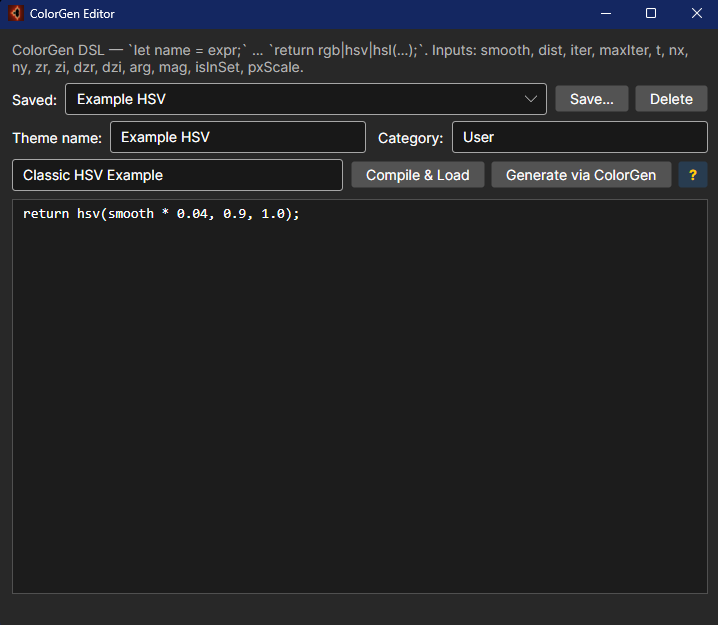

# ColorGen — User Guide

ColorGen turns a short DSL program into a fully-functional algorithmic
colour theme. Every pixel's escape data is exposed as named inputs; the
DSL evaluates to a `Vec3` colour in `[0, 1]^3` and the runtime packs that
into ARGB.

**Compile & Load** builds an **interpreted** colour map — the program is
parsed once and evaluated directly per pixel. There is **no compilation
step and no Roslyn/.NET code generation on the render path**, so it loads
instantly and is safe to share and open from other users' theme files.
**Generate via ColorGen** is the separate export path: it writes a
permanent C# file you can build into the app.

Open the editor from the render surface's **right-click → ColorGen
Editor…** menu.

> [!NOTE]
> ColorGen themes run on a pure interpreter (`InterpretedColorMap`). The
> older versions compiled each theme to a `.NET` assembly at runtime; that
> path was retired — nothing you type is ever compiled or executed as code.
> On the GPU, the same program is translated to an HLSL palette function
> (again, generated text, not compiled .NET), so GPU rendering is unaffected.

> Companion pages: [User Index](_Index.md) · [Color Theme Editor Guide](ColorThemeEditor-Guide.md)



---

## A friendly tour

ColorGen is a tiny **programming language for palettes**. You write one short program; it produces
the same kind of theme the Color Theme Editor's *Gradient* / *Cycling* knobs produce, except you can
do things that no list of colour stops could ever express — like *"the colour depends on the angle
of the orbit at escape"* or *"every prime iteration count gets a different hue"*.

If you have written a CSS calc() expression, a Google Sheets formula, or a Discord-bot message
template, you already know enough to write a ColorGen palette.

Every program ends with `return <colour>;`. Everything before is up to you.

### The shortest possible palette

```cg
return rgb(1.0, 0.5, 0.0);
```

That is an orange palette. Every pixel is the same colour. Boring — but it *is* a valid theme, and
it loads. Useful for proving the editor works.

### A first useful palette — hue tracks escape speed

```cg
let h = smooth * 0.03;
let s = 0.85;
let v = isInSet > 0.5 ? 0.3 : 1.0;
return hsv(h, s, v);
```

What is happening:

| Line                                  | Plain meaning                                                                                  |
|---------------------------------------|-------------------------------------------------------------------------------------------------|
| `let h = smooth * 0.03;`              | Hue (`0..1`) = smoothed escape count, scaled so a full rainbow spans ~33 iterations.            |
| `let s = 0.85;`                       | Saturation a constant 85 % — colours are vivid but not eye-strain.                              |
| `let v = isInSet > 0.5 ? 0.3 : 1.0;`  | Inside the set, value is dim grey; outside, value is full brightness. Reads like Mathematica.   |
| `return hsv(h, s, v);`                | Final colour, expressed in HSV.                                                                 |

Click **Compile & Load**. The render repaints with a rainbow that cycles every ~33 iterations.

### Worked example — "Match the colour to which direction the orbit escapes"

```cg
let angle = atan2(zi, zr);        // -pi .. +pi
let h     = (angle + 3.1415) / 6.2832;
let s     = 0.9;
let v     = isInSet > 0.5 ? 0.0 : 1.0;
return hsv(h, s, v);
```

The output is a *domain colouring*: the hue at each pixel matches the angle (argument) of the
final iterate. Pointing east is red, pointing north is green, west is cyan, south is purple. Try
it on Newton — the petals of each root get distinct hue zones automatically.


---

## 1. Quick start

1. Open **ColorGen Editor…**.
2. Type a DSL program. The default seed:
   ```cg
   let h = smooth * 0.03;
   let s = 0.85;
   let v = isInSet > 0.5 ? 0.3 : 1.0;
   return hsv(h, s, v);
   ```
3. Set the **Theme name** and (optional) **Category** / **Description**.
4. **Compile & Load** — the live render switches to the new theme.
5. **Save…** to persist the source (under
   `%APPDATA%\FracturingFog\colorgen.json`).
6. **Generate via ColorGen** to emit a permanent class under
   `Models/ColorSchemes/Generated/{Name}Theme.cs` — rebuild to ship.

The editor enforces one rule: the program must end with **exactly one**
`return <vec3>;`. Use `rgb`, `hsv`, `hsl`, or `palette` to produce the
final vec3.

---

## 2. Language reference

### 2.1 Statements

```
let <name> = <expr>;       // bind a local (Scalar or Vec3)
return <vec3-expr>;        // last statement; must be Vec3
```

`let` names cannot shadow built-in inputs or constants. Comments use
`//` (line) or `/* … */` (block).

### 2.2 Types

| Type    | Meaning                  | Channel access |
|---------|--------------------------|----------------|
| Scalar  | `double`                 | n/a            |
| Vec3    | RGB triple, each `[0,1]` | `.r .g .b`     |

Binary `+ - * / % ^` auto-broadcast scalar↔vec3 (the result is Vec3
when either side is Vec3). Comparisons and logical ops require scalar
operands and yield `1.0` / `0.0`.

### 2.3 Inputs (read-only built-ins)

| Name        | Type   | Meaning                                              |
|-------------|--------|------------------------------------------------------|
| `smooth`    | scalar | Smooth iteration count at escape                     |
| `dist`      | scalar | Exterior distance estimate (0 inside set)            |
| `iter`      | scalar | Iteration count at escape (or maxIter for in-set)    |
| `maxIter`   | scalar | Max iterations for this frame                       |
| `t`         | scalar | `smooth / maxIter` — convenience normalised [0, 1]   |
| `nx, ny`    | scalar | Surface-normal components in `[-1, 1]`               |
| `zr, zi`    | scalar | Final `z` at escape                                  |
| `dzr, dzi`  | scalar | Final `dz/dc` at escape                              |
| `arg`       | scalar | `atan2(zi, zr)` (radians)                            |
| `mag`       | scalar | `hypot(zr, zi)` = `|z|`                              |
| `isInSet`   | scalar | `1.0` if `iter >= maxIter`, else `0.0`               |
| `pxScale`   | scalar | Complex-plane width of one pixel (1.0 if unset)      |
| `trap`      | scalar | Orbit-trap distance measured against the **shape you pick from the Trap-shape menu** (same 19 shapes as the Color Theme Editor: Point, Cross, Circle, Line, Star, Square, Ring, Hyperbola, Lemniscate, Cardioid, DiagonalCross, Triangle, Hexagon, Heart, SineWave, Concentric, Grid, Pinwheel, PolarRose). Point (default) ⇒ identical to `trapMin`. †‡ |
| `trapMin`   | scalar | Orbit-trap distance: min `\|z_n\|` over the orbit (origin point-trap). †|
| `trapCross` | scalar | Orbit-trap distance to the nearer coordinate axis: min `min(\|Re\|,\|Im\|)`. †|
| `trapRing`  | scalar | Orbit-trap distance to a circle (r=0.3 at (-1,0)) — concentric ring filaments. †|
| `trapHyperbola` | scalar | Orbit-trap distance to the curve `\|Re·Im\|=1`. †|
| `trapHexagon` | scalar | Orbit-trap distance to a regular hexagon's edges. †|
| `stripeAvg` | scalar | Stripe average: mean of `0.5+0.5·sin(7·arg(z_n))` (classic SAC). †|
| `tiaAvg`    | scalar | Triangle-inequality average over the orbit. †|
| `curvature` | scalar | Mean `\|Δarg\|` between successive orbit segments (radians, ~`[0,π]`). †|
| `lyapunov`  | scalar | Mean `log\|2·z_n\|` — local divergence rate (unbounded; scale it). †|
| `gaussian`  | scalar | Mean distance to the nearest Gaussian integer (`~[0, 0.71]`). †|
| `expSmooth` | scalar | Mean `e^{−\|z_n\|}` (Kerry Mitchell) — weights orbits near the origin. †|

> **† Orbit inputs (F15).** These read the *whole orbit*, not just the
> escape point, so a program using any of them is rendered on the CPU
> orbit-sampling path. Both *Compile & Load* and *Generate via ColorGen* (C#
> export) support them — the exported class implements `IOrbitAwareColorMap` and
> samples the orbit itself. The one remaining caveat is the **GPU palette**: the
> escape-only shader can't compute these, so an orbit theme always renders on the
> CPU. Best on shallow zoom, like the built-in Orbit Trap / Stripe themes.
>
> **‡ `trap` (selectable shape, #611).** The **Trap shape** dropdown in the
> ColorGen editor picks the SDF the `trap` input is measured against — the same
> 19-shape list as the Color Theme Editor. The choice is saved with the theme.
> `trap` with the default **Point** shape is exactly `trapMin`. Because the 14
> non-legacy shapes have no GPU shader yet, a program using `trap` always renders
> on the CPU, and **C# export (*Generate via ColorGen*) of a `trap` theme is not
> supported yet** — use *Compile & Load* to render it live, or the fixed-shape
> inputs (`trapMin` / `trapCross` / `trapRing` / `trapHyperbola` / `trapHexagon`)
> when you need C# export.

> **Out-of-bounds colour (#615).** The **Out-of-bounds colour** toggle + picker
> in the ColorGen editor sets a dedicated colour for the beyond-escape-radius
> *surround* — the large flat disk you see when a 2D escape-time fractal is
> zoomed out far enough that the set shrinks to a dot. It colours that surround
> independently of the fractal, instead of leaving it as colour stop 0. Off by
> default (no change); the choice is saved with the theme and applies on
> *Compile & Load*. It is not a DSL input — it's a per-theme surround fill, so it
> doesn't affect your `return` expression. See
> `Docs/Technical/OutOfBounds-Surround-DesignPlan.md`.

### 2.4 Constants

`pi`, `tau` (= `2π`), `e`, `phi` (golden ratio).

### 2.5 Operators (precedence high → low)

| Group        | Operators        | Notes                          |
|--------------|------------------|--------------------------------|
| Postfix      | `.r .g .b`       | Channel access on Vec3         |
| Unary        | `- + !`          | `!x` is `1.0` iff `x == 0`     |
| Power        | `^`              | Right-associative              |
| Multiplicative | `* / %`        | `%` is GLSL-style `mod`        |
| Additive     | `+ -`            |                                |
| Comparison   | `< <= > >= == !=`| Scalar; yield `1.0` / `0.0`    |
| Logical AND  | `&&`             | Scalar                         |
| Logical OR   | `\|\|`           | Scalar                         |
| Ternary      | `?:`             | Branches must match types      |

### 2.6 Built-in functions

#### Scalar → Scalar
`sin cos tan asin acos atan sinh cosh tanh exp log log2 log10 sqrt abs
sign floor ceil round fract saturate radians degrees`

#### Two-argument scalar
`atan2(y,x) hypot(x,y) min(a,b) max(a,b) mod(x,y) pow(x,e) step(edge,x)`

#### Three-argument scalar
`clamp(x, lo, hi) smoothstep(edge0, edge1, x)`

#### Scalar `mix`
`mix(a, b, t)` — linear interpolation.

#### Hash / noise
`hash(x)` — pseudo-random scalar in `[0,1)` from a single input.
`hash2(x, y)` — two-input version.

#### Vec3 constructors
| Form                  | Description                                    |
|-----------------------|------------------------------------------------|
| `rgb(r, g, b)`        | Direct linear RGB (each in `[0,1]`)            |
| `hsv(h, s, v)`        | Hue is cyclic (`fract` is applied for you)     |
| `hsl(h, s, l)`        | Same hue convention                            |
| `oklab(L, a, b)`      | Perceptual OkLab → sRGB. `L∈[0,1]`, `a`/`b`≈`[-0.4,0.4]` |
| `oklch(L, C, h)`      | OkLCh → sRGB. `C` = chroma, `h` = hue in **radians** |

#### Vec3 operations
| Form                          | Description                                 |
|-------------------------------|---------------------------------------------|
| `mix(va, vb, t)`              | Polymorphic — picks Vec3 form when args are |
| `mix_oklab(va, vb, t)`        | Blend two sRGB colours through OkLab — smooth mid-tones |
| `palette(t, c0, c1, c2, …)`   | Cyclic n-stop palette evaluated at `t`      |
| `cosine(t, a, b, c, d)`       | IQ cosine palette: `a + b·cos(τ·(c·t + d))`, a/b/c/d Vec3 |
| `brightness(v, s)`            | Add `s` to each channel                     |
| `contrast(v, s)`              | Around 0.5; `s` in `[-1, 1]`                |
| `gamma(v, g)`                 | `pow(channel, 1/g)`                         |

### 2.7 Output packing

Final `return <vec3>;` clamps each channel to `[0, 1]` and packs as
opaque ARGB. There is no separate alpha; the colour map's interior
override is handled by the host (via `isInSet`).

---

## 3. Examples

Every example below is a complete program — paste verbatim into the
editor and Compile & Load.

### 3.1 Pure HSV cycler

```cg
return hsv(smooth * 0.04, 0.9, 1.0);
```

### 3.2 HSV with in-set override

```cg
let v = isInSet > 0.5 ? 0.3 : 1.0;
return hsv(smooth * 0.05, 0.85, v);
```

### 3.3 Sinusoidal RGB

```cg
let k = smooth * 0.1;
return rgb(
  0.5 + 0.5 * sin(k),
  0.5 + 0.5 * sin(k + tau / 3),
  0.5 + 0.5 * sin(k + 2 * tau / 3));
```

### 3.4 Cyclic palette

```cg
return palette(
  smooth * 0.02,
  rgb(0.05, 0.02, 0.10),
  rgb(0.40, 0.10, 0.55),
  rgb(0.95, 0.55, 0.10),
  rgb(1.00, 0.95, 0.70));
```

### 3.5 Banded gradient

```cg
let k = fract(t * 8.0);              // 8 bands across [0, 1]
return palette(k,
  rgb(0, 0, 0),
  rgb(1, 0.4, 0),
  rgb(1, 1, 0.7),
  rgb(0.2, 0.6, 1));
```

### 3.6 Distance-field glow

```cg
let d = tanh(dist / pxScale * 0.5);
let core = rgb(1.0, 0.95, 0.6);
let halo = rgb(0.1, 0.3, 0.9);
return mix(halo, core, smoothstep(0.0, 1.0, d));
```

`dist / pxScale` converts the raw complex-plane distance estimate into pixel
units, so the halo width stays constant at every zoom level. `tanh` gives a
smooth saturation curve — no hard edge where the glow flattens out.

### 3.7 Slope (Lambert) shading

```cg
// Light from upper-right; nx,ny are -1..1.
let lx = 0.4;
let ly = -0.4;
let lz = 0.8;
let nzNorm = 1.0;                         // implicit z component
let dotN = nx*lx + ny*ly + nzNorm*lz;
let lit = clamp(dotN, 0.0, 1.0);
let base = hsv(smooth * 0.03, 0.6, 1.0);
return brightness(base * lit, 0.05);
```

### 3.8 Argument coloring (domain coloring)

```cg
return hsv(arg / tau, 1.0, isInSet > 0.5 ? 0.3 : 1.0);
```

### 3.9 |z| chrome bands

```cg
let band = fract(log(mag) * 4.0);
let v = 0.4 + 0.6 * band;
return rgb(v, v, v);
```

### 3.10 Two-tone toon

```cg
let lit = nx*0.5 + ny*0.5 + 0.5;          // crude shade [0,1]
return lit > 0.6 ? rgb(1, 1, 1) : rgb(0.05, 0.05, 0.20);
```

### 3.11 Stripes from iter

```cg
let stripe = sin(smooth * pi / 4.0);
let base = palette(t,
  rgb(0.10, 0.10, 0.20),
  rgb(0.95, 0.25, 0.40),
  rgb(1.00, 0.85, 0.30));
return brightness(base, 0.10 * stripe);
```

### 3.12 Procedural noise

```cg
let n = hash2(floor(smooth), floor(t * 50.0));
let hue = fract(t * 3.0 + 0.1 * n);
return hsv(hue, 0.85, 0.9);
```

### 3.13 Field-line emphasis

```cg
let edge = smoothstep(0.0, 1.0, abs(sin(smooth * pi)));
let body = hsv(t * 3.0, 0.7, 0.9);
return brightness(body, -0.3 * edge);
```

### 3.14 Inside-set highlight

```cg
let outside = palette(smooth * 0.03,
  rgb(0,0,0), rgb(0.3,0.0,0.5), rgb(1,1,1));
let inside = rgb(0.0, 0.4, 0.6);
return isInSet > 0.5 ? inside : outside;
```

### 3.15 Phong-ish three light blend

```cg
let lit1 = clamp(nx*0.5 + ny*-0.5 + 0.7, 0.0, 1.0);
let lit2 = clamp(nx*-0.4 + ny*0.4 + 0.3, 0.0, 1.0);
let key = rgb(1, 0.95, 0.85);
let fill = rgb(0.2, 0.35, 0.7);
let c1 = key * lit1;
let c2 = fill * lit2 * 0.5;
let base = palette(t * 2,
  rgb(0.02, 0.02, 0.08),
  rgb(0.8, 0.6, 0.3),
  rgb(1, 1, 1));
return base * 0.5 + c1 + c2;
```

### 3.16 Cycling palette + lighting hybrid

```cg
let lit = clamp(nx*0.4 + ny*-0.4 + 0.5, 0.0, 1.0);
let p = palette(smooth * 0.015,
  rgb(0.00, 0.00, 0.05),
  rgb(0.10, 0.20, 0.60),
  rgb(0.95, 0.85, 0.30),
  rgb(1.00, 0.40, 0.20));
return brightness(p * lit, 0.04);
```

### 3.17 Power-law gamma

```cg
let base = palette(smooth * 0.02,
  rgb(0, 0, 0),
  rgb(1, 0.3, 0.1),
  rgb(1, 1, 1));
return gamma(base, 1.8);
```

### 3.18 Contrast-pumped grayscale

```cg
let g = saturate(smooth * 0.005);
return contrast(rgb(g, g, g), 0.6);
```

### 3.19 Hue-rotated escape phase

```cg
let phase = arg / tau + 0.5;             // [0, 1]
let hue = fract(phase + 0.15 * sin(t * tau));
return hsv(hue, 0.85, isInSet > 0.5 ? 0.3 : 1.0);
```

### 3.20 Layered psychedelia

```cg
let a = hsv(smooth * 0.04, 0.8, 1.0);
let b = hsv(smooth * 0.04 + 0.5, 0.8, 1.0);
let mixT = 0.5 + 0.5 * sin(t * tau * 3.0);
return mix(a, b, mixT);
```

### 3.21 Channel-shifted RGB

```cg
let k = smooth * 0.05;
let r = 0.5 + 0.5 * sin(k);
let g = 0.5 + 0.5 * sin(k + 1.0);
let b = 0.5 + 0.5 * cos(k * 1.3);
return rgb(r, g, b);
```

### 3.22 |dz/dc| highlight

```cg
let mag2 = sqrt(dzr*dzr + dzi*dzi);
let glow = saturate(log(1 + mag2) * 0.2);
let base = palette(smooth * 0.02,
  rgb(0.05, 0.05, 0.10),
  rgb(0.40, 0.20, 0.80),
  rgb(1.00, 0.95, 0.40));
return brightness(base, 0.3 * glow);
```

### 3.23 Threshold-banded posterise

```cg
let raw = saturate(smooth * 0.005);
let q = floor(raw * 6.0) / 5.0;
return hsv(q, 0.8, 1.0);
```

### 3.24 Interior cycle painter

```cg
let outside = palette(smooth * 0.03,
  rgb(0, 0, 0), rgb(0.5, 0, 0.5), rgb(1, 1, 1));
let inside = hsv(arg / tau, 0.7, 0.6);
return isInSet > 0.5 ? inside : outside;
```

### 3.25 Wood grain

```cg
let r = mag * 8.0;
let g = fract(r + sin(arg * 6.0) * 0.2);
let base = mix(
  rgb(0.30, 0.18, 0.08),
  rgb(0.78, 0.55, 0.25),
  g);
return base;
```

### 3.26 Holographic interference

```cg
let f1 = sin(smooth * 0.5);
let f2 = sin(smooth * 0.5 + arg * 3.0);
let mixT = 0.5 + 0.5 * (f1 * f2);
let a = rgb(0.10, 0.50, 1.00);
let b = rgb(1.00, 0.30, 0.70);
return mix(a, b, mixT);
```

### 3.27 Heatmap

```cg
let t01 = saturate(smooth * 0.003);
return palette(t01,
  rgb(0.00, 0.00, 0.10),
  rgb(0.30, 0.00, 0.50),
  rgb(0.90, 0.20, 0.00),
  rgb(1.00, 0.90, 0.20),
  rgb(1.00, 1.00, 1.00));
```

### 3.28 Aurora

```cg
let band1 = sin(t * tau * 4 + nx * 6);
let band2 = sin(t * tau * 7 + ny * 9);
let mixT = 0.5 + 0.25 * band1 + 0.25 * band2;
return mix(
  rgb(0.05, 0.10, 0.20),
  rgb(0.10, 1.00, 0.40),
  saturate(mixT));
```

### 3.29 Plasma

```cg
let p = sin(smooth * 0.05) + sin(arg * 4.0) + sin(mag * 3.0);
let q = fract((p + 3.0) * 0.16667);
return palette(q,
  rgb(0.05, 0.00, 0.30),
  rgb(0.80, 0.10, 0.50),
  rgb(1.00, 0.85, 0.40),
  rgb(0.95, 1.00, 0.95));
```

### 3.30 Vintage sepia

```cg
let g = saturate(smooth * 0.005);
let warm = rgb(g * 1.10, g * 0.95, g * 0.70);
return gamma(warm, 1.4);
```

---

## 4. Advanced gallery

The §3 gallery covers the everyday palette. This section pushes the DSL
harder — the tools that a fixed list of colour stops simply cannot express:
**perceptually-uniform colour** (`oklab`/`oklch`/`mix_oklab`), the
**cosine palette** (`cosine`), **derivative** and **orbit-geometry**
inputs (`dzr`/`dzi`, `zr`/`zi`), **whole-orbit accumulators** (§4.12+ — real
orbit traps, stripe/TIA average, curvature, Lyapunov, …), **channel
recombination** (`.r/.g/.b`), **boolean decision logic**, and **hash-built
noise**. Every program below is complete — paste verbatim and Compile & Load.

### 4.1 Perceptual spectral cycler — `oklch`

```cg
let hue = smooth * 0.15;                 // radians; ~1 full loop / 42 iters
let L   = isInSet > 0.5 ? 0.30 : 0.72;   // constant lightness = no hot/dark bands
return oklch(L, 0.13, hue);
```

Only the hue rotates; lightness and chroma are pinned. The result steps
through the spectrum in **equal visual increments**, without the dark-blue /
blown-out-yellow banding that plagues a raw `hsv` hue sweep.

### 4.2 Inigo Quilez cosine gradient — `cosine`

```cg
let a = rgb(0.5, 0.5, 0.5);
let b = rgb(0.5, 0.5, 0.5);
let c = rgb(1.0, 1.0, 1.0);
let d = rgb(0.00, 0.33, 0.67);
return cosine(smooth * 0.02, a, b, c, d);
```

`a + b·cos(τ·(c·t + d))` per channel. Stop-free, infinitely cyclic, and
tuned entirely by four coefficient vectors — the standard palette form in
shader-fractal tools. Shift `d` to move where each channel peaks.

### 4.3 Distant-hue blend through OkLab — `mix_oklab`

```cg
let w    = 0.5 + 0.5 * sin(smooth * 0.06);
let cold = rgb(0.05, 0.25, 0.95);
let warm = rgb(1.00, 0.80, 0.10);
return mix_oklab(cold, warm, w);
```

A plain `mix` of blue and gold passes through a muddy grey at the midpoint
(the two colours cancel in sRGB). Blending through OkLab keeps the
mid-tones vivid the whole way across.

### 4.4 Value noise from the hash lattice

```cg
let x = smooth * 0.35;
let i = floor(x);
let f = fract(x);
let u = smoothstep(0.0, 1.0, f);         // fade curve between lattice points
let n = mix(hash(i), hash(i + 1.0), u);  // interpolated 1-D noise
return hsv(fract(t * 2.0 + 0.3 * n), 0.8, 0.95);
```

Raw `hash` flickers. Sampling it at integer lattice points and
smoothstep-interpolating between them yields continuous **value noise** — an
organic hue drift instead of static.

### 4.5 Cross orbit trap

```cg
let trap = min(abs(zr), abs(zi));        // distance to nearest coordinate axis
let glow = exp(-trap * 6.0);             // tight, bright filaments
let bg   = oklch(0.35, 0.10, smooth * 0.05);
let ink  = rgb(1.0, 0.95, 0.7);
return mix_oklab(bg, ink, saturate(glow));
```

Uses the escape point `(zr, zi)` directly. Distance to the nearest axis,
run through `exp`, lights up bright filaments that trace the fractal's
internal structure — a classic orbit-trap look.

> **This is a *single-point* trap** — it only sees `z` at escape, so it is a
> cheap imitation, not a true orbit trap. For the real thing (minimum over the
> **whole** orbit) use the **`trapCross`** input instead — and see
> [§4.12](#412-real-orbit-traps--trapmin--trapcross--shape-traps) below for the
> full orbit-accumulator family (F15).

### 4.6 Anti-aliased iso-contours

```cg
let band = fract(smooth * 0.25);
let line = smoothstep(0.0, 0.08, band) * smoothstep(0.0, 0.08, 1.0 - band);
let fill = oklch(0.65, 0.12, smooth * 0.03);
return brightness(fill, -0.5 * (1.0 - line));
```

Two back-to-back `smoothstep`s carve a thin dark line at every integer
crossing of the band coordinate. Because the edges are smoothstepped (not
hard `step`s), the contours stay clean at any zoom.

### 4.7 Boolean plaid material

```cg
let u    = floor(zr * 4.0);
let v    = floor(zi * 4.0);
let cell = mod(u + v, 2.0);                              // checker parity
let edge = (fract(mag * 3.0) < 0.15) || (fract(arg * 2.0) < 0.15);
let base = cell > 0.5 ? rgb(0.15, 0.20, 0.45) : rgb(0.85, 0.75, 0.35);
return edge ? brightness(base, 0.35) : base;
```

A checker parity from the orbit geometry, plus an `||` of two thin-stripe
tests overlaid as a glowing grid. Shows `&&`/`||`/`?:` composing into a
real material.

### 4.8 Derivative field direction — `dzr`/`dzi`

```cg
let ang = atan2(dzi, dzr);
let hue = fract(ang / tau + 0.5);
let m   = log(1.0 + hypot(dzr, dzi));
let v   = saturate(m * 0.15);
return isInSet > 0.5 ? rgb(0, 0, 0) : hsv(hue, 0.85, 0.3 + 0.7 * v);
```

Colours by the analytic derivative `dz/dc`: hue tracks the **angle** the
field points, brightness tracks its **log-magnitude** (how fast the field
stretches). Pure exterior structure, invisible to iteration-count colouring.

### 4.9 Multi-octave fBm

```cg
let x   = smooth * 0.4 + arg;
let o1  = hash(floor(x));
let o2  = hash(floor(x * 2.0)) * 0.5;
let o3  = hash(floor(x * 4.0)) * 0.25;
let fbm = (o1 + o2 + o3) / 1.75;         // normalise back toward [0,1]
return cosine(t + 0.4 * fbm,
  rgb(0.5, 0.5, 0.5), rgb(0.5, 0.5, 0.5),
  rgb(1.0, 1.0, 1.0), rgb(0.00, 0.10, 0.20));
```

Three octaves of hash noise at doubling frequency and halving weight stack
into a cloudy / marble field, which then modulates the phase of a cosine
palette. fBm — fractal noise colouring a fractal.

### 4.10 Nested-ternary elevation map

```cg
let h = saturate(smooth * 0.006);
let c =
  h < 0.30 ? rgb(0.02, 0.10, 0.35) :     // deep water
  h < 0.40 ? rgb(0.10, 0.35, 0.65) :     // shallows
  h < 0.50 ? rgb(0.85, 0.80, 0.55) :     // sand
  h < 0.72 ? rgb(0.15, 0.45, 0.15) :     // forest
  h < 0.88 ? rgb(0.45, 0.35, 0.25) :     // rock
             rgb(0.98, 0.98, 1.00);      // snow
return c;
```

A chain of thresholds paints biome bands from deep water up to snow — a
colour lookup table expressed as data-flow, with **hard steps** no
blended stop-list can reproduce.

### 4.11 Chromatic aberration — channel access

```cg
let k  = smooth * 0.02;
let ca = 0.015;
let rr = cosine(k - ca, rgb(0.5,0.5,0.5), rgb(0.5,0.5,0.5), rgb(1,1,1), rgb(0.0,0.33,0.67)).r;
let gg = cosine(k,      rgb(0.5,0.5,0.5), rgb(0.5,0.5,0.5), rgb(1,1,1), rgb(0.0,0.33,0.67)).g;
let bb = cosine(k + ca, rgb(0.5,0.5,0.5), rgb(0.5,0.5,0.5), rgb(1,1,1), rgb(0.0,0.33,0.67)).b;
return rgb(rr, gg, bb);
```

Samples the same palette at three slightly-offset positions and keeps only
`.r` / `.g` / `.b` from each, then recombines. The split fringes distant
colour edges the way a real lens does.

### 4.12 Real orbit traps — `trapMin` / `trapCross` / shape traps

Everything above (and §4.5) reads only the **escape point** `z`. The **orbit
inputs (F15)** read the *whole orbit* — the host samples `z` at every iteration
and hands you an accumulated value at escape. This is what makes a **true**
orbit trap possible: the minimum distance from the orbit to a shape, not just
the last point.

Trap inputs (each a **raw distance** — you scale + curve it):

| Input | Shape |
|---|---|
| `trapMin` | origin point (min `\|z\|`) |
| `trapCross` | nearer coordinate axis |
| `trapRing` | circle (r=0.3 at (-1,0)) |
| `trapHyperbola` | `\|Re·Im\| = 1` |
| `trapHexagon` | regular hexagon edges |

```cg
// True hexagon orbit trap: min over the whole orbit, response-curved.
let t = pow(saturate(trapHexagon * 1.5), 0.4);
return palette(t,
  rgb(0.02, 0.02, 0.06),
  rgb(0.80, 0.25, 0.10),
  rgb(1.00, 0.85, 0.40),
  rgb(1.00, 1.00, 0.95));
```

> **Orbit inputs render on the CPU.** A program that uses any of them renders on
> the CPU sampling path (no GPU palette). Both **Compile & Load** and **Generate
> via ColorGen** (C# export) support them — the exported class implements
> `IOrbitAwareColorMap` and samples the orbit itself. They read the whole orbit,
> so they shine at shallow zoom — like the built-in Orbit Trap / Stripe /
> Statistical themes. Referencing an orbit input flips the theme onto the
> sampling path; only the inputs you actually use are computed per iteration.

### 4.13 Stripe Average Coloring (SAC) — `stripeAvg`

```cg
// stripeAvg is already in [0,1] — the silky Ultra-Fractal stripe look.
let v = saturate(stripeAvg);
return hsv(0.60 - 0.40 * v, 0.7, 0.3 + 0.7 * v);
```

The genuine article (mean of `0.5+0.5·sin(7·arg z_n)` over the orbit), not the
single-sample `sin(arg)` fake — smooth flowing bands instead of a flat wash.

### 4.14 Triangle-inequality average — `tiaAvg`

```cg
return palette(saturate(tiaAvg),
  rgb(0.05, 0.02, 0.10), rgb(0.50, 0.10, 0.40), rgb(1.00, 0.80, 0.30));
```

### 4.15 Curvature spirals — `curvature`

```cg
// Raw mean turn angle in radians (~0..pi); normalise by pi.
let c = saturate(curvature / 3.14159);
return hsv(fract(0.15 + c), 0.85, 0.30 + 0.70 * c);
```

Accumulated `|Δarg|` between successive orbit segments — reveals spiral
substructure that iteration count alone can't.

### 4.16 Lyapunov exponent — `lyapunov` (deep-zoom friendly)

```cg
// lyapunov is UNBOUNDED (mean log|2 z_n|); map a sensible window yourself.
let x = saturate((lyapunov + 1.0) / 5.5);
return palette(x, rgb(0.0, 0.0, 0.10), rgb(0.70, 0.20, 0.40), rgb(1.0, 0.9, 0.7));
```

### 4.17 Gaussian lattice + exponential glow — `gaussian` / `expSmooth`

```cg
let lat  = saturate(gaussian * 1.4);     // → 0 near a Gaussian integer
let glow = saturate(expSmooth * 1.5);    // bright where the orbit lingers near 0
let base = hsv(0.55, 0.5, 0.2 + 0.8 * lat);
return brightness(base, 0.4 * glow);
```

### 4.18 Two shape traps at once (independent channels)

```cg
// Each shape trap has its own accumulator, so they don't fight over one slot.
let a = exp(-trapRing * 10.0);
let b = exp(-trapHexagon * 8.0);
let ring = rgb(0.2, 0.6, 1.0) * a;
let hex  = rgb(1.0, 0.7, 0.2) * b;
return ring + hex;
```

---

## 5. Compile & Load vs Generate via ColorGen

| Path                       | What it does | When to use |
|----------------------------|--------------|-------------|
| **Compile & Load**         | Parses the program and loads it as an **interpreted** map — no compile step, instant | Iterative tuning. Theme lives until you close the app. |
| **Save…**                  | Persists the **DSL source** | Keep a theme between sessions. |
| **Generate via ColorGen**  | Emits a permanent **C# file** for the build | Promote a keeper you want to commit + ship. |

Despite the button name, **Compile & Load does not compile anything** — it
parses your program to an AST and runs it through the interpreter. That is
why it is instant and why an error there is always a *parse/type* error
(see [§7](#7-troubleshooting)), never a C# compiler error.

> **Orbit inputs export too.** A program that uses any orbit accumulator
> (§4.12+) works on **both** paths: *Compile & Load* runs it on the interpreter,
> and *Generate via ColorGen* emits an orbit-aware C# class (it implements
> `IOrbitAwareColorMap` and samples the orbit itself). The only path that can't
> do orbit is the **GPU palette** — the escape-only shader has no per-iteration
> orbit, so an orbit theme always renders on the CPU.

**Generate via ColorGen** is the only path that emits C#. The file lands at
`Models/ColorSchemes/Generated/{Name}Theme.cs`; a `dotnet build` of the main
project picks it up via the default glob, and the theme then appears in every
theme combo under its **Algorithmic** kind. That generated file *is* compiled
by the build (Roslyn), which is where a C# compiler error could surface — at
build time, never on the live render path. (An orbit theme emits a different
class shape — no GPU palette, plus `InitOrbit` / `Sample` — but it compiles and
loads the same way.)

---

## 6. Persistence

`%APPDATA%\FracturingFog\colorgen.json` stores `Name + Source +
Description` tuples. Edit the file with any text editor — invalid
entries are silently dropped on load (no app crash). Use **Save…** to
ensure the JSON regenerates cleanly.

---

## 7. Troubleshooting

| Message                                            | Cause                                                    |
|----------------------------------------------------|----------------------------------------------------------|
| `'return' must yield a Vec3 …`                     | Wrap the final value with `rgb` / `hsv` / `hsl` / `palette`.|
| `Stray tokens after 'return' …`                    | `return` must be the last statement.                     |
| `Unknown identifier 'foo' …`                       | Typo or unsupported name. Check input list.              |
| `Ternary branches must have matching types …`      | Both `?:` arms must be both Scalar or both Vec3.         |
| `palette() arg 1 must be scalar …`                 | First palette arg is `t`; stops come after.              |
| `palette() stops must be Vec3 …`                   | Use `rgb`/`hsv`/`hsl` for each stop.                     |
| `Channel access requires a Vec3 …`                 | `.r/.g/.b` only on Vec3 values.                          |
| A C# compiler error (`CSxxxx`)                     | Only from **Generate via ColorGen** at build time — never from Compile & Load (which is interpreted). Fix the DSL and regenerate. |
| Theme picks up but render unchanged                | Some calculators cache; pan/zoom once to force recolor.  |

---

## 8. Reference card

```
Inputs    smooth dist iter maxIter t nx ny zr zi dzr dzi arg mag isInSet pxScale
          trapMin trapCross trapRing trapHyperbola trapHexagon
          stripeAvg tiaAvg curvature lyapunov gaussian expSmooth
                                     // orbit inputs (F15): CPU only (no GPU); Compile & Load + C# export
Const     pi tau e phi
Ctors     rgb(r,g,b) hsv(h,s,v) hsl(h,s,l) oklab(L,a,b) oklch(L,C,h)
Palette   palette(t, c0, c1, …)                  // n cyclic stops
Cosine    cosine(t, a, b, c, d)                  // IQ: a + b*cos(tau*(c*t+d))
Mix       mix(a,b,t) mix_oklab(a,b,t)            // scalar/vec3; oklab = perceptual
Color FX  brightness(v,s) contrast(v,s) gamma(v,g)
Math      sin cos tan asin acos atan sinh cosh tanh exp log log2 log10
          sqrt abs sign floor ceil round fract saturate radians degrees
          atan2 hypot min max mod pow step clamp smoothstep
Hash      hash(x) hash2(x,y)
Ops       + - * / % ^ < <= > >= == != && || ! ?:
Channels  .r .g .b
Stmts     let name = expr;     return vec3-expr;
```

The DSL grammar is small enough to memorise; this card plus the example
galleries in §3 (everyday) and §4 (advanced) covers virtually every
"I want a theme that does X" scenario.

---

## 9. See Also

- [ColorThemeEditor-Guide.md](ColorThemeEditor-Guide.md) — Stops / Phong / PBR3D editor for non-DSL theme authoring
- [Avalonia-UserGuide.md](Avalonia-UserGuide.md) — UI walkthrough including the ColorGen editor
- [CalcGen-UserGuide.md](CalcGen-UserGuide.md) — sibling DSL for algorithmic fractal equations
- [Architecture-Overview.md](../Technical/Architecture-Overview.md) — where ColorGen sits in the solution
- [Capture-Guide.md](Capture-Guide.md) — using ColorGen output in posters / videos
