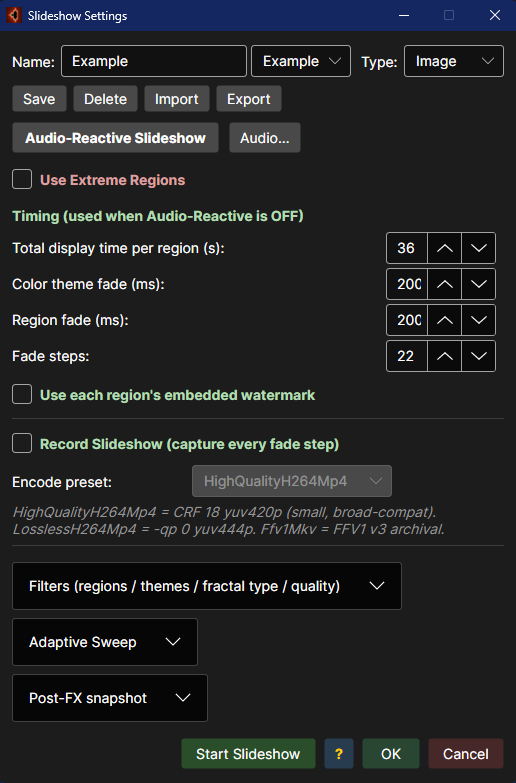
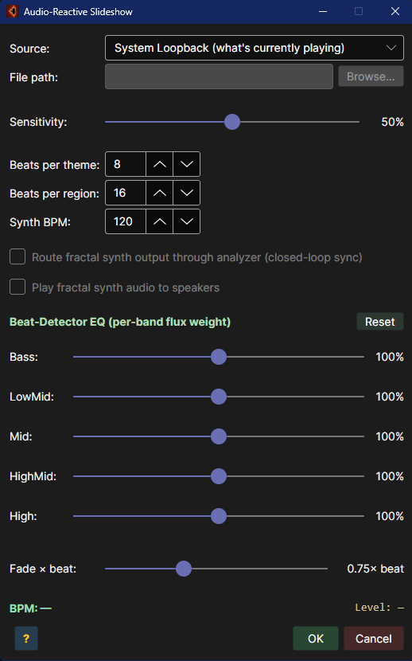

# Slideshow + Audio-Reactive Guide

How to use Fracturing Fog's hands-free guided-tour mode, including the audio-reactive engine that lands transitions on detected beats.

> Companion pages: [User Index](_Index.md) · [Regions Guide](Regions-Guide.md) · [Capture Guide](Capture-Guide.md)





---

## A friendly tour

The slideshow is Fracturing Fog's hands-free mode: it picks one of your saved regions, paints it
with a theme, cross-fades to the next region after a while, and keeps going forever. If you turn
on **audio-reactive** mode, those transitions land on the beat of whatever music is playing — your
desktop audio, a file, a microphone, or a synth the app generates from the fractal itself.

The whole experience can be recorded to MP4 — so you can leave it running for an hour and end up
with a video to share.

### The simplest way to start it

1. Have at least two regions in your **Region** dropdown (the built-ins are enough).
2. Floating Menu → click **Slideshow**.
3. Watch.

The app cycles themes every ~10 seconds and regions every ~30 seconds by default. To stop, press
**`Esc`** or click the **Stop** button (the Slideshow button changes label while it is running).

### Worked example — "Sync the slideshow to music I play in Spotify"

1. Start the music in Spotify / browser / any app — whatever you would normally listen to.
2. Floating Menu → click **Slideshow Settings…**
3. **Source** = `System Loopback` (the default).
4. **Sensitivity** = `50%` (default — raise it if the music has no strong drums).
5. **Beats per Theme** = `8` (about 2 bars in 4/4).
6. **Beats per Region** = `32` (about 8 bars).
7. **Audio-Reactive** checkbox → tick it.
8. Click **OK**.
9. Floating Menu → **Slideshow**.

The next theme change will land on the next strong beat the detector hears. If the music is too
quiet, raise sensitivity; if every cymbal triggers a change, lower it.

> [!TIP]
> *No music?* Set **Source = Fractal Synth**. Fracturing Fog will synthesise a generative arpeggio
> based on the current view. Tempo is configurable; it sounds nothing like Spotify but it lands
> transitions perfectly because the synth is the detector.

### Worked example — "Record a 5-minute audio-reactive video"

1. Set up the slideshow exactly as above.
2. Floating Menu → **Video Slideshow**.
3. Pick an output `.mp4` filename.
4. Duration → `5` minutes, framerate → `30`.
5. Click **Render**. The app starts a slideshow internally, runs it for 5 minutes, encodes every
   frame, and writes the video.

> [!IMPORTANT]
> Audio-reactive timing of *recorded* slideshows uses the live timing from when the recording
> started. Re-running the same audio source on a different day produces a different video — that
> is by design (real-time response). If you want frame-exact reproducibility, record once and keep
> the file.

---

## Table of Contents

1. [Basic Slideshow](#1-basic-slideshow)
2. [Slideshow Settings Dialog](#2-slideshow-settings-dialog)
3. [VCR Transport](#3-vcr-transport)
4. [Single-Shot Video Zoom](#4-single-shot-video-zoom)
5. [Video Slideshow Loop](#5-video-slideshow-loop)
6. [Recording](#6-recording)
7. [Audio-Reactive Engine](#7-audio-reactive-engine)
8. [Worked Audio Scenarios](#8-worked-audio-scenarios)
9. [Troubleshooting](#9-troubleshooting)

---

## 1. Basic Slideshow

Click **Slideshow** (Floating Menu) to start an auto-cycle of regions + themes.

Default timing (no audio):

| Event | Default | Configurable in |
|---|---:|---|
| Theme change | 10 s | Slideshow Settings → Beats per Theme |
| Region change | 30 s | Slideshow Settings → Beats per Region |
| Cross-fade duration | 3 s | Slideshow Settings → Fade duration |
| Watermark visible | Yes | Toolbar Watermark toggle |

Modifiers:

| Action | Effect |
|---|---|
| Shift+click Slideshow | Lock current region — only themes cycle |
| Esc | Stop the slideshow |
| Click ▶▶ / ◀◀ | Skip to next / previous region |

The Slideshow button label flips to **Stop** while running.

---

## 2. Slideshow Settings Dialog

Open via Floating Menu → **Slideshow Settings…**. Modeless — you can leave it open while the slideshow runs.

| Tab | Contents |
|---|---|
| Timing | Beats per Theme, Beats per Region, Fade duration |
| Filter | Include extreme regions, Theme filter, Per-fractal filter |
| Audio | Master enable, Source, Sensitivity, Synth options, EQ |
| Video | Output format, dimensions, fps, ffmpeg flags |
| Watermark | Show region name, theme name, program label, opacity |

OK commits to disk (`slideshow-settings.json` + `audio-settings.json`). Cancel discards.

---

## 3. VCR Transport

The slideshow VCR row sits at the bottom of MainWindow, between the render surface and the status bar. Visible only while the slideshow is running.

```
◀◀   ◀   ▮▮   ▶   ▶▶
```

| Button | Action |
|---|---|
| ◀◀ | Skip back to the previous region (resets theme counter) |
| ◀ | Skip back one theme within the current region |
| ▮▮ | Pause / Resume |
| ▶ | Skip forward one theme |
| ▶▶ | Skip forward to the next region |

The VCR row is in its own layout band — never occluded by the GPU swap-chain HWND.

---

## 4. Single-Shot Video Zoom

The **Video** button in the Floating Menu animates a smooth zoom from the current view to the currently-selected region. Independent from the slideshow.

Two-phase motion:

1. **Pan phase** (first 5 % of duration) — pan to the target center at the current zoom. Avoids the ""zoom-and-drift"" feel.
2. **Zoom phase** (remaining 95 %) — log-zoom interpolation with center fixed.

Both phases smoothstep-ease.

Frame rate is **calculation-bound**, not wall-clock. The loop advances by elapsed wall-clock time so total duration is honored even when individual frames are slow.

While running, the Video button label reads **Stop** and three extra Live TAA sliders appear in the Floating Menu:

| Slider | Purpose |
|---|---|
| TAA Alpha | Temporal blend strength between frames. Higher = more smoothing, more ghosting. |
| Fade Start | Zoom at which deep-zoom artifact fade begins. |
| Fade End | Zoom at which fade reaches full strength. |

---

## 5. Video Slideshow Loop

Continuous variant: zoom in → pause → zoom out → next region → repeat.

| Leg | Default |
|---|---:|
| Zoom in duration | 30 s |
| Pause at target | 7 s |
| Zoom out duration | 30 s |
| Inter-region gap | 0 s |

Stops independently from the single-shot Video feature (Esc or the Slideshow button toggles off).

---

## 6. Recording

Configure in Slideshow Settings → Video tab.

| Format | Container | Encoder | Needs ffmpeg? |
|---|---|---|---|
| None | — | — | No |
| MP4 (built-in) | .mp4 | Media Foundation H.264 | No |
| Lossless H.264 | .mp4 | libx264 -qp 0, yuv444p, +faststart | Yes |
| Lossless FFV1 | .mkv | FFV1 v3 | Yes |
| H.264 HQ | .mp4 | libx264 -crf 18, yuv420p | Yes |
| PNG sequence | folder | (sidecar; can pair with any video format) | No |

ffmpeg.exe discovery order:

1. App folder.
2. `<install>\Tools\`, `<install>\Resources\`.
3. PATH.

Two-phase workflow when ffmpeg is engaged:

1. Render every frame to disk as `frame_NNNNNN.png` (image2-compatible).
2. Invoke ffmpeg with the preset's argument set; ffmpeg progress feeds a second progress meter.

`--keep-frames` / `--no-keep-frames` in the batch CLI controls whether the PNG folder is retained. Interactive recording follows the same on-disk flag.

---

## 7. Audio-Reactive Engine

The audio-reactive engine replaces fixed-duration timers with a **beat counter** driven by spectral-flux onset detection. Open via Slideshow Settings → Audio tab, or Floating Menu → Audio Settings…

### Master enable

The **Audio-Reactive** checkbox is the master switch. OFF = fixed-duration timing. ON = beat-driven, even if the dialog is closed.

State persists between launches via `%APPDATA%\FracturingFog\audio-settings.json`.

### Source

| Source | Description |
|---|---|
| System Loopback | Captures whatever is currently playing on the default audio output (Spotify, browser, video player, game). Nothing else to configure. |
| Audio File | MP3 / WAV / FLAC / OGG / AIFF / WMA. Plays through speakers AND drives the detector — you hear what's being analyzed. |
| Microphone | Default capture device. Good for live shows / external speakers. |
| Fractal Synth | Internally generated audio derived from the fractal itself (closed-loop showcase). |

### Sensitivity

Range 0 – 100 %, default 50. Controls the onset-detection threshold. Lower = only strongest hits register (heavy drums); higher = subtler transients fire (ambient, speech).

### Beat counters

| Setting | Default | Meaning |
|---|---:|---|
| Beats per Theme | 8 | ≈ 2 bars at 4/4 |
| Beats per Region | 32 | ≈ 8 bars at 4/4 |

A region change resets the theme counter so both events never fire on the same beat.

### Synth BPM / routing (Fractal Synth only)

| Setting | Range | Default |
|---|---:|---:|
| Synth BPM | 30 – 240 | 120 |
| Route through analyzer | — | On |
| Route to speakers | — | On |

### EQ band weights

5 band-weight sliders, 0 – 200 %:

| Band | Default % |
|---|---:|
| Bass | 100 |
| Low-Mid | 100 |
| Mid | 100 |
| High-Mid | 100 |
| High | 100 |

Steer which instruments drive the beat detector. Boost Bass to lock onto kick drums; boost High-Mid for cymbal hats.

### Fade × beat

Range 0.10 – 2.00, default 0.75. Cross-fade duration as a fraction of one detected beat. Hard minimum of 120 ms even at high BPM.

---

## 8. Worked Audio Scenarios

### Scenario 1 — Dance music, system loopback

- Source: System Loopback
- Sensitivity: 60
- Beats per Theme: 4 (≈ 1 bar)
- Beats per Region: 32 (≈ 8 bars)
- EQ: Bass 150, others 100
- Fade × beat: 0.5
- Start Spotify, hit Slideshow.

Result: theme flips every bar, region every 8 bars, all snapped to the kick.

### Scenario 2 — Ambient drone, microphone

- Source: Microphone
- Sensitivity: 80 (drones are subtle)
- Beats per Theme: 16
- Beats per Region: 64
- EQ: Bass 80, Low-Mid 120, Mid 120, High-Mid 100, High 80
- Fade × beat: 1.25 (long cross-fades match the mood)

### Scenario 3 — Showcase video, fractal synth

- Source: Fractal Synth
- Synth BPM: 110
- Route to speakers: ON (you hear the closed-loop audio)
- Route through analyzer: ON
- Beats per Theme: 8
- Beats per Region: 32
- EQ: defaults

Use this when recording a video — the synth deterministically produces the same audio every time, so two renders match frame-for-frame.

### Scenario 4 — Live VJ set, audio file

- Source: Audio File → pick the next track
- Sensitivity: 50
- Beats per Theme: 4
- Beats per Region: 16
- Fade × beat: 0.625
- Lock the region with Shift+click Slideshow if you want to focus on one location while themes cycle.

---

## 9. Troubleshooting

**No beats firing.**
- Confirm the source is producing audio (loopback: another app is playing; file: file has started; mic: input meter moving).
- Lower Sensitivity.
- Boost the Bass band in the EQ if you're listening to drum music.

**Beats too frequent.**
- Raise Sensitivity.
- Reduce Bass / Low-Mid band weights.
- The detector reports onsets, not just downbeats — for pure 4/4 downbeat sync, set Beats per Theme to 4 (≈ 1 bar) rather than 1.

**Audio cuts out mid-slideshow.**
- File mode: end-of-file ends silently. Switch source or pick another file.
- Loopback: the source app stopped playing. Restart it.
- Mic: input device changed (e.g., headset unplugged). Reopen Audio Settings.

**Cross-fades feel wrong tempo.**
- Adjust Fade × beat. At 0.5 the fade ends in half a beat (snappy). At 1.5 it sprawls (cinematic).

**Synth doesn't make sound.**
- Tick **Route to speakers**. Without it, the synth is analyzer-only.

**Slideshow advances on every loopback noise (notification ping, system sound).**
- Raise Sensitivity. The detector is too eager.
- Switch source to a dedicated audio app rather than system loopback if other apps are sharing the output.

**Slideshow audio settings aren't sticking between launches.**
- Make sure you clicked **OK** (commit), not Cancel. The file is `%APPDATA%\FracturingFog\audio-settings.json`.

---

*Slideshow + Audio-Reactive Guide · Fracturing Fog · © 2026*
