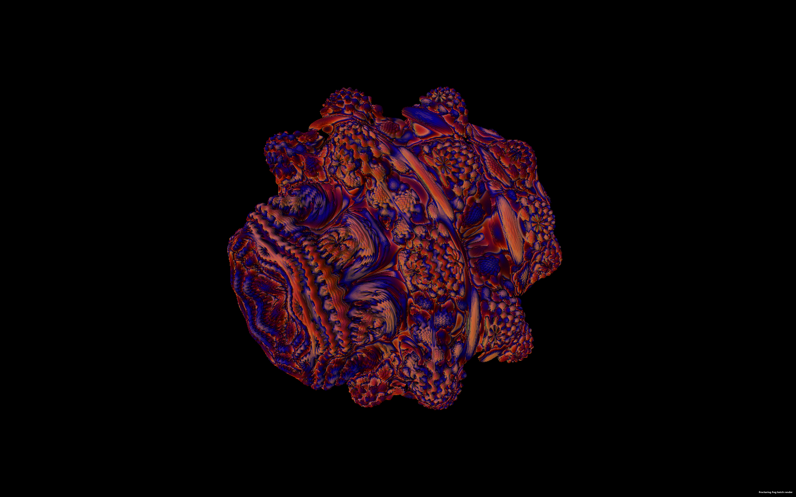
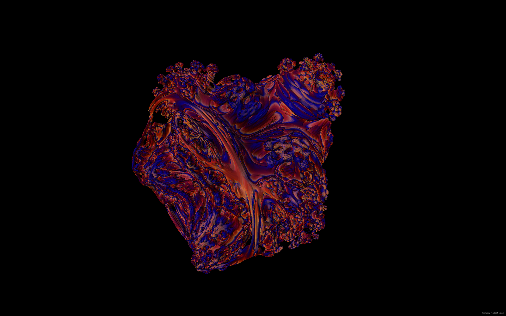
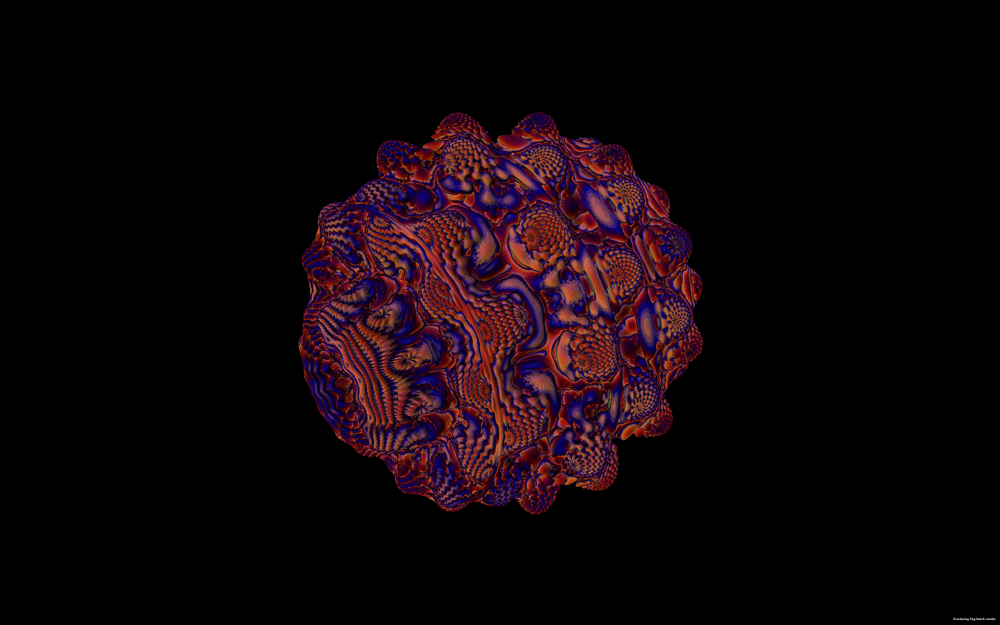

# User Bulb 3D — Guide

Fracturing Fog's User Bulb engine is the 3D analogue of User Equation. Author a per-iteration step function in either full C# (Roslyn) or a restricted DSL (Sandbox); the engine handles raymarching, distance estimation, lighting, AO, fog, and surface normals.

This guide covers the dialog, the Vec3 / Quat APIs, distance-estimation tradeoffs, the chain editor, mesh export, the Sandbox DSL grammar, and 14 ready-to-paste example bodies.

> Companion pages: [User Index](_Index.md) · [CalcGen User Guide](CalcGen-UserGuide.md) · [Fractal Equation Design Guide (Technical)](../Technical/FractalEquation-DesignGuide.md)



---

## A friendly tour

The 2-D fractals you know — Mandelbrot, Julia, Burning Ship — all live in the complex plane: every
point has a *real* part and an *imaginary* part. The **User Bulb** moves that idea into three
dimensions, so every point has an `x`, a `y`, and a `z`. Run a recipe over and over on every point;
the points that stay close to home form a shape in space. Light it from a direction and you get a
sculpture.

The most famous shape of this kind is Daniel White's **Mandelbulb**, which uses what mathematicians
call *triplex* algebra. It looks like this:

$$
\vec{v}_{n+1} = \vec{v}_n^{\,p} + \vec{c}
\quad\text{where}\quad
\vec{v}^{\,p} = r^p \big(\sin(p\theta)\cos(p\varphi),\; \sin(p\theta)\sin(p\varphi),\; \cos(p\theta)\big)
$$

Power `p = 8` is the classic. Fracturing Fog ships that recipe as the default, *plus* a full editor
that lets you swap it for anything you want to try. You can write it in real C#, or in a tiny DSL
that protects you from making the app crash.

|  |  |  |
|:--:|:--:|:--:|
| **p = 4** — soft, organic, jelly-like. | **p = 8** — the canonical look. | **p = 12** — finer detail, quill-like. |

### Worked example — "Spin a Mandelbulb on its axis for a video loop"

1. Switch the toolbar **Type** dropdown to **User Bulb (3D)**.
2. Press **`R`** to reset to the default Mandelbulb.
3. The default body is already correct — no editing needed.
4. Open Floating Menu → **Params** → scroll to **Animation**. Enable the animated `t` parameter,
   period `10` seconds.
5. In the **Camera** group, set **Theta animation** = `t * 360°` so the camera rotates around once
   per period.
6. Floating Menu → **Video** → duration `10` seconds, framerate `30 fps`, output `.mp4`.
7. Click **Render**.

The result is a perfectly looping spin of the bulb — drop it on a Discord channel as an animated
banner.

### Worked example — "Try the Burning Ship in 3-D"

1. Switch the toolbar **Type** to **User Bulb (3D)**.
2. Floating Menu → **Params** → editor opens.
3. Paste this body:

```csharp
// 3-D Burning Ship: absolute-value all three components before the bulb-power step.
var w = new Vec3(Math.Abs(v.X), Math.Abs(v.Y), Math.Abs(v.Z));
return BulbPow(w, 8.0) + c;
```

4. Hit **Compile & Load**. The render switches in ~500 ms.

You will see a much rougher, almost rocky shape — sharp masts, jagged hulls — because the
absolute-value step makes the map non-smooth.

---

## Table of Contents

1. [Open the Editor](#1-open-the-editor)
2. [Step Signature](#2-step-signature)
3. [Vec3 API](#3-vec3-api)
4. [Quat API (4D mode)](#4-quat-api-4d-mode)
5. [Algebra Mode](#5-algebra-mode)
6. [DE Modes](#6-de-modes)
7. [Backends (CPU vs GPU)](#7-backends-cpu-vs-gpu)
8. [Camera + Lighting](#8-camera--lighting)
9. [Render Knobs](#9-render-knobs)
10. [Param Bank](#10-param-bank)
11. [Animation (global t)](#11-animation-global-t)
12. [Julia Mode](#12-julia-mode)
13. [Color Drivers](#13-color-drivers)
14. [Chain Editor](#14-chain-editor)
    - 14.1 [Hybrid primitives (Mandelbulber-style)](#141-hybrid-primitives-mandelbulber-style)
15. [Save / Load / Promote](#15-save--load--promote)
16. [Mesh Export (OBJ)](#16-mesh-export-obj)
17. [Example Gallery](#17-example-gallery)
18. [Pitfalls + Troubleshooting](#18-pitfalls--troubleshooting)
19. [Sandbox DSL Compiler](#19-sandbox-dsl-compiler)

---

## 1. Open the Editor

Fractal Type → **User Bulb (3D)** → Floating Menu → **Params** button (or click the gear icon in the toolbar).

Modeless dialog. Auto-compiles ~500 ms after the last keystroke. Errors render in red below the editor. Camera, lighting, iter count, epsilon, bailout, Jacobian h, params, animation, color driver, lighting weights, and view knobs update without recompiling — only changes to source body / algebra / chain steps / param names trigger a fresh compile.

---

## 2. Step Signature

The compiled body is wrapped as:

```csharp
// Vec3 mode
Vec3 Step(Vec3 z, Vec3 c, int n, double[] p)

// Quat mode
Quat Step(Quat z, Quat c, int n, double[] p)
```

| Param | Description |
|---|---|
| `z` | Previous iterate. Starts at Zero on iter 0. |
| `c` | Per-pixel constant. Vec3 in 3D mode; (px.X, px.Y, px.Z, SliceW) in Quat mode. Replaced with JuliaC in Julia mode. |
| `n` | 0-based iteration index. |
| `p` | Named param vector. Trailing slot reserved for global animation `t`. Each Params row exposes a bare local `double <name>`. |

Body must `return` a Vec3 (or Quat in Quat mode):

```csharp
// Single expression form
Vec3.Pow(z, 8) + c

// Multi-statement form
var v = Vec3.Pow(z, 8);
return v + c;
```

---

## 3. Vec3 API

`FracturingFog.Models.Vec3` — readonly record struct, 3 components, double precision.

```csharp
// Fields
double X, Y, Z

// Properties
double Length          // sqrt(X² + Y² + Z²)
double LengthSquared   // X² + Y² + Z²

// Operators
+ - (unary -)  scalar *  scalar /

// Constants
Vec3.Zero, Vec3.One

// Static geometric / arithmetic
Vec3.Dot(a, b) → double
Vec3.Cross(a, b) → Vec3
Vec3.Sin(v), Vec3.Cos(v), Vec3.Sinh(v), Vec3.Cosh(v), Vec3.Exp(v), Vec3.Abs(v)

// Static fractal-authoring helpers
Vec3.Pow(v, n)               // triplex spherical power (Mandelbulb)
Vec3.Rot(v, axis, angle)     // Rodrigues rotation
Vec3.BoxFold(v, limit)       // Tglad fold (Mandelbox component)
Vec3.SphereFold(v, rMin, rMax)  // inversion fold
Vec3.AbsX(v), Vec3.AbsY(v), Vec3.AbsZ(v)  // asymmetric folds
Vec3.Mod(v, period)          // tile per axis
Vec3.SMin(a, b, k)           // C¹ smooth-min DE blend (scalars)
Vec3.ToSpherical(v) → (r, theta, phi)
Vec3.FromSpherical(r, theta, phi) → Vec3

// Instance
v.Normalized()
```

Construct with `new Vec3(x, y, z)`.

---

## 4. Quat API (4D mode)

```csharp
// Fields
double W, X, Y, Z

// Properties
double Length, LengthSquared

// Operators
+ - (unary -)  ·s (scalar)  Q · Q (Hamilton product)

// Constants
Quat.Zero, Quat.Identity = (1, 0, 0, 0)

// Methods + static
q.Conjugate() → Quat        // (W, -X, -Y, -Z)
Quat.Dot(a, b) → double
Quat.FromVec3(v, w = 0) → Quat
q.ToVec3() → Vec3           // drops W
```

In Quat mode the raymarched 3-space slice comes from the camera ray's (x, y, z) plus the user-chosen Slice W coordinate. Changing Slice W explores different 3D slices of the same 4D set.

---

## 5. Algebra Mode

| Mode | Type | Slice W | Speed |
|---|---|---|---|
| Vec3 (3D) | Vec3 | ignored | Fast |
| Quat (4D) | Quat | active | Slower |

Algebra change triggers a recompile.

---

## 6. DE Modes

Three distance-estimation modes selectable from the DE mode combo:

| Mode | When valid | Speed | Accuracy |
|---|---|---|---|
| Auto | Default; detects triplex-power patterns | Fast when matched, Numerical fallback otherwise | Best per-map |
| Analytic | Hubbard-Douady analytic DE only valid for triplex power maps | ~4× faster | Exact for matched maps; wrong for everything else |
| Numerical | Always | Slow | Works for any map |

Analytic formula:

```
DE(p) = 0.5 · ln(|z|) · |z| / dr
dr  = p · r^(p-1) · dr + 1
```

Numerical formula: 4 lockstep trajectories at `(c, c+h·êx, c+h·êy, c+h·êz)`, `dr = max(|z_px-z_base|, |z_py-z_base|, |z_pz-z_base|) / h`. Works for ANY map.

**Jac h** slider controls the finite-difference perturbation. 1e-4 default. Too small → cancellation noise; too large → soft-edged surface.

---

## 7. Backends (CPU vs GPU)

| Backend | Coverage | Speed |
|---|---|---|
| CPU | Every map. Roslyn-compiled delegate via `Parallel.For` over rows. | Baseline |
| GPU | Pre-baked triplex spherical power-N kernel only. | 5–20× faster when matched |

The GPU backend silently falls back to CPU for any body it can't translate. Currently the only GPU-translatable body is `Vec3.Pow(z, N) + c` with literal integer N.

To check whether GPU translation succeeded: render at a known-fast resolution; if frame time matches CPU at the same resolution, you fell back.

---

## 8. Camera + Lighting

### Camera (sphere around origin)

| Knob | Range | Default |
|---|---|---|
| Distance | 0.5 – 100 | 3.0 |
| Theta (azimuth) | 0 – 360° | 45° |
| Phi (elevation) | 1 – 179° | 63° |
| Reset cam | — | restores canonical view |

### Lighting (key direction)

| Knob | Range | Default |
|---|---|---|
| Light theta | 0 – 360° | 45° |
| Light phi | 1 – 179° | 60° |

L1 / L2 / L3 intensity sliders weight three directional contributions (key / fill / rim).

### Mouse

| Input | Action |
|---|---|
| Mouse wheel | Zoom (smaller/larger Distance) |
| Left-click drag | Pan in screen space |
| Right-click drag X | Orbit Theta |
| Right-click drag Y | Orbit Phi (inverted) |

---

## 9. Render Knobs

| Knob | Sane range | Notes |
|---|---|---|
| Iterations | 4 – 16 | DE inner-loop count |
| Max steps | 48 – 256 | Raymarch step cap |
| Bailout | 2 – 16 | `|z|` escape threshold |
| Epsilon | 0.0005 – 0.005 | Surface hit threshold |
| Jac h | 1e-5 – 1e-3 | Numerical-DE perturbation |
| Cull r | 1.5 – 8 | Bounding-sphere radius |

Cull radius gates ray entry — rays missing the bounding sphere render the sky color directly (zero march cost). Default 2.0 fits canonical Mandelbulb; Mandelbox needs 4–8.

---

## 10. Param Bank

Add arbitrary scalar params from the Params panel. Each row: Name, Value, Min, Max, X (remove).

In source, reference by name — the wrapper exposes each as a local `double <name>`:

```csharp
// Params: k = 2.0, twist = 0.3, freq = 4.0
return Vec3.Pow(z, k) + c + Vec3.Sin(z * freq) * twist;
```

Changing a value re-renders (no recompile). Changing a NAME / adding / removing triggers a recompile.

---

## 11. Animation (global t)

The Animation bar plays a continuously increasing clock `t` (seconds × Speed).

Reference as a bare local in your source:

```csharp
return Vec3.Pow(z, 4 + 2*Math.Sin(t)) + c;
```

▶ starts (~30 Hz updates). ▮ pauses. Speed multiplies the per-tick delta. Setting `t` manually fires a render.

---

## 12. Julia Mode

Tick **Enable (fix c)** in the Julia group to replace the per-pixel `c` with a single user-supplied constant for EVERY iteration.

| Field | Vec3 mode | Quat mode |
|---|---|---|
| c.X | active | active |
| c.Y | active | active |
| c.Z | active | active |
| c.W | disabled | active |

The pixel coordinate still drives the raymarch position; only the iteration's `c` is overridden. Produces a 3D (or 4D-sliced) Julia set.

---

## 13. Color Drivers

Selects what the IColorMap receives as input per pixel.

| Driver | Input |
|---|---|
| StepDepth | Number of march steps before hit. Highlights silhouette depth. Default. |
| OrbitTrap | Min distance from orbit to user-set trap point (tx, ty, tz). Reveals tendrils. |
| EscapeAngle | atan2 of escape vector projected onto user-chosen axis. Highlights spirals. |
| FinalMagnitude | log(|z|) at escape. Smooth gradient. |
| IterComponent | Specific axis of final iterate (X/Y/Z). Anisotropic. |
| Normal | Surface normal mapped to RGB. Pure shading debug; no palette involved. |

---

## 14. Chain Editor

When the Chain panel has ≥ 1 step, the single-source editor is **ignored**. Each chain step:

| Field | Purpose |
|---|---|
| Output name | Identifier added as a local Vec3 (or Quat) available to later steps. |
| Source | A C# body returning Vec3 / Quat (same rules as single editor). |

Steps run sequentially per iteration; the LAST step's output becomes the new `z`. Earlier outputs are visible to later steps.

```
Step 1   name = pre
         source = Vec3.Rot(z, new Vec3(0,1,0), t)

Step 2   name = sq
         source = Vec3.Pow(pre, 8) + c
```

Delete every chain row to revert to the single-editor flow.

### 14.1 Hybrid primitives (Mandelbulber-style)

Two toolbar buttons make composing 3D hybrids one click:

| Button | Action |
|---|---|
| **+ Primitive ▾** | Appends one named fold/power step to the chain. Options: Mandelbox fold (box+sphere+scale), KIFS Menger fold, KIFS Sierpinski tetra fold, Mandelbulb power. |
| **Hybrid ▾** | Replaces the chain with a worked-example two-step hybrid: Mandelbox + Mandelbulb, or Menger + Mandelbulb. |

Each primitive is plain `Vec3` source you can edit after dropping it in — change the box-fold limit, the sphere-fold radii, the Mandelbulb power, or the KIFS scale to taste. Output names auto-uniquify on insertion so duplicate primitives compose cleanly.

The two built-in hybrid examples (`Hybrid: Mandelbox + Mandelbulb` and `Hybrid: Menger + Mandelbulb`) are also seeded in the saved-equation dropdown, so you can recall them by name later.

---

## 15. Save / Load / Promote

Saved bulbs persist to `%APPDATA%\FracturingFog\userbulbs.json`.

| Button | Action |
|---|---|
| Save… | Stores the current editor text under the typed name. Overwrite confirmation if name exists (v0.6.2+). |
| Delete | Removes the selected saved entry. |
| Import… | Reads a single-entry `.fbulb` JSON file. Renames on name collision. |
| Export… | Writes the selected entry to a `.fbulb` JSON. |
| Promote to fractal list | When ticked, the saved bulb appears in the main Type combo as a first-class option. |

10 default presets ship pre-seeded on first run. Delete / edit / re-save freely.

---

## 16. Mesh Export (OBJ)

Click **Export mesh (OBJ)…** to sample the DE field on a uniform N³ grid inside a cube of side `2·Range` centred at origin. Each cell with a surface crossing emits a voxel cube of triangles. ASCII OBJ output.

| Field | Range | Default |
|---|---:|---:|
| Grid N | 8 – 256 | 64 |
| Range | 0.5 – 10 | 2.0 |

N=64 ≈ 32k voxels, fast. N=128 ≈ 256k voxels, slow (10s+). The result is **blocky** (voxel cubes, not interpolated triangles). Adequate for 3D printing or external smoothing.

Marching-cubes with the 256-entry triangulation table is a future enhancement.

---

## 17. Example Gallery

Each example: source body + suggested config block. Paste into the editor (or save).

### 1. Square Triplex (default — fast 3D Mandelbrot)

```csharp
return new Vec3(
    z.X*z.X - z.Y*z.Y - z.Z*z.Z,
    2*z.X*z.Y,
    2*z.X*z.Z) + c;
```

Config: Vec3 / Auto DE / Iter 8 / Bailout 4 / Steps 96 / Eps 0.0015 / Cull 2.0.

### 2. Mandelbulb p=8 (GPU-friendly)

```csharp
return Vec3.Pow(z, 8) + c;
```

Config: Vec3 / GPU / Auto DE / Iter 8 / Bailout 2 / Eps 0.0008 / Cull 1.5.

### 3. Power-12 Ridged Bulb

```csharp
return Vec3.Pow(z, 12) + c;
```

Config: Iter 10 / Steps 160 / Eps 0.0006 / AO 4 / Fog 0.08.

### 4. Animated Breathing Bulb

```csharp
return Vec3.Pow(z, 4 + 2*Math.Sin(t)) + c;
```

Animation ▶, Speed 0.5. Falls to Numerical (animated power = no analytic). SS = 1, Iter 6 / Steps 64 for live playback.

### 5. Quartic + Sin Perturbation

```csharp
return Vec3.Pow(z, 4) + Vec3.Sin(z) * 0.5 + c;
```

Power escapes + bounded sin adds texture. Color driver OrbitTrap (0,0,0) highlights folds.

### 6. Abs-Bulb p=8 (Burning-Ship 3D)

```csharp
return Vec3.Pow(Vec3.Abs(z), 8) + c;
```

Flat-top + sharp ridges.

### 7. Mandelbox

```csharp
var v = Vec3.SphereFold(Vec3.BoxFold(z, 1.0), 0.5, 1.0);
return v * 2.0 + c;
```

Iter 12 / Bailout 16 / Eps 0.0006 / Jac h 1e-3 / Cull 6.0 / Distance 8 / AO 6 / Fog 0.15.

### 8. Quaternion Julia

```csharp
return z * z + c;
```

Algebra Quat / Slice W 0.3 / Julia ON / c=(-0.2, 0.4, -0.4, 0.0).

### 9. Vec3 Julia (3D triplex with fixed c)

```csharp
return new Vec3(
    z.X*z.X - z.Y*z.Y - z.Z*z.Z,
    2*z.X*z.Y,
    2*z.X*z.Z) + c;
```

Julia ON / c=(0.30, 0.50, -0.20).

### 10. Rotated-Triplex Helix

```csharp
var sq = new Vec3(
    z.X*z.X - z.Y*z.Y - z.Z*z.Z,
    2*z.X*z.Y,
    2*z.X*z.Z);
return Vec3.Rot(sq, new Vec3(0, 1, 0), t * 0.3) + c;
```

Animation ▶ Speed 0.4.

### 11. Periodic Kaleido

```csharp
var p = Vec3.Mod(z, 2.0);
return Vec3.Pow(p, 8) + c;
```

Distance 6 / FOV 80°. Infinite lattice of mini-bulbs.

### 12. Cross-Product Ribbons

```csharp
var sq = new Vec3(
    z.X*z.X - z.Y*z.Y - z.Z*z.Z,
    2*z.X*z.Y,
    2*z.X*z.Z);
return sq + c + Vec3.Cross(z, c) * 0.5;
```

Color driver EscapeAngle / axis Y.

### 13. Smooth-Min Blend (Chain editor)

```
Step 1   name = a    source = Vec3.Pow(z, 8) + c
Step 2   name = b    source = Vec3.Pow(z, 4) + c
```

Last step's output is new z. Swap powers (8/3, 12/6) to morph.

### 14. Parametric Twist-Bulb (named params)

Params: p=8 / k=0.3 / freq=4.

```csharp
var v = Vec3.Pow(z, p);
var twist = Vec3.Sin(z * freq) * k;
return v + c + twist;
```

Drag sliders to morph live (no recompile).

---

## 18. Pitfalls + Troubleshooting

**No-escape maps look blank.** Pure sin / cos / Vec3.Sinh that orbits forever never crosses bailout → DE meaningless → flat sphere or blank. Use Color driver = OrbitTrap or FinalMagnitude to visualise bounded maps.

**z₀ = 0 fixed points.** Any f with f(0,0) = 0 gives all-in-set when c=0 is centered. Enable Julia mode (fixes c) or rephrase the source so z₀ = 0 isn't a fixed point.

**Exploding maps.** `z^z`, double-exp grow to ∞ in 1–2 iterations. Drop Iterations to 2–4 / raise Bailout to 1e6 / rescale inputs.

**NaN / Inf.** Math.Log of negatives, Math.Atan2(0,0), division by zero. Guard with `+ 1e-6` in denominators and `Math.Max(r, 1e-12)` before Log.

**DE mode mismatch.** Analytic DE on non-triplex gives wrong surfaces. Use Auto (engine falls back to Numerical for unknown shapes) or pick Numerical explicitly.

**Tight Jac h on discontinuous maps.** Mandelbox-style folds have piecewise derivatives. Raise Jac h to 1e-3 for folds.

**Cull r too small.** Mandelbox extends beyond Cull r → bounding sphere clips silhouettes. Use 4–8 for Mandelbox; canonical bulbs are happy with 2.

**GPU backend fallback.** Anything beyond plain `Vec3.Pow(z, INT) + c` silently falls back to CPU. Check perf — if GPU was expected and you don't see a speedup, the body wasn't translatable.

**Perf.** Roslyn delegate ~40 ns per call. Heavy Math.Pow / Atan2 multiplies that. Prefer `x*x*x` over `Math.Pow(x, 3)`; hoist invariants out of the body.

**Black screen, no shape.** Check the error label (green ✓ vs red error). Bump Bailout to 16. Drop Iterations to 4. Spin Camera Theta. Raise Cull r.

**Speckled normals / noisy shading.** Raise Jac h from 1e-4 → 1e-3. Drop Epsilon to 0.0005.

**""Melted"" soft edges.** Lower Epsilon to 0.0008. Raise Max steps to 192.

**Banding / tile boundaries.** DE mode may be wrong — force Numerical. Toggle re-compile (edit source and revert) to flush the temporal cache.

**Unbearably slow render.** Drop Iterations to 4, Max steps to 48 for exploration. Switch Backend → GPU for plain `Vec3.Pow` bodies. Set SS back to 1. Resize window smaller.

---

## 19. Sandbox DSL Compiler

The **Compiler** combobox (Render group) toggles between two source compilers:

| Mode | Source language | Algebra | Backend | Speed | Safety |
|---|---|---|---|---|---|
| Roslyn (default) | full C# | Vec3 + Quat | CPU + GPU | fastest | trusts source |
| Sandbox | small DSL | Vec3 only | CPU | ~10–15× slower than Roslyn | parse-only, no BCL |

Pick **Roslyn** for performance, GPU rendering, or when you want the BCL (`Math.Atan2`, `Math.Truncate`, etc.). Pick **Sandbox** when the source comes from untrusted input, when you want the editor to detect closed-form DE patterns on the AST, or when you want a tighter grammar that fails fast on typos.

### 19.1 Source signature (Sandbox)

The Sandbox compiler does NOT wrap your source in a `Step` method. Write an **expression** that evaluates to `Vec3`:

```dsl
// Mandelbulb N=8
triplex(z, 8) + c
```

```dsl
// Square triplex (explicit)
vec(z.x*z.x - z.y*z.y - z.z*z.z, 2*z.x*z.y, 2*z.x*z.z) + c
```

```dsl
// Let-binding for clarity
let p = triplex(z, 8) in
let q = z * 2 in
p + q + c
```

There is no `return` keyword and no semicolon. The whole source is one expression. Use `let NAME = EXPR in EXPR` for intermediate variables.

### 19.2 Identifiers

| Name | Type | Description |
|---|---|---|
| `z` | Vec3 | Previous iterate. `Vec3.Zero` on iter 0. |
| `c` | Vec3 | Per-pixel constant. Replaced with Julia c in Julia mode. |
| `n` | Real | 0-based iteration index. |
| `t` | Real | Global animation time (always available). |
| `<param-name>` | Real | Each Params row adds an identifier. |
| `pi`, `e` | Real | Constants. |

Member access on a Vec3: `.x`, `.y`, `.z`. Member access on a scalar broadcasts (e.g. `n.x == n`).

### 19.3 Grammar

```
expr     := let_expr
let_expr := 'let' IDENT '=' expr 'in' expr | ternary
ternary  := or ('?' expr ':' expr)?
or       := and ('||' and)*
and      := not ('&&' not)*
not      := '!' not | cmp
cmp      := add (('<'|'>'|'<='|'>='|'=='|'!=') add)?
add      := mul (('+'|'-') mul)*
mul      := pow (('*'|'/') pow)*
pow      := unary ('^' pow)?           ; right-assoc
unary    := '-' unary | primary
primary  := NUMBER | IDENT (member|call)* | '(' expr ')' member*
member   := '.' ('x'|'y'|'z')
call     := '(' (expr (',' expr)*)? ')'
```

### 19.4 Operators

| Op | Vec / Vec | Vec / Real | Real / Real |
|---|---|---|---|
| `+`, `-` | componentwise | broadcast | scalar |
| `*` | Hadamard (componentwise) | broadcast | scalar |
| `/` | componentwise | broadcast | scalar |
| `^` | **triplex** Mandelbulb power | scalar Math.Pow | scalar Math.Pow |
| unary `-` | componentwise | – | scalar |
| `&&`, `\|\|`, `!`, comparisons | reduce to real (1.0 / 0.0) | – | scalar |

Note `^` is **triplex** power when the LHS is a Vec — `z ^ 8` is shorthand for `triplex(z, 8)`.

### 19.5 Functions

Single-arg (scalar or componentwise on Vec):
`sin`, `cos`, `tan`, `sinh`, `cosh`, `tanh`, `exp`, `log`, `sqrt`, `abs`

Vec3 specific:
- `vec(x, y, z)` — construct Vec3 from three reals.
- `length(v)` — Vec → real.
- `dot(a, b)`, `cross(a, b)`, `normalize(v)`
- `triplex(v, n)` — Mandelbulb spherical power.
- `rot(v, axis, angle)` — Rodrigues rotation.
- `boxfold(v, limit)` — Mandelbox box-fold.
- `spherefold(v, rmin, rmax)` — Mandelbox sphere-fold.
- `absx(v)`, `absy(v)`, `absz(v)` — fold a single axis.
- `mod(v, period)` — periodic space.

Scalar-only:
- `pow(a, b)`, `floor(s)`, `sign(s)`, `min(a, b)`, `max(a, b)`, `clamp(x, lo, hi)`, `smin(a, b, k)`.

### 19.6 Chains in Sandbox

The Chain editor works identically to Roslyn mode. Each step is its own Sandbox expression. Prior step output names become Vec3 identifiers in later steps.

```dsl
step0 (output: folded)
    vec(abs(z.x), abs(z.y), abs(z.z))

step1 (output: out)
    triplex(folded, 8) + c
```

The above is a "Burning Bulb" variant — abs-fold each axis before the triplex power.

### 19.7 Analytic DE detection

When the Sandbox compiles, the AST is walked to look for closed-form patterns the engine can render with a single trajectory instead of a four-trajectory numerical Jacobian. The detected pattern is shown in the **DE detect** badge (green when engaged, grey when numerical).

Currently recognised patterns:

| Pattern | Source shape | DE algorithm | Speedup |
|---|---|---|---|
| MandelbulbN | `triplex(z, K) + c` | Hubbard-Douady power-N | ~3-4× |
| Square | `vec(z.x*z.x - z.y*z.y - z.z*z.z, 2*z.x*z.y, 2*z.x*z.z) + c` | Hubbard-Douady N=2 | ~3-4× |

Chains never engage analytic DE — they always run numerical.

### 19.8 Limitations

- **No Quat (4D) mode** — Sandbox is Vec3-only. The algebra combobox disables Quat when Sandbox is selected; switching to Sandbox while Quat is active forces back to Vec3.
- **No GPU backend** — Sandbox always runs on CPU. Backend combobox selection is honoured only for Roslyn sources.
- **No BCL** — `Math.Atan2`, `Math.Round`, `Quaternion.*`, etc. are not in scope. Use the built-in functions table above.
- **Performance hit** — interpreter dispatch is roughly 10–15× slower than Roslyn-compiled per-iter. Mitigated when an analytic-DE pattern is detected.

### 19.9 When to use Sandbox vs Roslyn

| Decide for | Choose |
|---|---|
| Maximum framerate at any cost | **Roslyn** |
| GPU acceleration | **Roslyn** (Sandbox CPU-only) |
| Untrusted source / shared presets | **Sandbox** |
| Want compile-time error spans | **Sandbox** (parser positions are surfaced) |
| Pre-recognised Mandelbulb N=K | either (Roslyn faster on iter, Sandbox detects pattern too) |
| 4D / quaternion fractals | **Roslyn** until Sandbox-Quat support lands |

---

*User Bulb 3D Guide · Fracturing Fog · © 2026*
