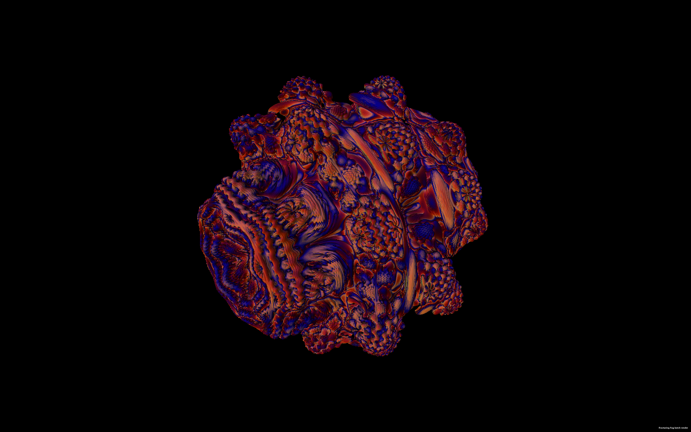
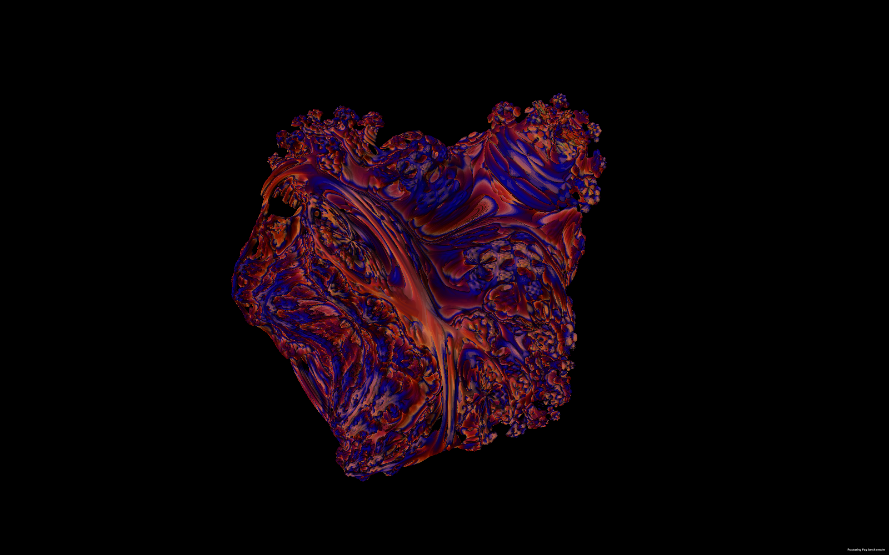
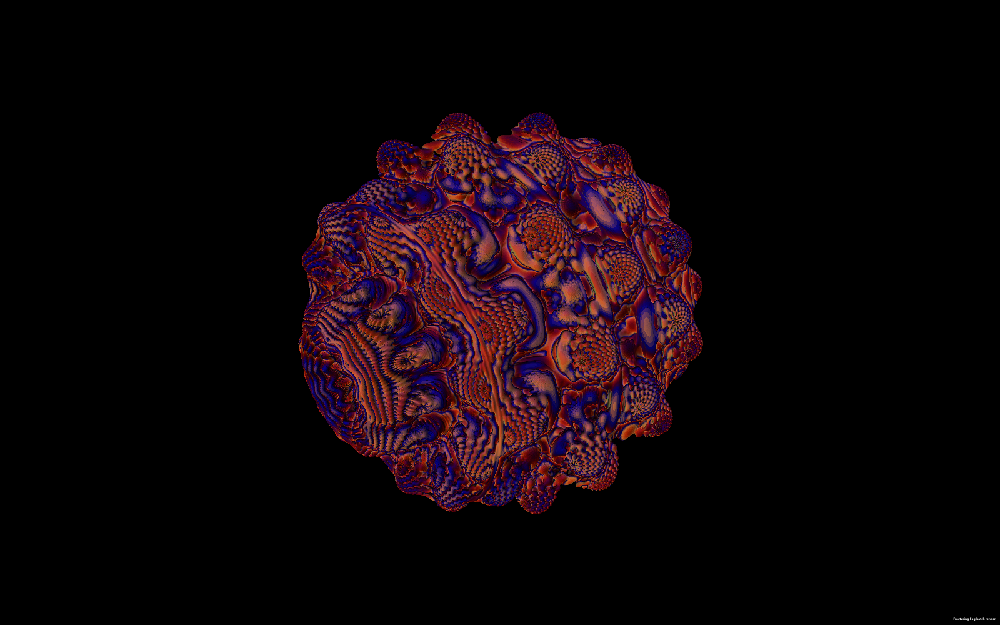

# User Bulb 3D — Guide

Fracturing Fog's User Bulb engine is the 3D analogue of User Equation. Write one step of the iteration in the bulb language — the equation language with 3-D values (§2) — and the engine handles raymarching, distance estimation, lighting, AO, fog, and surface normals.

This guide covers the dialog, the Vec3 / Quat APIs, distance-estimation tradeoffs, the chain editor, mesh export, the Sandbox DSL grammar, and 14 ready-to-paste example bodies.

> Companion pages: [User Index](_Index.md) · [CalcGen User Guide](CalcGen-UserGuide.md) · [Fractal Equation Design Guide (Technical)](../Technical/FractalEquation-DesignGuide.md)



---

## A friendly tour

The 2-D fractals you know — Mandelbrot, Julia, Burning Ship — all live in the complex plane: every
point has a *real* part and an *imaginary* part. The **User Bulb** moves that idea into three
dimensions, so every point has an `x`, a `y`, and a `z`. Run a recipe over and over on every point;
the points that stay close to home form a shape in space. Light it from a direction and you get a
sculpture.

The most famous shape of this kind is Daniel White's **Mandelbulb**, which uses what mathematicians
call *triplex* algebra. It looks like this:

$$
\vec{v}_{n+1} = \vec{v}_n^{\,p} + \vec{c}
\quad\text{where}\quad
\vec{v}^{\,p} = r^p \big(\sin(p\theta)\cos(p\varphi),\; \sin(p\theta)\sin(p\varphi),\; \cos(p\theta)\big)
$$

Power `p = 8` is the classic. Fracturing Fog ships that recipe as the default, *plus* a full editor
that lets you swap it for anything you want to try. You can write it in real C#, or in a tiny DSL
that protects you from making the app crash.

|  |  |  |
|:--:|:--:|:--:|
| **p = 4** — soft, organic, jelly-like. | **p = 8** — the canonical look. | **p = 12** — finer detail, quill-like. |

### Worked example — "Spin a Mandelbulb on its axis for a video loop"

1. Switch the toolbar **Type** dropdown to **User Bulb (3D)**.
2. Press **`R`** to reset to the default Mandelbulb.
3. The default body is already correct — no editing needed.
4. Open Floating Menu → **Params** → scroll to **Animation**. Enable the animated `t` parameter,
   period `10` seconds.
5. In the **Camera** group, set **Theta animation** = `t * 360°` so the camera rotates around once
   per period.
6. Floating Menu → **Video** → duration `10` seconds, framerate `30 fps`, output `.mp4`.
7. Click **Render**.

The result is a perfectly looping spin of the bulb — drop it on a Discord channel as an animated
banner.

### Worked example — "Try the Burning Ship in 3-D"

1. Switch the toolbar **Type** to **User Bulb (3D)**.
2. Floating Menu → **Params** → editor opens.
3. Type this step:

```bulb
// 3-D Burning Ship: absolute-value all three components before the bulb-power step.
abs(z)^8 + c
```

4. The render switches a moment after you stop typing.

You will see a much rougher, almost rocky shape — sharp masts, jagged hulls — because the
absolute-value step makes the map non-smooth.

---

## Table of Contents

1. [Open the Editor](#1-open-the-editor)
2. [Step Language](#2-step-language)
3. [Values, operators and functions](#3-values-operators-and-functions)
4. [Quaternions (Quat mode)](#4-quaternions-quat-mode)
5. [Algebra Mode](#5-algebra-mode)
6. [DE Modes](#6-de-modes)
7. [Backends (CPU vs GPU)](#7-backends-cpu-vs-gpu)
8. [Camera + Lighting](#8-camera--lighting)
9. [Render Knobs](#9-render-knobs)
10. [Param Bank](#10-param-bank)
11. [Animation (global t)](#11-animation-global-t)
12. [Julia Mode](#12-julia-mode)
13. [Color Drivers](#13-color-drivers)
14. [Chain Editor](#14-chain-editor)
    - 14.1 [Hybrid primitives (Mandelbulber-style)](#141-hybrid-primitives-mandelbulber-style)
15. [Save / Load / Promote](#15-save--load--promote)
16. [Mesh Export (OBJ / STL)](#16-mesh-export-obj--stl)
    - 16.1 [Export knobs](#161-export-knobs)
    - 16.2 [Getting a detailed mesh (not a blob)](#162-getting-a-detailed-mesh-not-a-blob)
    - 16.3 [Recommended recipes](#163-recommended-recipes)
    - 16.4 [Mesh export troubleshooting](#164-mesh-export-troubleshooting)
17. [Example Gallery](#17-example-gallery)
18. [Pitfalls + Troubleshooting](#18-pitfalls--troubleshooting)
19. [Language Notes](#19-language-notes)

---

## 1. Open the Editor

Fractal Type → **User Bulb (3D)** → Floating Menu → **Params** button (or click the gear icon in the toolbar).

Modeless dialog. Auto-compiles shortly after the last keystroke. Errors show in yellow below the editor, with the bad token selected. Camera, lighting, iter count, epsilon, bailout, Jacobian h, params, animation, color driver, lighting weights, and view knobs update without recompiling — only changes to source body / algebra / chain steps / param names trigger a fresh compile.

---

## 2. Step Language

You write **one step** of the iteration: the next `z` as an expression. The
language is the safe User Bulb DSL. Since #1100 it follows the same rules as the
2D equation language ([Equation-Language.md](../Technical/Equation-Language.md));
the value types are real, vec3 and quaternion.

| Name | Meaning |
|---|---|
| `z` | Previous iterate (vec3, or quaternion in Quat mode). Starts at zero on iteration 0. |
| `c` | Per-pixel constant. Vec3 in 3D mode; (px.X, px.Y, px.Z, SliceW) in Quat mode. Replaced with JuliaC in Julia mode. |
| `n` | 0-based iteration index (real). |
| `t` | Global animation time (real). |
| param names | Each Params row is a real variable with its name. |
| `pi`, `e` | Constants. |
| `.x .y .z .w` | Components (`.w` in Quat mode). |

```bulb
z^8 + c
```

**Rules shared with the 2D language:**
- `-z^2` means `-(z^2)`; write `(-z)^2` for the other reading. Bulbs saved
  before #1100 were rewritten automatically to keep their meaning (backup:
  `userbulbs.json.<timestamp>.bulb-language-v2.bak`).
- `if … then … else` and the ternary `cond ? a : b`; `&& || !`; comparisons on
  reals (`z.x > 0`, `length(z) < 2`).
- `let name = value in body`, and statements:

```bulb
var v = boxfold(z, 1.0);
if (length(v) < 0.5) v = v * 4.0;
return v * 2.0 + c;
```

- Comments `//` and `/* */`; one trailing `;` is fine.
- Errors name the spot: `Unknown function 'sni' at line 1, col 7. Did you mean 'sin'?`

**3D differences:**
- `^` on a vector is the **triplex** (Mandelbulb) power; on a quaternion it is the
  quaternion power.
- `abs(v)` is **componentwise** on vectors and quaternions — the fold idiom
  (`let v = abs(z) in …`). The magnitude is `length(v)`, and `norm(v)` is the
  squared length `dot(v, v)` (on a real, `norm(x)` = `x²`).
- Functions: `vec triplex length norm dot cross normalize rot boxfold spherefold
  absx absy absz mod smin pow min max clamp floor sign sin cos tan sinh cosh tanh
  exp log sqrt abs`, and in Quat mode `qvec qmul qpow qconj qinv qexp qlog qsqrt
  qsin qcos qtan qsinh qcosh qtanh qasin qacos qatan qasinh qacosh qatanh qcsc
  qsec qcot qcsch qsech qcoth`.

Saved bulbs from the C# era that the startup migration couldn't translate stay
editable but don't render until rewritten in the language (#211).

---

## 3. Values, operators and functions

A value is one of three kinds — **real**, **vec** (3-vector) or **quat**
(quaternion). You never declare the kind: `vec(...)` makes a vec, `qvec(...)` and
every `q*` function make a quat, arithmetic widens to the widest operand, and the
result is projected to the mode's type (Vec3 or Quat) automatically.

Members: `.x .y .z` on a vec or quat, `.w` (the real part) on a quat. On a real,
`.x/.y/.z` repeat the value and `.w` is `0`.

| Op | vec, vec | vec, real | real, real | quat operand |
|---|---|---|---|---|
| `+` `-` | componentwise | real adds to `x` | scalar | componentwise (quat result) |
| `*` | componentwise (Hadamard) | broadcast | scalar | quat × quat = **Hamilton product**; × real = scale |
| `/` | componentwise | broadcast | scalar | quat / real = scale |
| `^` | — | **triplex** (Mandelbulb) power | real power | quaternion power (§4.1) |
| `&&` `\|\|` `!`, comparisons | operands reduced to a real (magnitude) | | | |

`-z^8` means `-(z^8)`; write `(-z)^8` for the other reading (§2).

**Functions**

| Group | Functions |
|---|---|
| Elementwise (real or vec) | `sin cos tan sinh cosh tanh exp log sqrt` — rejected on a quat: use the `q*` versions |
| Magnitude | `abs(x)` — **componentwise** on vec and quat (the fold idiom), \|x\| on a real · `length(v)` — the magnitude · `norm(x)` — the squared length `dot(v, v)` (`x²` on a real) |
| Vector | `vec(x, y, z)` `dot(a, b)` `cross(a, b)` `normalize(v)` `triplex(v, p)` (same as `v^p`) `rot(v, axis, angle)` (Rodrigues) `boxfold(v, limit)` `spherefold(v, rmin, rmax)` `absx(v)` `absy(v)` `absz(v)` (one-axis folds) `mod(v, period)` (tile space) |
| Scalar | `pow(a, b)` `min(a, b)` `max(a, b)` `clamp(x, lo, hi)` `floor(s)` `sign(s)` `smin(a, b, k)` (smooth min) |
| Quaternion | `qvec(x, y, z, w)` (imaginary parts first, real `w` last) `qmul(a, b)` (= `a * b`) `qconj` `qinv` `qpow(q, s)` (= `q^s`) `qexp qlog qsqrt` `qsin qcos qtan qsinh qcosh qtanh` `qasin qacos qatan qasinh qacosh qatanh` `qcsc qsec qcot qcsch qsech qcoth` |

```bulb
// Mandelbox: box fold, sphere fold, scale.
var v = spherefold(boxfold(z, 1.0), 0.5, 1.0);
v * 2.0 + c
```

---

## 4. Quaternions (Quat mode)

In Quat mode `z` and `c` are quaternions `(w, x, y, z)`: `w` is the real part,
`x, y, z` the `i, j, k` axes. The `q*` functions are **quaternion algebra** —
`qsin(q)` is the true quaternion sine, not `sin` applied to four numbers — which
is what makes these maps a genuine 4-D analogue of the complex plane.

### 4.1 `Pow` semantics

`qpow(q, s)` (and `q^s`) picks its algorithm from the exponent:

- **Non-negative integer** exponent → exact repeated Hamilton self-multiply. `qpow(q, 0)` is 1 and `qpow(0, n)` is 0 for `n > 0`. This is the fast, exact path — prefer integer powers when you can.
- **Fractional or negative** exponent → the analytic form `q^s = exp(s · log q)`, evaluated on `q`'s principal axis. This is what makes `qsqrt`, `qasin`, `qacos`, `qasinh` and `qacosh` work (they all route through the square root).

### 4.2 The escape contract — these ops never throw

The quaternion DE hot loop has **no** `try`/`catch` by design (it compiles once, smoke-tests the step with finite inputs, then trusts it). A throw whose trigger depended on a runtime value the smoke test never hit would crash the whole render. So every quaternion op returns a **non-finite quaternion** for undefined inputs (`qpow(0, -1)`, `qlog(0)`, `qinv` of a zero quaternion, …) instead of throwing. The loop's `!double.IsFinite` guard turns that non-finite result into a cleanly *escaped* pixel. You therefore never need to guard denominators inside a Quat-mode body the way you do in Vec3 mode — a bad value just paints as "outside the set."

> [!NOTE]
> The inverse-trig functions use the unit imaginary axis that makes `qasin`/`qacos`/`qatan` well-defined — it is the direction `q` "points" in the 3-space of `{i, j, k}`. When `q` is (numerically) a pure real number there is no natural axis, so the helper falls back to the `x`-axis by convention. If an inverse-trig map shows a hard seam along the x-axis, that fallback is the cause; rotate your input or add a small imaginary bias to avoid the pure-real degeneracy.

In Quat mode the raymarched 3-space slice comes from the camera ray's `(x, y, z)` plus the user-chosen **Slice W** coordinate. Changing Slice W explores different 3-D slices of the same 4-D set.

### 4.3 Worked snippets

```bulbs
// Quaternion Julia with a transcendental twist — sine of the square, plus c.
qsin(z * z) + c
// Fractional-power bulb (analytic power path). Non-integer exponent → exp(s·log q).
qpow(z, 2.5) + c
// Exponential map — bounded, so read it with Color driver = FinalMagnitude.
qexp(z) * 0.5 + c
```

More in the [quaternion cookbook](#193-quaternion-cookbook).

---

## 5. Algebra Mode

| Mode | Type | Slice W | Speed |
|---|---|---|---|
| Vec3 (3D) | Vec3 | ignored | Fast |
| Quat (4D) | Quat | active | Slower |

Algebra change triggers a recompile.

---

## 6. DE Modes

Four distance-estimation modes selectable from the DE mode combo:

| Mode | When valid | Speed | Accuracy |
|---|---|---|---|
| Auto | Default; detects triplex-power patterns | Fast when matched, Numerical fallback otherwise | Best per-map |
| Analytic | Hubbard-Douady analytic DE only valid for triplex power maps | ~4× faster | Exact for matched maps; wrong for everything else |
| Numerical | Always (escape-time maps) | Slow | Works for any escaping map |
| Non-escaping | Maps that never escape (pseudo-Kleinian / lattice / Amoser sine) | Single-trajectory | Stability-clamp + running `min(1/dr)` |

Analytic formula:

```
DE(p) = 0.5 · ln(|z|) · |z| / dr
dr  = p · r^(p-1) · dr + 1
```

Numerical formula: 4 lockstep trajectories at `(c, c+h·êx, c+h·êy, c+h·êz)`, `dr = max(|z_px-z_base|, |z_py-z_base|, |z_pz-z_base|) / h`. Works for ANY *escaping* map.

**Jac h** slider controls the finite-difference perturbation. 1e-4 default. Too small → cancellation noise; too large → soft-edged surface.

### 6.1 Non-escaping DE (maps that never leave the bailout)

Auto / Analytic / Numerical are all **escape-time**: they assume the orbit eventually crosses `|z| > Bailout`. Some of the richest 3-D maps never do — their orbit is trapped forever in a bounded slab. Examples: pseudo-Kleinian and lattice maps, and the **Amoser complex-sine**:

```
z = ( sin(z.x)·cosh(z.y),
      cos(z.x)·cos(z.z)·sinh(z.y),
      sin(z.z)·cosh(z.y) ) + c
```

On these, the escape-time modes read a nonsense DE and you get a blank or garbage surface **no matter how you tune Iterations / Bailout / Max steps / Epsilon**. Switch DE mode to **Non-escaping**. It replaces the escape test with a stability clamp and accumulates a distance bound from the running derivative `dr`:

```
de = ∞;  dr = 1
for n in 0 … Iterations:
    z  = Step(z, c, n, p)           # your step map
    dr = DrBody(z, c, n, dr, …)     # your dr recurrence (or auto tangent)
    de = min(de, 1 / dr)            # tightest bound so far
    if |z.axis| > StabilityLimit:   # CLAMP, not escape
        break
return DEMultiplier · de
```

Three settings appear (only in this mode):

| Setting | What it does | Amoser start |
|---|---|---|
| **DEMultiplier** | Pure gain on the final distance. Lower → smaller raymarch steps → crisper but slower; too high → over-stepped, holes. | 0.5 |
| **Stability axis** | Which component (x/y/z) the clamp watches — pick the axis the map grows along. | y (cosh/sinh axis) |
| **Stability limit** | Clamp threshold on that axis. Larger → more interior detail, noisier; smaller → smoother, eats fine structure. | 8 |

### 6.2 The DE body editor — write your own `dr`

In Non-escaping mode a **DE body** editor appears. You write **one scalar DSL expression** that returns the **next `dr`**. The engine owns everything else: it computes `de = min(de, 1/dr)` each iteration and multiplies by `DEMultiplier`. You write only the derivative growth.

In scope inside the DE body:

| Name | Meaning |
|---|---|
| `z` | the **pre-step** position this iteration (Vec3) |
| `c` | the constant / Julia c (Vec3) |
| `n` | iteration index (scalar) |
| `t` | animation time (scalar) |
| *params* | every named param from the Param Bank |
| `dr` | the **previous** iteration's `dr` (scalar) |
| `de` | the **previous** iteration's `de` (scalar) |

Rules:

- The body is **scalar** — return a number, not a `vec`.
- Classic shape is `dr = stretch · dr + offset`, where *stretch* is the local magnitude of the map's derivative and *offset* is usually `1`.
- If the body fails to parse it does **not** break your step: the engine falls back to a two-trajectory numerical tangent and shows the error, so the render still appears.
- Leaving the body **blank** is valid — Non-escaping mode then uses the auto tangent (works for any non-escaping map, softer, ~2× the cost of a good analytic body).

**Examples**

```text
# 1 — constant growth (teaching): de = 1/2^Iterations
dr*2

# 2 — Amoser complex-sine stretch (the shipped preset)
#    sqrt(0.5·(e^2z + e^-2z)) = sqrt(cosh(2·z.z)) is the cosh stretch magnitude
let ez = exp(z.z) in
let s  = max(StretchMax, StretchScale*sqrt(0.5*(ez*ez + 1/(ez*ez)))) in
drScale*s*dr + drOffset
#    params: StretchScale 0.81, StretchMax 1.04, drScale 1.0, drOffset 1.0

# 3 — generic non-escaping starter (length-based stretch)
max(1.0, length(z)) * dr + 1.0

# 4 — folded / periodic map: stretch = largest per-factor magnitude
let g = max(abs(cos(z.x)), abs(cosh(z.y))) in
Scale*g*dr + 1.0
```

**One click:** load the saved preset **"Amoser complex-sine (non-escaping DE)"** — it wires the step, the Example-2 dr body, the four params, and the Non-escaping settings together. Edit from there.

> Camera note: the User Bulb camera hard-codes world-up +Y, so the reference Fragmentarium framing (`Up = (0,0,1)`) is not literally reproducible — the preset sets a sensible default distance instead.

---

## 7. Backends (CPU vs GPU)

| Backend | Coverage | Speed |
|---|---|---|
| CPU | Every equation, both algebra modes, chains, KIFS. | Baseline |
| GPU | The equation is emitted and compiled for the GPU where it can be; anything else **silently falls back to CPU**. | 5–20× faster when matched |

| Route | What it covers |
|---|---|
| **Quat mode** | Quaternion equations. Runs the analytic power DE when a pattern is detected and Julia is off; otherwise a 5-trajectory numerical-Jacobian DE. **Julia mode is supported.** |
| **Vec3 mode** | Analytic-power equations (`z^K + c`, `triplex(z, K) + c` and the square triplex). Vec3 Julia / Vec3 numerical stay on CPU for now. |

Chains compile on the GPU too (each step is emitted and inlined). Scalar-KIFS distance fields are **CPU-only**. The GPU emitter matches the CPU interpreter's arithmetic exactly (checked by `BulbEmitterParityTests`, #1105); the only expressions it declines are a product or quotient mixing a vector and a quaternion, and a ternary whose branches have different kinds — those run on the CPU.

To check whether GPU translation succeeded: render at a known-fast resolution; if the frame time matches CPU at the same resolution, you fell back. The status line also surfaces the last GPU compile/JIT error when a fallback happens.

---

## 8. Camera + Lighting

### Camera (sphere around origin)

| Knob | Range | Default |
|---|---|---|
| Distance | 0.5 – 100 | 3.0 |
| Theta (azimuth) | 0 – 360° | 45° |
| Phi (elevation) | 1 – 179° | 63° |
| Reset cam | — | restores canonical view |

### Lighting (key direction)

| Knob | Range | Default |
|---|---|---|
| Light theta | 0 – 360° | 45° |
| Light phi | 1 – 179° | 60° |

L1 / L2 / L3 intensity sliders weight three directional contributions (key / fill / rim).

### Mouse

| Input | Action |
|---|---|
| Mouse wheel | Zoom (smaller/larger Distance) |
| Left-click drag | Pan in screen space |
| Right-click drag X | Orbit Theta |
| Right-click drag Y | Orbit Phi (inverted) |
| **Middle-drag** | **Marquee zoom** — hold the middle button, drag a box, release to recentre + zoom into it. Same outline-to-zoom as the 2D right-drag, on a different button so right-drag stays camera orbit. Esc cancels before release. |

---

## 9. Render Knobs

| Knob | Sane range | Notes |
|---|---|---|
| Iterations | 4 – 16 | DE inner-loop count |
| Max steps | 48 – 256 | Raymarch step cap |
| Bailout | 2 – 16 | `|z|` escape threshold |
| Epsilon | 0.0005 – 0.005 | Surface hit threshold |
| Jac h | 1e-5 – 1e-3 | Numerical-DE perturbation |
| Cull r | 1.5 – 8 | Bounding-sphere radius |

Cull radius gates ray entry — rays missing the bounding sphere render the sky color directly (zero march cost). Default 2.0 fits canonical Mandelbulb; Mandelbox needs 4–8.

---

## 10. Param Bank

Add arbitrary scalar params from the Params panel. Each row: Name, Value, Min, Max, X (remove).

In the equation, use each param by its name (a real):

```bulb
// Params: k = 2.0, twist = 0.3, freq = 4.0
z^k + c + sin(z * freq) * twist
```

Changing a value re-renders (no recompile). Changing a NAME / adding / removing triggers a recompile.

---

## 11. Animation (global t)

The Animation bar plays a continuously increasing clock `t` (seconds × Speed).

Use it by name in the equation:

```bulb
z^(4 + 2*sin(t)) + c
```

▶ starts (~30 Hz updates). ▮ pauses. Speed multiplies the per-tick delta. Setting `t` manually fires a render.

---

## 12. Julia Mode

Tick **Enable (fix c)** in the Julia group to replace the per-pixel `c` with a single user-supplied constant for EVERY iteration.

| Field | Vec3 mode | Quat mode |
|---|---|---|
| c.X | active | active |
| c.Y | active | active |
| c.Z | active | active |
| c.W | disabled | active |

The pixel coordinate still drives the raymarch position; only the iteration's `c` is overridden. Produces a 3D (or 4D-sliced) Julia set.

---

## 13. Color Drivers

Selects what the IColorMap receives as input per pixel.

| Driver | Input |
|---|---|
| StepDepth | Number of march steps before hit. Highlights silhouette depth. Default. |
| OrbitTrap | Min distance from orbit to user-set trap point (tx, ty, tz). Reveals tendrils. |
| EscapeAngle | atan2 of escape vector projected onto user-chosen axis. Highlights spirals. |
| FinalMagnitude | log(|z|) at escape. Smooth gradient. |
| IterComponent | Specific axis of final iterate (X/Y/Z). Anisotropic. |
| Normal | Surface normal mapped to RGB. Pure shading debug; no palette involved. |

---

## 14. Chain Editor

When the Chain panel has ≥ 1 step, the single-source editor is **ignored**. Each chain step:

| Field | Purpose |
|---|---|
| Output name | A name later steps can use for this step's value (a vec, or a quat in Quat mode). |
| Source | A step equation — the same language as the single editor. |

Steps run sequentially per iteration; the LAST step's output becomes the new `z`. Earlier outputs are visible to later steps.

```
Step 1   name = pre
         source = rot(z, vec(0, 1, 0), t)

Step 2   name = sq
         source = pre^8 + c
```

A parse error names the step (`Step 2 (sq): Unknown function 'sni' at line 1, col 1. Did you mean 'sin'?`), and **Apply fix (Ctrl+.)** edits that step.

Delete every chain row to revert to the single-editor flow.

### 14.1 Hybrid primitives (Mandelbulber-style)

Two toolbar buttons make composing 3D hybrids one click:

| Button | Action |
|---|---|
| **+ Primitive ▾** | Appends one named fold/power step to the chain. Built-in options: Mandelbox fold (box+sphere+scale), KIFS Menger fold, KIFS Sierpinski tetra fold, Mandelbulb power — plus any of your own equations promoted to the list (see below). |
| **Hybrid ▾** | Replaces the chain with a worked-example two-step hybrid: Mandelbox + Mandelbulb, or Menger + Mandelbulb. |

Each primitive is plain `Vec3` source you can edit after dropping it in — change the box-fold limit, the sphere-fold radii, the Mandelbulb power, or the KIFS scale to taste. Output names auto-uniquify on insertion so duplicate primitives compose cleanly.

**Promote your own equation to a primitive (#535).** Select a saved single-source equation, then tick **Promote to primitive list**. It then appears in the **+ Primitive ▾** menu (below the built-ins) so you can drop it into any chain. The editor validates suitability first — the equation must be single-source (not itself a chain), must parse, and must reference `z` so it can compose with the prior step. A chain-bearing entry disables the checkbox. Any saved KIFS scale is carried over, so a promoted fold still auto-engages the scalar-KIFS DE when inserted.

The two built-in hybrid examples (`Hybrid: Mandelbox + Mandelbulb` and `Hybrid: Menger + Mandelbulb`) are also seeded in the saved-equation dropdown, so you can recall them by name later.

---

## 15. Save / Load / Promote

Saved bulbs persist to `%APPDATA%\FracturingFog\userbulbs.json`.

| Button | Action |
|---|---|
| Save… | Stores the current editor text under the typed name. Overwrite confirmation if name exists (v0.6.2+). |
| Delete | Removes the selected saved entry. |
| Import… | Reads a single-entry `.fbulb` JSON file. Renames on name collision. |
| Export… | Writes the selected entry to a `.fbulb` JSON. |
| Promote to fractal list | When ticked, the saved bulb appears in the main Type combo as a first-class option. |

10 default presets ship pre-seeded on first run. Delete / edit / re-save freely.

---

## 16. Mesh Export (OBJ / STL)

Click **Export mesh (OBJ)…** to sample the DE field on a uniform N³ grid inside a cube of side `2·Range` centred at origin and extract the surface with **marching cubes** (interpolated triangles, not blocky voxels). Choose `.obj` (ASCII, smooth per-vertex normals) or `.stl` (binary, faceted) in the save dialog.

The export runs on a **background thread** — the app stays responsive. A status-bar chip reads **"Exporting mesh…"** with a **Cancel** button; cancelling aborts the run and leaves any existing file untouched (no half-written stub). The export + Auto buttons disable while a run is in flight, so you can't launch two at once.

### 16.1 Export knobs

The knobs sit on their own row beneath the export button:

| Knob | Range | Default | What it does |
|---|---:|---:|---|
| **Grid** | 16 – 512 | 96 | Marching-cubes resolution per axis. Cost ~N³ DE evaluations (sampling is parallelised across CPU cores). Finer grid = more detail **and** smaller cells, which also tightens the fraction-mode Iso band. 256–384 for a detailed mesh. |
| **Range** | 0.25 – 64 | 2.0 | Object-space half-extent of the sampled cube. Must **enclose** the fractal — too small clips it; too large wastes resolution and can leave the mesh open where the surface exits the cube face. |
| **Auto** | — | — | Probes the DE along 64 rays from the centre, finds the fractal's extent, and sets **Range** to enclose it with a 20% margin. Use it first — removes the guess-and-clip loop and prevents boundary holes. |
| **Iso** | 0.005 – 2 | 0.5 | Iso-surface level. With **abs off** it is a *fraction of the cell size* (`iso = step·Iso`); the default 0.5 sits a half-cell **outside** the true surface, so at coarse grids thin filaments inflate into fat tubes and gaps fuse into a ball. Lower toward **0.1–0.25** to hug the surface and keep filament detail; raise it to bridge gaps if the mesh comes out shattered. |
| **abs** | on/off | off | When on, **Iso** is an *absolute object-space distance* (grid-independent). Set the surface level once and change Grid freely without re-tuning Iso. |
| **SS** | 1 – 4 | 1 | Supersampling. Box-averages an `s×s×s` stencil of DE samples per grid corner, antialiasing sub-cell filaments into **continuous arms** instead of broken tubes/dots. Cost is ~`s³×`, so keep it **1 at Grid ≥ 256** and reserve **2 for Grid ≤ 192**. |
| **Crease°** | 5 – 180 | 180 | Normal-smoothing threshold. 180 smooths **everything** (rounds off Mandelbox-style facets). Lower it (~**30**) to keep hard edges crisp — faces meeting at a sharper angle than this split into separate normals, so facets stay sharp while curved bulb arms still smooth. |

DE **quality** (Iterations, Jac h, DE mode) comes from the **Render** knobs above — the export DE is the same kernel as the render. All export knobs (Grid, Range, Iso, abs, SS, Crease°) **persist** with a saved bulb, along with the Render Iterations / Jac h.

### 16.2 Getting a detailed mesh (not a blob)

The exported mesh is only as good as the distance estimate:

- **DE mode → Analytic** (or Auto). The analytic running-derivative DE is exact and meshes crisply. The **numerical** Jacobian is an approximation — it renders acceptably but marching-cubes turns it into a soft blob. Analytic engages for recognised power maps (`z^N + c`, `triplex(z, N) + c`, the square triplex, and the quaternion square in Quat mode — §19.2).
- **Quaternion fractals → Axis Mode = Quat + Julia mode.** The *Quaternion Julia* saved preset sets these automatically; a `z*z + c` in Quat mode meshes like the built-in Quaternion Julia fractal type.
- **KIFS folds (Menger / Sierpinski / Mandelbox / kaleidoscopic) → set KIFS Scale** (3 for Menger, 2 for Sierpinski/Mandelbox). Inserting a fold primitive or loading a fold hybrid now sets this for you. Without it the numerical DE cannot cross the fold discontinuities and export yields **zero triangles**.
- **Raise Iterations** for geometry — the render default (8) is low; try 14–16 for export.
- **Drop Iso** — the single biggest lever against the "ball with tubes" look. Pair it with a higher Grid.

### 16.3 Recommended recipes

| Goal | Auto | Grid | Iso | SS | Crease° | Also |
|---|:--:|--:|--:|--:|--:|---|
| **Fast preview** | ✓ | 160 | 0.15 | 1 | 180 | — |
| **Detailed organic bulb** | ✓ | 320–384 | 0.12 | 1 | 180 | Iter 14–16, Jac h 1e-5, DE Analytic |
| **Filament close-up** | ✓ | 160–192 | 0.12 | 2 | 180 | SS antialiases thin arms |
| **Faceted hybrid** (Mandelbox + bulb) | ✓ | 256 | 0.15 | 1 | 30 | keeps box facets crisp |
| **3-D print (solid)** | ✓ | 192–256 | 0.30+ | 1 | 60 | higher Iso fuses thin filaments into a printable solid |

> **Reality check.** User Bulb is a general interpreter — for an *arbitrary* equation it can only estimate the DE numerically, so its mesh is inherently softer than a hand-written analytic calculator. For a faithful mesh of a *known* fractal (Quaternion Julia/Mandelbrot, Mandelbulb, Mandelbox, KIFS), prefer that concrete **Fractal Type**, whose exact DE meshes at full detail.

### 16.4 Mesh export troubleshooting

| Symptom | Cause | Fix |
|---|---|---|
| **Ball with tubes / cones** sticking out the ends | Iso too high for the grid — the half-cell offset inflates filaments and fuses gaps | Lower **Iso** to 0.1–0.2 and raise **Grid**; keep **SS 1** |
| **Blobby / soft**, no fine detail | Numerical DE + low iterations smooth the field | **DE mode → Analytic**, **Iterations 14–16**, **Jac h 1e-5** |
| **Broken filaments / dotty arms** | Sub-cell aliasing — arms thinner than a cell get point-sampled away | Raise **SS** to 2 (drop Grid to keep cost sane), or raise **Grid** |
| **Box facets look rounded** | Crease smoothing averages across the hard edges | Set **Crease° ~30** |
| **0 triangles exported** | Range doesn't enclose the set, or a fold needs its scale | Click **Auto**; for folds set **KIFS Scale** (3 Menger, 2 Sierpinski/Mandelbox) |
| **Mesh has holes / not watertight** | The surface reaches the cube face and marching cubes leaves it open | Click **Auto** (adds margin), or raise **Range** |
| **Shattered / disconnected shell** | Iso so low the surface falls between grid cells | Raise **Iso** slightly, or raise **Grid**; turn **abs** on for a grid-independent level |
| **Export hangs / very slow** | Grid×SS is huge (millions of DE evals × s³) | Lower **Grid** or **SS**, or hit **Cancel**; use **SS 1** at Grid ≥ 256 |
| **File enormous** | High Grid (and Crease° < 180 splits extra vertices) | Lower **Grid**; export `.stl` if you don't need smooth normals |

---

## 17. Example Gallery

Each example: the step equation + a suggested config. Paste into the editor (or save).

### 1. Square Triplex (default — fast 3D Mandelbrot)

```bulb
vec(z.x*z.x - z.y*z.y - z.z*z.z,
    2*z.x*z.y,
    2*z.x*z.z) + c
```

Config: Vec3 / Auto DE / Iter 8 / Bailout 4 / Steps 96 / Eps 0.0015 / Cull 2.0.

### 2. Mandelbulb p=8 (GPU-friendly)

```bulb
z^8 + c
```

Config: Vec3 / GPU / Auto DE / Iter 8 / Bailout 2 / Eps 0.0008 / Cull 1.5.

### 3. Power-12 Ridged Bulb

```bulb
z^12 + c
```

Config: Iter 10 / Steps 160 / Eps 0.0006 / AO 4 / Fog 0.08.

### 4. Animated Breathing Bulb

```bulb
z^(4 + 2*sin(t)) + c
```

Animation ▶, Speed 0.5. Falls to Numerical (animated power = no analytic). SS = 1, Iter 6 / Steps 64 for live playback.

### 5. Quartic + Sin Perturbation

```bulb
z^4 + sin(z) * 0.5 + c
```

Power escapes + bounded sin adds texture. Color driver OrbitTrap (0,0,0) highlights folds.

### 6. Abs-Bulb p=8 (Burning-Ship 3D)

```bulb
abs(z)^8 + c
```

Flat-top + sharp ridges.

### 7. Mandelbox

```bulb
var v = spherefold(boxfold(z, 1.0), 0.5, 1.0);
v * 2.0 + c
```

Iter 12 / Bailout 16 / Eps 0.0006 / Jac h 1e-3 / Cull 6.0 / Distance 8 / AO 6 / Fog 0.15.

### 8. Quaternion Julia

```bulb
z * z + c
```

Algebra Quat / Slice W 0.3 / Julia ON / c=(-0.2, 0.4, -0.4, 0.0).

Swap `z * z` for any quaternion function from §3 to explore relatives: `qpow(z, 3)` (cubic), `qsin(z * z)` (transcendental), `qexp(z) * 0.5` (exponential map). With DE mode **Analytic**, `z * z + c` uses the exact quaternion distance estimate.

### 9. Vec3 Julia (3D triplex with fixed c)

```bulb
vec(z.x*z.x - z.y*z.y - z.z*z.z,
    2*z.x*z.y,
    2*z.x*z.z) + c
```

Julia ON / c=(0.30, 0.50, -0.20).

### 10. Rotated-Triplex Helix

```bulb
var sq = vec(z.x*z.x - z.y*z.y - z.z*z.z,
             2*z.x*z.y,
             2*z.x*z.z);
rot(sq, vec(0, 1, 0), t * 0.3) + c
```

Animation ▶ Speed 0.4.

### 11. Periodic Kaleido

```bulb
var p = mod(z, 2.0);
p^8 + c
```

Distance 6 / FOV 80°. Infinite lattice of mini-bulbs.

### 12. Cross-Product Ribbons

```bulb
var sq = vec(z.x*z.x - z.y*z.y - z.z*z.z,
             2*z.x*z.y,
             2*z.x*z.z);
sq + c + cross(z, c) * 0.5
```

Color driver EscapeAngle / axis Y.

### 13. Two-Step Chain (Chain editor)

```
Step 1   name = a    source = z^8 + c
Step 2   name = b    source = a^4 + c
```

Last step's output is new z. Swap powers (8/3, 12/6) to morph.

### 14. Parametric Twist-Bulb (named params)

Params: p=8 / k=0.3 / freq=4.

```bulb
var v = z^p;
var twist = sin(z * freq) * k;
v + c + twist
```

Drag sliders to morph live (no recompile).

---

## 18. Pitfalls + Troubleshooting

**No-escape maps look blank.** Pure sin / cos / sinh that orbits forever never crosses bailout → DE meaningless → flat sphere or blank. Use Color driver = OrbitTrap or FinalMagnitude to visualise bounded maps.

**z₀ = 0 fixed points.** Any f with f(0,0) = 0 gives all-in-set when c=0 is centered. Enable Julia mode (fixes c) or rephrase the source so z₀ = 0 isn't a fixed point.

**Exploding maps.** `z^z`, double-exp grow to ∞ in 1–2 iterations. Drop Iterations to 2–4 / raise Bailout to 1e6 / rescale inputs.

**NaN / Inf.** `log` / `sqrt` of negatives, division by zero. Guard with `+ 1e-6` in denominators and `max(r, 1e-12)` before `log`.

**DE mode mismatch.** Analytic DE on non-triplex gives wrong surfaces. Use Auto (engine falls back to Numerical for unknown shapes) or pick Numerical explicitly.

**Tight Jac h on discontinuous maps.** Mandelbox-style folds have piecewise derivatives. Raise Jac h to 1e-3 for folds.

**Cull r too small.** Mandelbox extends beyond Cull r → bounding sphere clips silhouettes. Use 4–8 for Mandelbox; canonical bulbs are happy with 2.

**GPU backend fallback.** An equation the GPU route can't take silently falls back to CPU (§7). If GPU was expected and you don't see a speedup, that's why.

**Perf.** Transcendental calls dominate the interpreter's cost. Prefer `x*x*x` over `pow(x, 3)`; name repeated sub-expressions with `let` / `var`.

**Black screen, no shape.** Check the status line (green ✓ vs a yellow error). Bump Bailout to 16. Drop Iterations to 4. Spin Camera Theta. Raise Cull r.

**Speckled normals / noisy shading.** Raise Jac h from 1e-4 → 1e-3. Drop Epsilon to 0.0005.

**""Melted"" soft edges.** Lower Epsilon to 0.0008. Raise Max steps to 192.

**Banding / tile boundaries.** DE mode may be wrong — force Numerical. Toggle re-compile (edit source and revert) to flush the temporal cache.

**Unbearably slow render.** Drop Iterations to 4, Max steps to 48 for exploration. Switch Backend → GPU (`z^N + c` gets the fastest kernel). Set SS back to 1. Resize window smaller.

---

## 19. Language Notes

The step language is described in §2–§4. This chapter collects the details that
matter when you go further: chains, the analytic-DE detector, limitations, and a
quaternion cookbook.

### 19.1 Chains

Each chain step is its own equation. Earlier steps' output names can be used in later steps.

```
step0 (output: folded)
    vec(abs(z.x), abs(z.y), abs(z.z))

step1 (output: out)
    triplex(folded, 8) + c
```

The above is a "Burning Bulb" variant — abs-fold each axis before the triplex power.

### 19.2 Analytic DE detection

When the equation compiles, its parse tree is walked to look for closed-form patterns the engine can render with a single trajectory instead of a four-trajectory numerical Jacobian. The detected pattern is shown in the **DE detect** badge (green when engaged, grey when numerical).

Currently recognised patterns:

| Pattern | Source shape | DE algorithm | Speedup |
|---|---|---|---|
| MandelbulbN | `triplex(z, K) + c` or `z^K + c` | Hubbard-Douady power-N | ~3-4× |
| Square | `vec(z.x*z.x - z.y*z.y - z.z*z.z, 2*z.x*z.y, 2*z.x*z.z) + c` | Hubbard-Douady N=2 | ~3-4× |
| Square (Quat mode) | `z*z + c`, `qmul(z, z) + c`, `qpow(z, 2) + c` or `z^2 + c` | exact quaternion DE, with DE mode = Analytic | crisp field |

Chains never engage analytic DE — they always run numerical.

### Limitations

- **No .NET** — only the built-in functions (§3) are in scope, which is what makes equations safe to share.
- **No plain transcendentals on a quaternion** — `sin`/`cos`/`exp`/`log`/`sqrt` are rejected on a quat (they would apply to four numbers, which is geometrically meaningless). Use `qsin`/`qcos`/… or project to a component first. `abs` is the exception (a per-axis fold).
- **GPU coverage is not total** — see §7.
- **C#-era bulbs** that the startup conversion couldn't translate stay editable but don't render until rewritten (#211).

### 19.3 Quaternion cookbook

Set **Algebra → Quat (4D)**, then paste any of these into the editor. Tick **Backend → GPU** for the speed-up; all of them are GPU-translatable. Use **Slice W** to slide through the 4-D set and **Julia → Enable (fix c)** where noted.

```bulb
// 1. Classic quaternion Julia — the "hello world" of 4-D fractals.
//    z * z is the Hamilton product; z^2 would mean the same thing here.
//    Julia ON, c = (-0.2, 0.4, -0.4, 0.0), Slice W ≈ 0.3.
z * z + c
```

```bulb
// 2. Cubic quaternion Mandelbrot — integer power uses the exact fast path.
qpow(z, 3) + c
```

```bulb
// 3. Transcendental quaternion — sine of the square. qsin is true quaternion
//    sine, NOT sin applied to four numbers. Read bounded maps like this with
//    Color driver = FinalMagnitude or OrbitTrap.
qsin(z * z) + c
```

```bulb
// 4. Fractional power — analytic exp(s·log q) branch. Non-integer exponent.
qpow(z, 2.5) + c
```

```bulb
// 5. Build a quaternion by hand and fold it. qvec order is (x, y, z, w).
let q = qvec(z.x, z.y, z.z, z.w * 0.5) in
qmul(q, q) + c
```

```bulb
// 6. Exponential map, damped so it stays in frame.
qexp(z) * 0.5 + c
```

> [!TIP]
> `z * z` and `qmul(z, z)` compile to the same kernel — pick whichever reads better. When you mix reals and quaternions (`qpow(z, 3)`, `qexp(z) * 0.5`) the real operands broadcast automatically, so you rarely need `qvec` unless you are assembling a quaternion from separate scalar parts.

---

*User Bulb 3D Guide · Fracturing Fog · © 2026*
