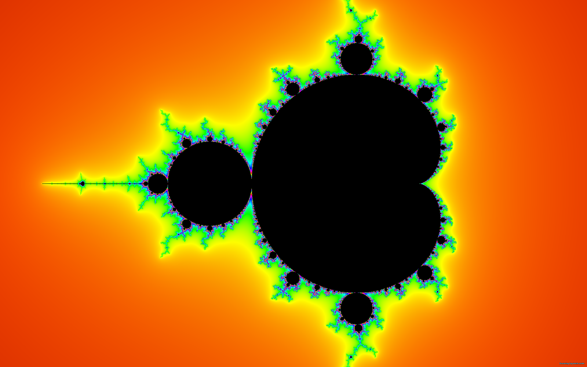

# Fracturing Fog — User Documentation

Welcome. **Fracturing Fog** is a real-time fractal explorer for Windows (with cross-platform foundations).
It lets you wander the famous *Mandelbrot set*, its many cousins, and your own custom equations —
zoom in trillions of times, paint them with hundreds of colour themes, record videos, and even synchronise
slideshows with music.

This page is the entry point for end-user documentation. If you are a developer or contributor, head
instead to the [Technical Index](../Technical/_Index.md). For a top-level router that bridges both
audiences plus the project-wide roadmaps, see [Docs Index](../_Index.md).

---

## What is a fractal?

A **fractal** is a shape made of patterns that keep repeating as you look closer. Coastlines, ferns,
broccoli, lightning bolts, snowflakes — they are all fractal-like. Mathematical fractals push that
idea to its logical extreme: their detail never runs out, no matter how deep you zoom.

The most famous of all is the **Mandelbrot set**, defined in 1980 by Benoit Mandelbrot. Pick a point
on the complex plane, run a tiny formula on it over and over, and ask: *does the result stay small,
or does it run away to infinity?* The points where it stays small form an astonishingly intricate
black silhouette. The points that escape are coloured by how *fast* they escape — and that gives you
the rainbow halos you see in every Mandelbrot picture.

If that already sparks curiosity, the rest of these guides will hand you the tools to wander as far
as your imagination wants to take you.

---

## Where do I start?

| If you want to…                                          | Go to                                                          |
|----------------------------------------------------------|----------------------------------------------------------------|
| Get the lay of the land — every menu and button          | [Avalonia User Guide](Avalonia-UserGuide.md)                   |
| Save and recall favourite views                          | [Regions Guide](Regions-Guide.md)                              |
| Take a screenshot, print a poster, or record a video     | [Capture Guide](Capture-Guide.md)                              |
| Run an automatic slideshow with music                    | [Slideshow + Audio-Reactive Guide](Slideshow-AudioReactive-Guide.md) |
| Recolour what you see, or invent a new palette           | [Colour Theme Editor Guide](ColorThemeEditor-Guide.md)         |
| Write a one-line palette in a tiny domain language       | [ColorGen User Guide](ColorGen-UserGuide.md)                   |
| Type your own fractal formula in C# or pseudo-code       | [CalcGen / User Equation Guide](CalcGen-UserGuide.md)          |
| Explore Mandelbulb-style 3-D fractals                    | [User Bulb 3D Guide](UserBulb-Guide.md)                        |
| Render on a powerful workstation, drive from a laptop    | [Client / Server Guide](ClientServer-UserGuide.md)             |
| Configure the local render server                        | [Server Admin Guide](ServerAdmin-Guide.md)                     |
| Stand up a multi-machine render cluster                  | [Distributed Rendering Guide](Distributed-UserGuide.md)        |
| Memorise the keyboard shortcuts                          | [Keyboard Shortcuts](Keyboard-Shortcuts.md)                    |

---

## A two-minute tour

1. **Launch the app.** Out of the box you are looking at the classic Mandelbrot set, centred on `(-0.5, 0)`.
2. **Roll the mouse wheel** over the picture. You zoom in (or out) anchored at the cursor.
3. **Left-click and drag** to pan. While dragging, the picture is fast and slightly fuzzy; when you let
   go it polishes itself in the background.
4. **Right-click and drag** to draw a rectangle. When you let go the view zooms straight to that rectangle.
5. **Pick a different family** from the *Type* combo in the toolbar — Julia, Burning Ship, Newton…
6. **Pick a different palette** from the *Theme* combo. There are over 200 built-in themes.
7. Hit **`M`** to bring up the Floating Menu. Hit **`T`** to open the live Colour Theme Editor. Hit **`R`** to reset.
8. When you find something beautiful, press **`V`** to save it as a *region* you can revisit any time.

That is the whole core loop. Everything else is a refinement of one of those steps.

---

## A glossary, in plain words

| Term                  | Plain meaning                                                                                        |
|-----------------------|------------------------------------------------------------------------------------------------------|
| *Fractal family*      | The mathematical recipe used — Mandelbrot, Julia, Newton, etc. Each family has its own personality.  |
| *Region*              | A saved spot — coordinates, zoom level, and palette — that you can jump back to any time.            |
| *Theme / Palette*     | The colours that paint the fractal. Themes can also do 3-D lighting, gloss, glow, distance shading.  |
| *Iteration*           | One step of the recipe. Deep zooms need thousands or millions of iterations to resolve detail.       |
| *Precision*           | How many digits of accuracy the calculation uses. Deep zoom needs more digits. The app picks for you.|
| *Quality preset*      | A bundle of trade-offs (iteration count + maths precision) that decides how detailed the picture is. |
| *Slideshow*           | A self-driving tour that cycles through regions and themes on its own — optionally on the beat.      |
| *Floating menu*       | The big stack of controls that pops up when you press `M`. Everything you ever need lives there.     |

---

## Reading conventions

- **Bold** marks a UI label you can click.
- `Monospace` marks a literal keystroke, file name, or value to type.
- A line starting with `> [!NOTE]` is a friendly aside.
- A line starting with `> [!WARNING]` is something to be careful with — they are yellow, not red,
  because the author is red/green colour-blind and yellow reads as the unambiguous alert hue
  across the rest of the app's UI as well.

---

## Need more?

- Every dialog has a **Help** button — clicking it opens the relevant guide jumped directly to the
  matching section. No more hunting through a wall of text.
- The same docs render in a web browser too: open `Docs/site/index.html` after running
  `dotnet run --project Tools/DocSiteGen` (or visit the project's GitHub Pages site).
- See [Documentation Plan](../Documentation-Plan.md) for what is still being written and how to
  contribute.
